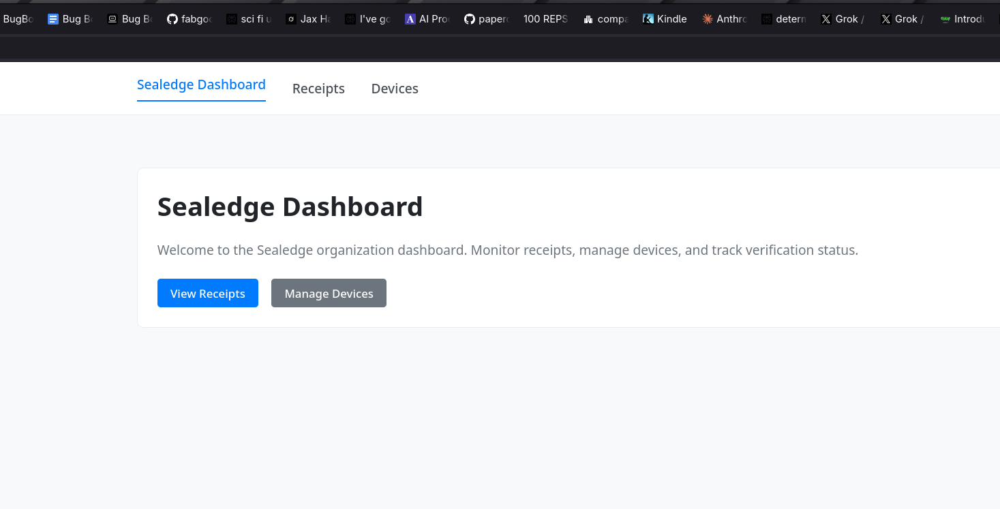

<objective>
Execute the full v6.0 validation gate authored in Plan 01 (`scripts/validate-v6.sh`), capture evidence for VALID-01 (local matrix) and VALID-03 (WASM / dashboard / docker) in `89-VERIFICATION.md`, and trigger the `workflow_dispatch`-gated workflows (`semver.yml` confirmed has the trigger; `wasm-tests.yml` pre-flight check determines whether to proceed) so their run URLs are ready for the pre-tag gate checklist in Plan 03.

This plan is the "running gauntlet" for Phase 89 — the script from Plan 01 does most of the work, but the developer has manual checkpoints for (a) the browser smoke of the dashboard per D-12 and (b) verifying the workflow_dispatch runs went green on the rename-target.

Purpose: Produce the evidence base that Plan 03's pre-tag gate reads. If anything in this plan fails, Phase 89 does NOT cut the v6.0.0 tag — fail-fast per CONTEXT.md §D-06. Hybrid-gate D-14 applies: trivial rebrand-side-effect fixes land inline as `fix(89):` commits; anything bigger defers to a hotfix sub-phase.

Output:
- `89-VERIFICATION.md` drafted with VALID-01 + VALID-03 evidence sections complete, VALID-02 §2.3 tag-push placeholder for Plan 03
- `validate-v6.log` committed alongside the VERIFICATION doc
- Two dashboard screenshots and one demo receipt JSON committed as phase evidence
- `semver.yml` workflow_dispatch run URL captured (always); `wasm-tests.yml` workflow_dispatch URL captured ONLY IF the trigger is present in the YAML (per Task 3 Step D pre-flight check — if absent, STOP and escalate to user since adding a `workflow_dispatch:` trigger would be a scope-expansion D-14 hybrid case the user must decide on)
</objective>

<execution_context>
@$HOME/.claude/get-shit-done/workflows/execute-plan.md
@$HOME/.claude/get-shit-done/templates/summary.md
</execution_context>

<context>
@.planning/PROJECT.md
@.planning/ROADMAP.md
@.planning/STATE.md
@.planning/phases/89-final-validation/89-CONTEXT.md
@.planning/phases/89-final-validation/89-PATTERNS.md
@.planning/phases/89-final-validation/89-01-PLAN.md
@.planning/phases/87-github-repository-rename/87-VERIFICATION.md
@.planning/phases/88-external-action-product-website/88-VERIFICATION.md
@scripts/validate-v6.sh
@scripts/demo.sh
@deploy/docker-compose.yml
@CLAUDE.md

<interfaces>
VERIFICATION.md top-of-file header (from `88-VERIFICATION.md:1-13` — copy verbatim, adjust phase + reqs + status):

```markdown
<!--
Copyright (c) 2025 TRUSTEDGE LABS LLC
MPL-2.0: https://mozilla.org/MPL/2.0/
Project: sealedge — Privacy and trust at the edge.
-->

# Phase 89 Verification — Final Validation

**Phase:** 89-final-validation
**Requirements:** VALID-01, VALID-02, VALID-03
**Date:** 2026-04-21
**Status:** IN PROGRESS — VALID-01 + VALID-03 evidence captured (Plan 02); VALID-02 §2.3 tag-push pending Plan 03

---
```

(Status flips to `PASS` after Plan 03 + Plan 04 close — Plan 03 updates §2.3, Plan 04 sets the final PASS line.)

§1 VALID-01 table shape (PATTERNS.md §File 2 — the exact 6-row D-01 matrix table):

```markdown
## 1. VALID-01 — Local CI-parity Matrix

All D-01 matrix commands verified green via `scripts/validate-v6.sh` pre-tag. See `validate-v6.log` for full output.

| # | Command | Exit code | Test count | Evidence |
|---|---------|-----------|------------|----------|
| 1 | `cargo test --workspace --no-default-features --locked` | 0 | N | validate-v6.log excerpt |
| 2 | `cargo test -p sealedge-core --features "audio,git-attestation,keyring,insecure-tls" --locked` | 0 | N | validate-v6.log excerpt |
| 3 | `cargo test -p sealedge-core --features yubikey --lib --locked` | 0 | N | validate-v6.log excerpt |
| 4 | `cargo test -p sealedge-platform --lib --locked` | 0 | N | validate-v6.log excerpt |
| 5 | `cargo test -p sealedge-platform --test verify_integration --locked` | 0 | N | validate-v6.log excerpt |
| 6 | `cargo test -p sealedge-platform --test verify_integration --features http --locked` | 0 | N | validate-v6.log excerpt |

**Total green:** N (D-02 floor: ≥471 — satisfied / justification below)

**D-02 justification (only present when `--allow-regression` was used):**
> D-02 justification: <verbatim copy of the justification text from `validate-v6.log`'s `D-02 JUSTIFICATION:` line>

**Log excerpt:** see `validate-v6.log` committed alongside this VERIFICATION.md.
```

§3 VALID-03 WASM + dashboard + docker evidence sections (draft shape — derived from PATTERNS.md File 2):

```markdown
## 3. VALID-03 — WASM + Dashboard + Docker

### 3.1 WASM build + size check (D-11)

**Commands:**
\`\`\`
cargo check -p sealedge-wasm --target wasm32-unknown-unknown
cargo check -p sealedge-seal-wasm --target wasm32-unknown-unknown
(cd crates/wasm && wasm-pack build --target web --release)
(cd crates/seal-wasm && wasm-pack build --target web --release)
\`\`\`

**Exit codes:** 0 (all four)

**Sizes:**
- `sealedge-wasm`: N bytes (floor: 2097152 / 2 MB — wasm-tests.yml parity)
- `sealedge-seal-wasm`: N bytes (informational)

### 3.2 Dashboard build + typecheck + browser smoke (D-12)

**Commands:**
\`\`\`
cd web/dashboard
npm ci
npm run build
npm run check
\`\`\`

**Exit codes:** 0 (all three)

**Browser smoke (manual):**
- `npm run dev` started; platform server running at `http://localhost:3001`
- Opened dashboard in browser
- Page title + headings render "Sealedge" (no "TrustEdge" product references): confirmed
- Device-list fetch against platform server: confirmed (screenshot below)

**Screenshots:**
- Home: 
- Device list: 

### 3.3 Docker stack + demo roundtrip (D-13)

**Commands:**
\`\`\`
docker compose -f deploy/docker-compose.yml up --build -d
curl -sf http://localhost:3001/healthz
./scripts/demo.sh
docker compose -f deploy/docker-compose.yml down
\`\`\`

**Exit codes:** 0 (all four)

**Container health (from `docker compose ps`):**
- platform: <status>
- postgres: <status>
- dashboard: <status>

**`/healthz` response:** `{"status":"OK","timestamp":"..."}` (200)

**Demo receipt:** see `demo-receipt.json` committed alongside this VERIFICATION.md
```

§5 ROADMAP success criteria closing table shape (PATTERNS.md §File 2 — copy verbatim, adjust `— §N` back-references):

```markdown
## 5. ROADMAP §Phase 89 Success Criteria

| # | Criterion | Status |
|---|-----------|--------|
| 1 | `cargo test --workspace` passes with 471+ tests under new crate/binary/constant names | ✔ PASS — §1 |
| 2 | Feature-matrix tests pass for yubikey, http, postgres, ca, openapi combinations | ✔ PASS — §1 (postgres via docker compose D-13 carve-out; openapi exercised via build) |
| 3 | All GitHub Actions workflows run green on push to renamed repo | 🟡 PARTIAL — §2.1 (main CI reused from 87-VERIFICATION) + §2.2 (workflow_dispatch) captured; §2.3 pending Plan 03 tag-push |
| 4 | WASM builds, web/dashboard builds + typegen, docker compose stack + demo script all green under new names | ✔ PASS — §3.1 (WASM), §3.2 (dashboard), §3.3 (docker) |
```
</interfaces>
</context>

<tasks>

<task type="auto">
  <name>Task 1: Run scripts/validate-v6.sh and capture validate-v6.log</name>
  <files>.planning/phases/89-final-validation/validate-v6.log</files>
  <read_first>
    - scripts/validate-v6.sh (just-authored by Plan 01 Task 1 — confirm it exists and is executable before running)
    - .planning/phases/89-01-SUMMARY.md (Plan 01's outcome — audit output + ci.yml disposition)
    - .planning/phases/89-final-validation/89-CONTEXT.md §D-02 (test-count floor: 471; justify if lower via `--allow-regression "<text>"`)
    - .planning/phases/89-final-validation/89-CONTEXT.md §D-14 (hybrid-gate: trivial inline fix is allowed; scope-expansion-shaped defers)
  </read_first>
  <action>
    Pre-flight check via Bash tool:
    ```
    test -x scripts/validate-v6.sh
    head -5 scripts/validate-v6.sh | grep -q 'Project: sealedge'
    command -v docker && docker compose version
    command -v wasm-pack || echo "WARN: wasm-pack missing — WASM build gate will skip"
    rustup target list --installed | grep -q wasm32-unknown-unknown || echo "WARN: wasm32 target missing — WASM check gate will skip"
    ```

    If `docker` or `wasm-pack` or `wasm32-unknown-unknown` are missing, STOP and surface to the developer — they must be installed before the gate runs (CONTEXT.md D-11/D-13 require them). No substitutions.

    Run the script from the repo root:
    ```
    ./scripts/validate-v6.sh
    ```

    The script writes `validate-v6.log` to `$PWD` (repo root) per Plan 01's `exec > >(tee validate-v6.log) 2>&1` line. Expect runtime ~10-25 min (depends on hardware — cargo cold-cache compile is the long tail).

    **Expected outcome (default path):** Exit code 0; final line `"✔ All v6.0 validation gates passed. Safe to cut v6.0.0 tag."`; `Total green tests: N (floor: 471)` with N ≥ 471.

    **D-02 escape-hatch path (CONTEXT D-02 — when test count drops below 471 with developer-acknowledged justification):**

    If the developer has determined ahead of time that the post-rename test count legitimately drops below 471 (e.g., a flaky test was removed, or a duplicate-coverage test was consolidated), the developer may invoke the script with the escape hatch:
    ```
    ./scripts/validate-v6.sh --allow-regression "<verbatim justification text — e.g. 'flaky-test-X removed in Phase 84 commit abc123, equivalent coverage in test-Y'>"
    ```
    In this path:
    - The script writes `D-02 JUSTIFICATION: <text>` to `validate-v6.log` (machine-readable line).
    - Exit code is 0 even if `TOTAL < 471`.
    - Task 4 MUST surface the same justification text in `89-VERIFICATION.md` §1 as `D-02 justification: <text>` (developer-readable line; both lines must contain the same text — Plan 02 Task 1's `<verify><automated>` cross-checks this).

    **If exit code is non-zero AND `--allow-regression` was NOT used**, classify per D-14 hybrid-gate:
    - Trivial rebrand-side-effect (stale docstring, broken test assert clearly carry-forward from Phase 83-86, copy-paste straggler): fix inline via Edit tool as a `fix(89): <subject>` commit BEFORE this task completes. Re-run the script. Iterate until green.
    - Scope-expansion-shaped (new feature, refactor, new test coverage not previously present): STOP, record in `89-VERIFICATION.md` §"Deferred Operational Findings", and surface to the developer — may require a hotfix sub-phase. Phase 89 does NOT proceed to Plan 03 until all D-14 fixes are either landed or formally deferred.
    - Test-count regression with developer-acknowledged justification: re-run with `--allow-regression "<text>"`; ensure Task 4 records the same text in 89-VERIFICATION.md §1.

    After green run, move `validate-v6.log` from repo root to the phase directory:
    ```
    mv validate-v6.log .planning/phases/89-final-validation/validate-v6.log
    ```
    (This keeps the repo root clean and preserves the log in the audit trail.)

    Verify the move:
    ```
    test -f .planning/phases/89-final-validation/validate-v6.log
    ```

    Extract the summary for the SUMMARY.md + VERIFICATION.md:
    ```
    tail -20 .planning/phases/89-final-validation/validate-v6.log
    grep -oE 'test result: ok\. [0-9]+ passed' .planning/phases/89-final-validation/validate-v6.log | awk '{s+=$4} END {print s}'
    grep 'D-02 JUSTIFICATION:' .planning/phases/89-final-validation/validate-v6.log || echo "(no D-02 escape hatch used — default ≥471 path)"
    ```

    Record the per-command test counts (the 6 D-01 commands) by grepping for `test result: ok. N passed` lines and mapping them back to their matrix row. Keep these numbers for Task 4's VERIFICATION.md table population. If a `D-02 JUSTIFICATION:` line is present, capture its exact text — Task 4 MUST surface the same text in 89-VERIFICATION.md §1.

    Also capture WASM sizes from the log:
    ```
    grep -E 'sealedge-wasm: [0-9]+ bytes|sealedge-seal-wasm: [0-9]+ bytes' .planning/phases/89-final-validation/validate-v6.log
    ```
  </action>
  <verify>
    <automated>test -f .planning/phases/89-final-validation/validate-v6.log && tail -5 .planning/phases/89-final-validation/validate-v6.log | grep -q 'Safe to cut v6.0.0 tag\|REGRESSION ALLOWED' && grep -q 'Total green tests:' .planning/phases/89-final-validation/validate-v6.log && { TOTAL=$(grep -oE 'Total green tests: [0-9]+' .planning/phases/89-final-validation/validate-v6.log | grep -oE '[0-9]+'); JUST=$(grep 'D-02 JUSTIFICATION:' .planning/phases/89-final-validation/validate-v6.log | sed 's/.*D-02 JUSTIFICATION: //'); { [ "$TOTAL" -ge 471 ]; } || { [ -n "$JUST" ] && grep -qF "D-02 justification: $JUST" .planning/phases/89-final-validation/89-VERIFICATION.md 2>/dev/null; }; }</automated>
  </verify>
  <acceptance_criteria>
    - `scripts/validate-v6.sh` exit code: 0
    - `.planning/phases/89-final-validation/validate-v6.log` exists and is > 0 bytes
    - One of the two green-gate confirmations present: `grep -c 'Safe to cut v6.0.0 tag' .planning/phases/89-final-validation/validate-v6.log` → ≥ 1 (default path) OR `grep -c 'REGRESSION ALLOWED' .planning/phases/89-final-validation/validate-v6.log` → ≥ 1 (D-02 escape-hatch path)
    - `grep -c '✖' .planning/phases/89-final-validation/validate-v6.log` → 0 (no failure markers)
    - Either of: `grep -oE 'Total green tests: [0-9]+' .planning/phases/89-final-validation/validate-v6.log` yields a number ≥ 471 (D-02 default floor) OR `grep -c 'D-02 JUSTIFICATION:' .planning/phases/89-final-validation/validate-v6.log` → ≥ 1 with non-empty justification text (D-02 escape hatch — and Task 4 MUST cross-write the same text to 89-VERIFICATION.md §1)
    - `grep -c 'test result: ok' .planning/phases/89-final-validation/validate-v6.log` → ≥ 6 (one per D-01 matrix command; may be more if ci-check.sh reports per-package)
    - `grep -cE 'sealedge-wasm: [0-9]+ bytes' .planning/phases/89-final-validation/validate-v6.log` → ≥ 1 (WASM size captured)
    - `grep -c 'docker stack healthy' .planning/phases/89-final-validation/validate-v6.log` → ≥ 1 (docker gate passed)
    - `grep -c 'demo roundtrip' .planning/phases/89-final-validation/validate-v6.log` → ≥ 1 (demo.sh completed)
    - If any D-14 hybrid-gate fixes were committed during this task, they land as separate `fix(89): ...` atomic commits BEFORE this task's log-capture commit; each is referenced in the SUMMARY
    - If `--allow-regression` was used: the verbatim justification text from `D-02 JUSTIFICATION:` in `validate-v6.log` is captured by Task 1 and handed to Task 4 for surfacing in `89-VERIFICATION.md` §1 as `D-02 justification: <same text>` (Task 4 acceptance criteria enforce the cross-write)
  </acceptance_criteria>
  <done>validate-v6.log committed to the phase directory with green final line and Total green tests ≥ 471 (default) OR a `D-02 JUSTIFICATION:` line with non-empty justification text (escape-hatch path); no scope-expansion issues surfaced; any trivial D-14 fixes landed as their own `fix(89):` commits before this task closes.</done>
</task>

<task type="checkpoint:human-verify" gate="blocking">
  <name>Task 2: Manual browser smoke of the dashboard (D-12) + capture screenshots</name>
  <what-built>
    Plan 01 authored the dashboard-gate build+typecheck in `scripts/validate-v6.sh` (non-interactive — `npm ci && npm run build && npm run check`). Task 1 just ran that script to completion with exit code 0, proving the dashboard BUILDS + TYPECHECKS clean.

    D-12 additionally requires a MANUAL browser smoke: the dashboard must render "Sealedge" branding (not "TrustEdge") and the device-list fetch must succeed against a running platform server. This is the one task in Plan 02 that an automated script cannot close — it requires a human looking at a browser window.

    Developer must have the docker stack from Task 1 already running (if `docker compose down` executed as part of the script's tear-down, bring it back up for this task — see steps below).
  </what-built>
  <how-to-verify>
    **Step A — Bring the docker stack back up** (Task 1's script tore it down; bring it back for the browser smoke):

    ```bash
    docker compose -f deploy/docker-compose.yml up --build -d

    # Wait for platform health (same pattern as Task 1):
    until curl -sf http://localhost:3001/healthz > /dev/null; do sleep 2; done
    curl -sf http://localhost:3001/healthz
    ```

    Expected: `{"status":"OK","timestamp":"..."}`.

    **Step B — Start the dashboard dev server** (in a separate terminal):

    ```bash
    cd web/dashboard
    npm run dev
    ```

    Expected: SvelteKit serves on `http://localhost:5173` (or similar — the terminal output will print the URL; use whatever it prints).

    **Step C — Open the dashboard in a browser and verify D-12 items:**

    1. **Open** `http://localhost:5173` (or whatever URL Step B printed) in a browser (Chrome, Firefox, Safari — any works).

    2. **Verify page title + headings render "Sealedge" (NOT "TrustEdge"):**
       - Browser tab title should contain "Sealedge" or similar sealedge-branded text
       - The main heading (`<h1>` or equivalent) on the home page should NOT contain "TrustEdge" as a product name
       - Footer / header / nav elements should NOT contain "TrustEdge" product references

       If "TrustEdge" appears anywhere as a product name (not the company-brand "TrustEdge Labs" which is intentionally preserved), that is a rebrand straggler — D-14 hybrid gate applies (fix inline via Edit on the relevant `.svelte` file, then re-run `npm run build && npm run check`, then re-load in the browser).

    3. **Verify the device-list fetch works:**
       - Navigate to the devices page (typically `/devices` or via nav menu — whatever the dashboard structure is)
       - Confirm the page renders without a network-error banner
       - Confirm the device list (possibly empty — that's fine; what matters is the FETCH succeeded, not that devices exist)

       If a fetch error appears (401, 500, connection refused), the dashboard's env-var configuration may not match the running platform. Check `web/dashboard/.env.local` for `PUBLIC_PLATFORM_API_URL=http://localhost:3001` or similar and align. This is a D-14 hybrid-gate fix if it's clearly a rebrand side-effect (e.g., env var was `TRUSTEDGE_API_URL` and got missed in Phase 85's env-var sweep).

    **Step D — Capture two screenshots:**

    1. Home page (or the first page that loads): save as `.planning/phases/89-final-validation/dashboard-home.png`
    2. Device list page: save as `.planning/phases/89-final-validation/dashboard-devices.png`

    Use any screenshot tool (OS native, or `grim` on Linux / `screencapture` on macOS). Crop to the browser viewport — system chrome is fine to include but not required.

    **Step E — Tear down dev mode:**

    - Stop `npm run dev` in the dashboard terminal (Ctrl+C)
    - Leave the docker stack running (Task 3 re-tears it down when capturing the demo receipt OR if the stack is already down from Task 1, Task 3 brings it up once more — the docker compose up/down is cheap since images are now cached)

    **Step F — Verify both screenshot files exist and are non-empty:**

    ```bash
    test -s .planning/phases/89-final-validation/dashboard-home.png
    test -s .planning/phases/89-final-validation/dashboard-devices.png
    file .planning/phases/89-final-validation/dashboard-home.png | grep -q 'PNG image'
    file .planning/phases/89-final-validation/dashboard-devices.png | grep -q 'PNG image'
    ```

    Expected: all four checks pass.

    **Step G — Pre-commit check** (before resuming): confirm no hybrid-gate edits are uncommitted. If Step C revealed "TrustEdge" in the dashboard or an env-var mismatch and you fixed it inline, those fixes should already be committed as `fix(89): ...` before resuming.
  </how-to-verify>
  <resume-signal>Reply `approved` after both screenshots are captured, the dashboard visually confirmed to render 'Sealedge' branding with a successful device-list fetch, and any D-14 hybrid-gate fixes are committed. Reply `issue: <description>` if a scope-expansion-shaped problem was found that requires a hotfix sub-phase.</resume-signal>
  <files>.planning/phases/89-final-validation/dashboard-home.png, .planning/phases/89-final-validation/dashboard-devices.png</files>
  <action>Human-executed checkpoint — see &lt;how-to-verify&gt; above for the full Step A-G protocol (docker stack up, npm run dev, open browser, verify Sealedge branding + device-list fetch, capture two PNG screenshots to the phase dir, verify PNG files exist + non-empty).</action>
  <verify>
    <automated>test -s .planning/phases/89-final-validation/dashboard-home.png && test -s .planning/phases/89-final-validation/dashboard-devices.png && file .planning/phases/89-final-validation/dashboard-home.png | grep -q 'PNG image' && file .planning/phases/89-final-validation/dashboard-devices.png | grep -q 'PNG image'</automated>
  </verify>
  <done>Both PNG screenshots captured and present in phase directory; developer replied with `approved` resume-signal confirming Sealedge branding + device-list fetch both verified; any D-14 hybrid-gate fixes discovered during smoke test landed as `fix(89):` atomic commits before resume.</done>
</task>

<task type="auto">
  <name>Task 3: Capture demo receipt + trigger wasm-tests/semver workflow_dispatch runs</name>
  <files>
    .planning/phases/89-final-validation/demo-receipt.json
  </files>
  <read_first>
    - scripts/demo.sh (auto-detect docker mode — confirm a receipt JSON is produced; read the script to identify where the receipt lands)
    - .planning/phases/89-final-validation/89-CONTEXT.md §D-05 (workflow_dispatch trigger commands for wasm-tests + semver)
    - .planning/phases/89-final-validation/89-CONTEXT.md §D-13 (docker e2e — verify-receipt capture)
    - .github/workflows/wasm-tests.yml (verify `workflow_dispatch:` trigger is present — known-issue per Phase 89 revision: this trigger may NOT be in the workflow; pre-flight check in Step D below decides whether to proceed)
    - .github/workflows/semver.yml (verify `workflow_dispatch:` trigger is present — confirmed present at `semver.yml:15` per planning-phase grep)
  </read_first>
  <action>
    **Step A — Ensure docker stack is up** (Task 2 may have left it up; if down from Task 1's tear-down, bring it back):

    ```bash
    docker compose -f deploy/docker-compose.yml ps
    ```

    If platform+postgres+dashboard all show `running`/`healthy`, continue. Otherwise:
    ```bash
    docker compose -f deploy/docker-compose.yml up --build -d
    until curl -sf http://localhost:3001/healthz > /dev/null; do sleep 2; done
    ```

    **Step B — Run demo.sh and capture the verify-receipt response.**

    `scripts/demo.sh` in docker-mode auto-detect performs a full roundtrip: generate keys, wrap a sample file, POST to `/v1/verify`, print the receipt.

    Run:
    ```bash
    ./scripts/demo.sh 2>&1 | tee demo.stdout.log
    ```

    The receipt JSON is typically printed to stdout during the POST step. Extract it:
    ```bash
    # demo.sh prints the receipt as JSON in a specific section; grep for the receipt block
    # Best-effort extraction: grab the JSON object that contains "receipt_id" or "verification_key"
    grep -Pzo '(?s)\{[^}]*"receipt_id"[^}]*\}' demo.stdout.log > .planning/phases/89-final-validation/demo-receipt.json 2>/dev/null
    # If that grep fails (schema may differ), fall back to capturing a fresh curl POST:
    ```

    If the grep extraction fails or produces an empty file, run an explicit curl POST against the running platform using the archive `demo.sh` just created, and save that response:
    ```bash
    # demo.sh creates artifacts under /tmp/sealedge-demo/ or similar — inspect demo.stdout.log to find the exact path
    # Then:
    # curl -X POST http://localhost:3001/v1/verify \
    #   -H "Content-Type: application/json" \
    #   -d @<emitted-request.json> \
    #   > .planning/phases/89-final-validation/demo-receipt.json
    ```

    Either way, end state: `.planning/phases/89-final-validation/demo-receipt.json` exists, is non-empty, is valid JSON, and contains fields indicating a successful verification (e.g., `"status": "valid"` or `"receipt_id": "..."`).

    **Validate JSON:**
    ```bash
    test -s .planning/phases/89-final-validation/demo-receipt.json
    python3 -c "import json; json.load(open('.planning/phases/89-final-validation/demo-receipt.json'))"
    ```

    Expected: exit 0 (valid JSON).

    **Step C — Tear down docker stack:**

    ```bash
    docker compose -f deploy/docker-compose.yml down
    ```

    Remove the transient `demo.stdout.log` at repo root (do not commit; it's evidence-capture scaffolding):
    ```bash
    rm -f demo.stdout.log
    ```

    **Step D — Trigger D-05 workflow_dispatch runs (with workflow_dispatch trigger pre-flight per W-3).**

    Phase 89 D-05 requires `wasm-tests.yml` and `semver.yml` to be exercised post-rename via workflow_dispatch (they're path-filtered + scheduled, not push-triggered).

    **Pre-flight (CRITICAL — added per W-3 revision):** before invoking `gh workflow run`, confirm both YAML files actually have a `workflow_dispatch:` trigger declared:
    ```bash
    grep -l 'workflow_dispatch:' .github/workflows/wasm-tests.yml .github/workflows/semver.yml
    ```

    Expected output (both files listed):
    ```
    .github/workflows/wasm-tests.yml
    .github/workflows/semver.yml
    ```

    **STOP and escalate to user if either file is missing from the output.** Per planning-phase verification, `wasm-tests.yml` does NOT currently have `workflow_dispatch:` declared (only `push` + `pull_request` triggers on path-filtered paths) — adding the trigger would be a scope-expansion D-14 hybrid case the user must decide on. Do NOT silently add the trigger as a "trivial fix"; surface to the developer as:

    > "wasm-tests.yml lacks `workflow_dispatch:` trigger. CONTEXT D-05 requires triggering via workflow_dispatch but the trigger is absent. Adding it is a scope-expansion D-14 hybrid case — user decides:
    > (A) Add the trigger as a one-line `fix(89): add workflow_dispatch trigger to wasm-tests.yml` commit and proceed (preferred — minimal scope expansion).
    > (B) Skip the wasm-tests.yml workflow_dispatch step; record the gap in 89-VERIFICATION.md §2.2 with a defer-rationale; proceed only with `semver.yml`.
    > (C) Defer to a hotfix sub-phase entirely; STOP Phase 89 here.
    > Which option?"

    Wait for user reply. After user decides:
    - If (A): apply the one-line `workflow_dispatch:` addition to `wasm-tests.yml` via Edit tool; commit as `fix(89): add workflow_dispatch trigger to wasm-tests.yml (D-05 enabling)`; proceed with both workflow_dispatch invocations below.
    - If (B): proceed with `semver.yml` only; record the wasm-tests.yml gap in 89-VERIFICATION.md §2.2 (Task 4) as a deferred follow-up.
    - If (C): STOP Phase 89; no further work in this plan.

    **Default path (both files have `workflow_dispatch:` confirmed):**

    Use the `gh` CLI:
    ```bash
    gh workflow run wasm-tests.yml --ref main
    gh workflow run semver.yml --ref main
    ```

    Wait ~10-15 seconds for GitHub to enqueue the runs, then fetch the URLs:
    ```bash
    # Use --limit 3 because gh workflow run doesn't return the run ID directly; the newest run is usually ours
    gh run list --workflow=wasm-tests.yml --limit 3 --json databaseId,status,conclusion,event,createdAt,url
    gh run list --workflow=semver.yml --limit 3 --json databaseId,status,conclusion,event,createdAt,url
    ```

    Identify the newest `workflow_dispatch` event runs for each and CAPTURE the URLs. Save them to a scratch file (or record in the SUMMARY) — they go into VERIFICATION.md §2.2 in Task 4.

    **Step E — Watch both runs to completion:**

    ```bash
    gh run watch <wasm-tests-run-id>
    gh run watch <semver-run-id>
    ```

    Expected: both runs conclude with `conclusion: success`. If either fails, classify per D-14 hybrid-gate:
    - Rebrand-side-effect (e.g., wasm-tests.yml still references `trustedge_wasm_bg.wasm` somewhere): inline fix, re-trigger, capture new URL
    - Scope-expansion: STOP, record in VERIFICATION.md §Deferred Operational Findings, surface to developer

    Re-confirm conclusions:
    ```bash
    gh run view <wasm-tests-run-id> --json conclusion -q '.conclusion'  # expect: success
    gh run view <semver-run-id> --json conclusion -q '.conclusion'      # expect: success
    ```

    **Evidence to hand off to Task 4:**
    - `demo-receipt.json` committed
    - workflow_dispatch run URLs + conclusions (both, or `semver.yml`-only if Step D's pre-flight diverted to option B)
    - Any inline D-14 fixes committed as `fix(89): ...`
    - Pre-flight outcome (option A/B/C) recorded in SUMMARY for audit
  </action>
  <verify>
    <automated>test -s .planning/phases/89-final-validation/demo-receipt.json && python3 -c "import json; json.load(open('.planning/phases/89-final-validation/demo-receipt.json'))" && gh run list --workflow=semver.yml --event=workflow_dispatch --limit 1 --json conclusion -q '.[0].conclusion' | grep -q 'success'</automated>
  </verify>
  <acceptance_criteria>
    - `.planning/phases/89-final-validation/demo-receipt.json` exists, > 0 bytes, valid JSON
    - Demo receipt contains at least one of: `receipt_id`, `status`, `verification_key`, `chain_hash` (schema-flexible check; grep `grep -cE 'receipt_id|status|verification_key|chain_hash' demo-receipt.json` → ≥ 1)
    - Pre-flight `workflow_dispatch:` trigger check executed: `grep -l 'workflow_dispatch:' .github/workflows/wasm-tests.yml .github/workflows/semver.yml` was run BEFORE invoking `gh workflow run`; outcome (both present / wasm-tests missing / fix applied / deferred) documented in SUMMARY
    - `gh run list --workflow=semver.yml --event=workflow_dispatch --limit 1 --json conclusion -q '.[0].conclusion'` → `success` (semver.yml workflow_dispatch trigger is confirmed present per planning-phase grep)
    - `wasm-tests.yml` workflow_dispatch run conclusion: success IF Step D pre-flight confirmed the trigger is present OR option A added it; OR documented gap in SUMMARY + 89-VERIFICATION.md §2.2 IF option B was chosen
    - Run URL(s) captured in scratch notes or SUMMARY (used in Task 4 for VERIFICATION.md §2.2)
    - Docker stack torn down: `docker compose -f deploy/docker-compose.yml ps` shows no running containers (or the compose file's services report Exit)
    - No transient `demo.stdout.log` at repo root after task completes
  </acceptance_criteria>
  <done>Demo receipt captured + valid JSON; semver.yml workflow_dispatch run green with URL captured; wasm-tests.yml workflow_dispatch outcome handled per Step D pre-flight (option A/B/C — recorded in SUMMARY); docker stack torn down; any D-14 hybrid-gate fixes landed as their own commits.</done>
</task>

<task type="auto">
  <name>Task 4: Draft 89-VERIFICATION.md with VALID-01, VALID-03, §2.1/§2.2 evidence (VALID-02 §2.3 placeholder)</name>
  <files>.planning/phases/89-final-validation/89-VERIFICATION.md</files>
  <read_first>
    - .planning/phases/87-github-repository-rename/87-VERIFICATION.md (template — section-per-requirement structure, ROADMAP SC closing table)
    - .planning/phases/88-external-action-product-website/88-VERIFICATION.md (template — command/output fenced blocks, verifier-appended trailer pattern)
    - .planning/phases/89-final-validation/validate-v6.log (just captured by Task 1 — extract per-command exit codes + test counts for §1; also extract `D-02 JUSTIFICATION:` line if present)
    - .planning/phases/89-final-validation/89-CONTEXT.md §D-15 (structured evidence table requirements)
    - .planning/phases/89-final-validation/89-PATTERNS.md §File 2 (VERIFICATION.md shape + exact header + section templates)
    - .planning/phases/87-github-repository-rename/87-VERIFICATION.md §D-13 §3 (the main-CI run URL reused in §2.1 per D-04)
  </read_first>
  <action>
    Create `.planning/phases/89-final-validation/89-VERIFICATION.md` using the Write tool. Structure MUST follow PATTERNS.md File 2's section skeleton.

    **Header** (copy PATTERNS.md File 2's top-of-file shape verbatim, adjust status):
    ```
    <!--
    Copyright (c) 2025 TRUSTEDGE LABS LLC
    MPL-2.0: https://mozilla.org/MPL/2.0/
    Project: sealedge — Privacy and trust at the edge.
    -->

    # Phase 89 Verification — Final Validation

    **Phase:** 89-final-validation
    **Requirements:** VALID-01, VALID-02, VALID-03
    **Date:** 2026-04-21
    **Status:** IN PROGRESS — VALID-01 + VALID-03 evidence captured (Plan 02); VALID-02 §2.3 tag-push pending Plan 03

    ---
    ```

    **§1 VALID-01 — Local CI-parity Matrix** (PATTERNS.md File 2 exact shape):

    Populate the 6-row table with exit codes and test counts extracted from `validate-v6.log` (Task 1). Use the exact command strings from CONTEXT.md §Specifics. Record the running total under the table as "Total green: N (D-02 floor: ≥471 — satisfied)". Reference the committed `validate-v6.log` as the evidence file.

    **D-02 escape-hatch handling (CRITICAL — added per B-2 revision):**

    If Task 1 captured a `D-02 JUSTIFICATION: <text>` line from `validate-v6.log` (i.e., the developer used `--allow-regression`), §1 MUST include a "D-02 justification" block immediately below the table:
    ```
    **D-02 justification:** <verbatim copy of the text from validate-v6.log's `D-02 JUSTIFICATION:` line>
    ```

    The text MUST match exactly (no paraphrasing, no truncation) — Plan 02 Task 1's `<verify><automated>` cross-checks that the same text is present in BOTH `validate-v6.log` (`D-02 JUSTIFICATION:` prefix) AND `89-VERIFICATION.md` §1 (`D-02 justification:` prefix). The two prefixes differ only in case (machine-readable vs. developer-readable convention).

    If the test count is ≥ 471 (default path, no escape hatch used), §1 simply notes "D-02 floor: ≥471 — satisfied" and omits the justification block.

    DO NOT silently hide a shortfall — every regression below 471 MUST surface either as a script-failure (no flag) or as a verbatim justification block (with flag).

    **§2 VALID-02 — GitHub Actions Green** with three subsections:

    §2.1 **Post-rename main CI run (reused from 87-VERIFICATION.md)** — reference `87-VERIFICATION.md` §D-13 §3 verbatim. Include the run URL `https://github.com/TrustEdge-Labs/sealedge/actions/runs/24724694867` (from 87-VERIFICATION.md:124). Do NOT re-trigger.

    §2.2 **workflow_dispatch runs on wasm-tests.yml + semver.yml (D-05)** — populate with the run URLs from Task 3. Include the gh commands used. Record conclusions (success). If Task 3 Step D's pre-flight diverted to option B (wasm-tests.yml lacks the trigger), §2.2 MUST surface the gap explicitly:
    ```
    ### 2.2.1 wasm-tests.yml workflow_dispatch — DEFERRED

    **Status:** DEFERRED per Task 3 Step D pre-flight (option B). The `wasm-tests.yml` workflow lacks a `workflow_dispatch:` trigger; adding it was a scope-expansion D-14 hybrid case the user chose to defer. Tracked as a follow-up item.
    ```

    §2.3 **Tag-push v6.0.0 CI run (D-04 authoritative gate)** — placeholder block:
    ```
    ### 2.3 Tag-push `v6.0.0` CI run (D-04 authoritative gate)

    **Status:** PENDING — filled in by Plan 03 after v6.0.0 tag cut + tag-push CI run completes.

    **Expected capture:**
    - Run URL: <to be captured by Plan 03>
    - Conclusion: <success expected>
    - Self-attestation job conclusion (includes dogfood of sealedge-attest-sbom-action@v2): <expected success>
    - Release assets uploaded: `seal`, `seal.sha256`, `seal-sbom.cdx.json`, `build.pub`, `seal.se-attestation.json`
    ```

    **§3 VALID-03 — WASM + Dashboard + Docker** with three subsections:

    §3.1 **WASM build + size check (D-11)** — use the interfaces §3.1 skeleton from <context> above. Populate WASM sizes extracted from `validate-v6.log` (via `grep 'sealedge-wasm: [0-9]\\+ bytes'`). Confirm the 2 MB floor per D-11.

    §3.2 **Dashboard build + typecheck + browser smoke (D-12)** — use the interfaces §3.2 skeleton. Reference the two screenshots via relative links: `` and ``. Record the commands and their exit codes (all 0 per Task 1's script run).

    §3.3 **Docker stack + demo roundtrip (D-13)** — use the interfaces §3.3 skeleton. Reference `demo-receipt.json` via a markdown link: `[demo-receipt.json](demo-receipt.json)`. Include the `/healthz` response body extracted from the log or Task 3 Step A output.

    **§4 Tag-Failure Recovery Status** — placeholder block (per PATTERNS.md File 2 §"Rollback-status pattern"):
    ```
    ## 4. Tag-Failure Recovery Status

    **Not executed.** Plan 03 has not yet cut the v6.0.0 tag. After tag-push CI runs green (Plan 03 §2.3), this section confirms no recovery needed.

    **Recovery commands (documented verbatim per D-06 / Phase 87 D-15 pattern):**

    \`\`\`
    # If tag-push run fails: fix inline, then either:
    # Option A — force-update (if no consumers downloaded yet):
    git tag -f v6.0.0 <new-sha>
    git push origin v6.0.0 --force

    # Option B — cut v6.0.1 (audit-cleaner):
    git tag -a v6.0.1 -m "v6.0 Sealedge Rebrand — fix applied"
    git push origin v6.0.1
    \`\`\`

    Solo-dev context, no production consumers in the bootstrap window — force-update is acceptable per CONTEXT.md §Claude's-Discretion.
    ```

    **§5 ROADMAP §Phase 89 Success Criteria** — use the PATTERNS.md File 2 closing table with partial/PASS markers as laid out in interfaces §5 above. Criterion #3 is PARTIAL until Plan 03 closes §2.3.

    **§6 Deferred Operational Findings** — any D-14 hybrid-gate fixes discovered in Task 1, Task 2, or Task 3 get enumerated here. Includes the `wasm-tests.yml` workflow_dispatch trigger gap if Task 3 Step D pre-flight diverted to option B. If none found (expected happy path), write a single line: "None. All gates passed on first run; no hybrid-gate fixes required."

    **Verifier-appended trailer** — do NOT write a `## Phase Goal Verification (verifier agent)` block. The verifier agent appends that section separately during phase close per PATTERNS.md File 2 §"Verifier-appended section pattern".

    Do NOT commit inside this task; the plan's atomic-commit sweep at plan close commits all five evidence files (`89-VERIFICATION.md`, `validate-v6.log`, `dashboard-home.png`, `dashboard-devices.png`, `demo-receipt.json`) together with message `docs(89): capture VALID-01/VALID-03 + wasm-tests/semver workflow_dispatch evidence`.
  </action>
  <verify>
    <automated>test -f .planning/phases/89-final-validation/89-VERIFICATION.md && grep -c '^## ' .planning/phases/89-final-validation/89-VERIFICATION.md | awk '$1 >= 6 {exit 0} {exit 1}' && grep -c 'VALID-01\|VALID-02\|VALID-03' .planning/phases/89-final-validation/89-VERIFICATION.md | awk '$1 >= 3 {exit 0} {exit 1}' && grep -q 'IN PROGRESS\|PASS' .planning/phases/89-final-validation/89-VERIFICATION.md && grep -q 'dashboard-home.png' .planning/phases/89-final-validation/89-VERIFICATION.md && grep -q 'dashboard-devices.png' .planning/phases/89-final-validation/89-VERIFICATION.md && grep -q 'demo-receipt.json' .planning/phases/89-final-validation/89-VERIFICATION.md && grep -q 'validate-v6.log' .planning/phases/89-final-validation/89-VERIFICATION.md && grep -q '24724694867' .planning/phases/89-final-validation/89-VERIFICATION.md && { JUST=$(grep 'D-02 JUSTIFICATION:' .planning/phases/89-final-validation/validate-v6.log 2>/dev/null | sed 's/.*D-02 JUSTIFICATION: //'); [ -z "$JUST" ] || grep -qF "D-02 justification: $JUST" .planning/phases/89-final-validation/89-VERIFICATION.md; }</automated>
  </verify>
  <acceptance_criteria>
    - File exists: `test -f .planning/phases/89-final-validation/89-VERIFICATION.md`
    - Section count: `grep -c '^## ' .planning/phases/89-final-validation/89-VERIFICATION.md` → ≥ 6 (1. VALID-01, 2. VALID-02, 3. VALID-03, 4. Tag-Failure Recovery Status, 5. ROADMAP Success Criteria, 6. Deferred Operational Findings)
    - All three requirement IDs present: `grep -c 'VALID-0[123]' .planning/phases/89-final-validation/89-VERIFICATION.md` → ≥ 3
    - Header block with copyright: `head -5 .planning/phases/89-final-validation/89-VERIFICATION.md | grep -q 'MPL-2.0'`
    - Status line present: `grep -qE '^\\*\\*Status:\\*\\*' .planning/phases/89-final-validation/89-VERIFICATION.md`
    - §1 VALID-01 table: `grep -c '| cargo test ' .planning/phases/89-final-validation/89-VERIFICATION.md` → ≥ 6 (all 6 D-01 commands as table rows)
    - §1 D-02 line satisfied either: `grep -c 'D-02 floor: ≥471 — satisfied' .planning/phases/89-final-validation/89-VERIFICATION.md` ≥ 1 (default path, no flag) OR `grep -c 'D-02 justification:' .planning/phases/89-final-validation/89-VERIFICATION.md` ≥ 1 with the same text as `validate-v6.log`'s `D-02 JUSTIFICATION:` line (escape-hatch path; cross-write enforcement per B-2)
    - §2.1 reused main CI URL: `grep -q '24724694867' .planning/phases/89-final-validation/89-VERIFICATION.md` (the 87-VERIFICATION.md run URL)
    - §2.2 workflow_dispatch URL(s) present: `grep -cE 'wasm-tests.yml|semver.yml' .planning/phases/89-final-validation/89-VERIFICATION.md` → ≥ 1 (semver.yml always; wasm-tests.yml present unless Task 3 Step D diverted to option B, in which case `grep -c 'wasm-tests.yml workflow_dispatch — DEFERRED' .planning/phases/89-final-validation/89-VERIFICATION.md` ≥ 1)
    - §2.3 pending placeholder: `grep -c 'PENDING — filled in by Plan 03' .planning/phases/89-final-validation/89-VERIFICATION.md` → ≥ 1
    - §3.1 WASM sizes recorded: `grep -cE 'sealedge-wasm: [0-9]+ bytes' .planning/phases/89-final-validation/89-VERIFICATION.md` → ≥ 1
    - §3.2 screenshot references: `grep -c 'dashboard-home.png\\|dashboard-devices.png' .planning/phases/89-final-validation/89-VERIFICATION.md` → ≥ 2
    - §3.3 demo-receipt link: `grep -c 'demo-receipt.json' .planning/phases/89-final-validation/89-VERIFICATION.md` → ≥ 1
    - §4 recovery commands documented: `grep -c 'git tag -f v6.0.0\\|git tag -a v6.0.1' .planning/phases/89-final-validation/89-VERIFICATION.md` → ≥ 2
    - §5 ROADMAP success criteria table: `grep -c '✔ PASS\\|🟡 PARTIAL' .planning/phases/89-final-validation/89-VERIFICATION.md` → ≥ 3 (crit 1, 2, 4 PASS; crit 3 PARTIAL)
    - D-02 justification cross-write enforcement (B-2 hardening): if `validate-v6.log` contains a `D-02 JUSTIFICATION: <text>` line, then `89-VERIFICATION.md` MUST contain `D-02 justification: <same text>` (verbatim) — verified by the script in `<automated>` above
  </acceptance_criteria>
  <done>89-VERIFICATION.md drafted with all §1/§3 evidence populated, §2.1/§2.2 captured (with wasm-tests.yml gap surfaced if Task 3 Step D diverted), §2.3/§4/§5 placeholders ready for Plan 03 to close. D-02 escape-hatch justification cross-written from validate-v6.log to §1 if applicable. All five evidence files (validate-v6.log, 2×PNG screenshots, demo-receipt.json, VERIFICATION.md) committed as atomic commit `docs(89): capture VALID-01/VALID-03 + wasm-tests/semver workflow_dispatch evidence`.</done>
</task>

</tasks>

<threat_model>
## Trust Boundaries

| Boundary | Description |
|----------|-------------|
| developer shell → validate-v6.sh → cargo/npm/docker | All gates run under developer's ambient authority; no elevated privileges; no secrets involved |
| developer shell → GitHub API (gh workflow_dispatch + gh run watch) | Uses developer's existing `gh auth` (repo scope); no new credentials added |
| browser → dashboard (localhost:5173) → platform (localhost:3001) → postgres (localhost:5432) | All localhost; no external traffic; demo data is transient |

## STRIDE Threat Register

| Threat ID | Category | Component | Disposition | Mitigation Plan |
|-----------|----------|-----------|-------------|-----------------|
| T-89-02-01 | Tampering | `validate-v6.log` committed to repo (phase artifact) | mitigate | Log is append-only during `tee`; committed under atomic-commit discipline; any future log rewrite would show in `git diff` + `git blame`; log contains only cargo/npm/docker stdout (no secrets) |
| T-89-02-02 | Information disclosure | `demo-receipt.json` committed to repo | accept | Receipt is cryptographic output for a test archive with a generated-at-demo-time ephemeral keypair; no production signing key, no user data. The whole purpose of the receipt format is that it is publicly verifiable |
| T-89-02-03 | Information disclosure | Dashboard screenshots committed to repo | mitigate | Screenshots show UI only (no auth tokens, no cookies visible to user). Before capturing, ensure no browser devtools panel shows a JWT / cookie in the frame; crop out any such regions. Solo-dev context (no multi-tenant dashboard data) |
| T-89-02-04 | Denial of service | Docker stack teardown leaves containers orphaned | mitigate | Task 3 Step C explicitly runs `docker compose down`; Task 2 Step E leaves them running but Task 3 tears them down. Acceptance criteria verify zero running containers at Task 3 close |
| T-89-02-05 | Repudiation | GitHub run URLs captured but attacker replaces with fake URLs | accept | Run URLs are `https://github.com/TrustEdge-Labs/sealedge/actions/runs/NNN` format — the GitHub audit trail (run IDs, owner, status) is immutable server-side. VERIFICATION.md + gh run view re-check gives two-source confirmation |
| T-89-02-06 | Tampering | D-14 hybrid-gate inline fix lands without review | mitigate | Each inline fix is its own atomic `fix(89): ...` commit with Co-Authored-By; git log makes these auditable; scope-expansion fixes explicitly STOP and surface to developer before proceeding |
| T-89-02-07 | Repudiation | D-02 `--allow-regression` flag could be used to silently bypass the test floor | mitigate | Flag REQUIRES non-empty justification text; script writes `D-02 JUSTIFICATION: <text>` to `validate-v6.log`; Task 4 cross-writes the same text to `89-VERIFICATION.md` §1 as `D-02 justification: <text>`; Task 1 `<verify>` enforces the cross-write match (B-2 hardening) |

**Severity gate:** All threats are low severity (validation-phase evidence-capture surface). No blocking threats.
</threat_model>

<verification>
- `./scripts/validate-v6.sh` exit code 0 with Total green tests ≥ 471 OR `D-02 JUSTIFICATION:` text present in `validate-v6.log` AND cross-written verbatim to `89-VERIFICATION.md` §1
- Dashboard browser-smoke (human-verified) confirms Sealedge branding + device-list fetch works
- `demo-receipt.json` is valid JSON with verification-receipt fields
- `gh run list --workflow=semver.yml --event=workflow_dispatch --limit 1` shows `conclusion: success`; `wasm-tests.yml` shows same UNLESS Task 3 Step D pre-flight diverted to option B (gap surfaced in §2.2)
- `89-VERIFICATION.md` has six sections covering VALID-01 + VALID-02 §2.1/§2.2 + VALID-03 + placeholders for §2.3/§4 (Plan 03) + ROADMAP success criteria table
- All five evidence files (validate-v6.log, 2 PNGs, demo-receipt.json, VERIFICATION.md) committed in atomic `docs(89):` commit
</verification>

<success_criteria>
Plan 02 succeeds when:

1. `scripts/validate-v6.sh` ran green (exit 0) with all D-01/D-11/D-12/D-13 gates passing AND test count ≥ 471 OR `--allow-regression "<text>"` was used and the same text appears in BOTH `validate-v6.log` (`D-02 JUSTIFICATION:`) and `89-VERIFICATION.md` §1 (`D-02 justification:`)
2. `validate-v6.log` committed to phase directory
3. Dashboard browser smoke confirmed Sealedge branding + device-list fetch; two screenshots captured and committed
4. Demo receipt captured from docker-mode `demo.sh` run; valid JSON; committed
5. workflow_dispatch run on `semver.yml` green with URL captured in VERIFICATION.md §2.2; `wasm-tests.yml` workflow_dispatch run handled per Task 3 Step D pre-flight (option A succeeded OR option B gap surfaced in §2.2)
6. `89-VERIFICATION.md` drafted with full VALID-01 + VALID-03 evidence, VALID-02 §2.1/§2.2 captured (wasm-tests.yml gap if applicable), and §2.3/§4/§5 placeholder shape ready for Plan 03 to fill
7. Any D-14 hybrid-gate inline fixes landed as separate `fix(89): ...` commits with Co-Authored-By trailer

Plan 03's pre-tag gate checklist reads this plan's SUMMARY + VERIFICATION.md §2.2 URLs before proceeding.
</success_criteria>

<output>
After completion, create `.planning/phases/89-final-validation/89-02-SUMMARY.md` including:
- One-line outcome
- `scripts/validate-v6.sh` exit code and top-of-log + bottom-of-log excerpts
- Total green test count (exact N) AND, if `--allow-regression` was used, the verbatim D-02 justification text (and confirmation it was cross-written to 89-VERIFICATION.md §1)
- WASM sizes (sealedge-wasm + sealedge-seal-wasm)
- Dashboard smoke outcome (branding check + device-list fetch check)
- Docker stack health + demo-receipt summary (receipt_id or status field)
- `gh` workflow_dispatch run URLs (semver always; wasm-tests if option A or already-present; "deferred" note if option B)
- Task 3 Step D pre-flight outcome (workflow_dispatch trigger present in both / option A applied / option B deferred / option C escalated)
- Any D-14 hybrid-gate fixes applied (commit SHAs)
- Any deferred findings surfaced for the developer
- Commit SHAs of the evidence-capture atomic commits
</output>
