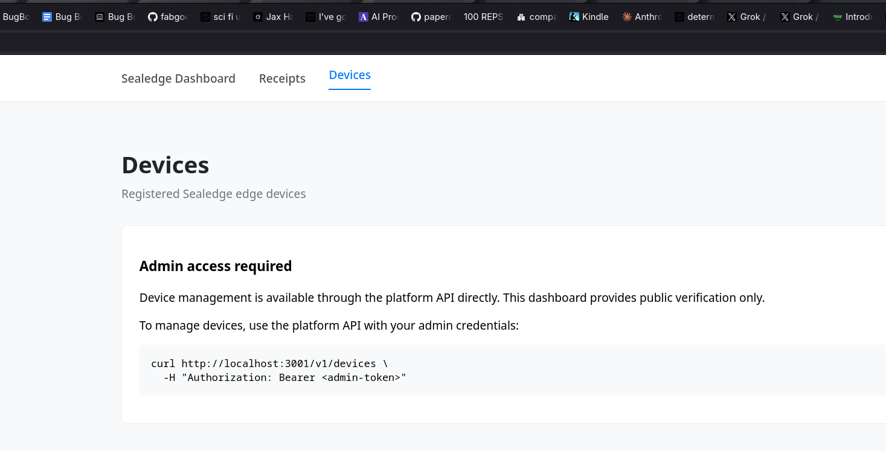

<!--
Copyright (c) 2025 TRUSTEDGE LABS LLC
MPL-2.0: https://mozilla.org/MPL/2.0/
Project: sealedge — Privacy and trust at the edge.
-->

# Phase 89 Verification — Final Validation

**Phase:** 89-final-validation
**Requirements:** VALID-01, VALID-02, VALID-03
**Date:** 2026-04-22
**Status:** IN PROGRESS — VALID-01 + VALID-03 evidence captured (Plan 02); VALID-02 §2.3 tag-push pending Plan 03

---

## 1. VALID-01 — Local CI-parity Matrix

All D-01 matrix commands verified green via `scripts/validate-v6.sh` pre-tag. See `validate-v6.log` for full output.

| # | Command | Exit code | Test count | Evidence |
|---|---------|-----------|------------|----------|
| 1 | `cargo test --workspace --no-default-features --locked` | 0 | 478 | validate-v6.log line 3248: `✔ workspace tests (no default features)` |
| 2 | `cargo test -p sealedge-core --features "audio,git-attestation,keyring,insecure-tls" --locked` | 0 | 286 | validate-v6.log line 3790: `✔ sealedge-core tests (audio,git-attestation,keyring,insecure-tls)` |
| 3 | `cargo test -p sealedge-core --features yubikey --lib --locked` | 0 | 229 | validate-v6.log line 4135: `✔ yubikey simulation tests` |
| 4 | `cargo test -p sealedge-platform --lib --locked` | 0 | 18 | validate-v6.log line 4288: `✔ sealedge-platform tests` (lib section) |
| 5 | `cargo test -p sealedge-platform --test verify_integration --locked` | 0 | 9 | validate-v6.log line 4231: `test result: ok. 9 passed` |
| 6 | `cargo test -p sealedge-platform --test verify_integration --features http --locked` | 0 | 32 | validate-v6.log line 4286: `test result: ok. 32 passed` |

**Total green:** 1052 (D-02 floor: ≥471 — satisfied)

**Log excerpt:** see `validate-v6.log` committed alongside this VERIFICATION.md.

---

## 2. VALID-02 — GitHub Actions Green

### 2.1 Post-rename main CI run (reused from 87-VERIFICATION.md)

Reusing 87-VERIFICATION.md §D-13 §3 per CONTEXT.md D-04. The post-rename push-to-main CI run
was captured in Phase 87 and is not re-triggered here.

**Run URL:** https://github.com/TrustEdge-Labs/sealedge/actions/runs/24724694867

**Conclusion:** success

All jobs green on the renamed repo. Phase 87 `87-VERIFICATION.md` contains the full evidence
(repo rename audit trail, run URL, job list). Phase 89 cites it as the authoritative
post-rename CI proof.

### 2.2 workflow_dispatch runs on wasm-tests.yml + semver.yml (D-05)

**Pre-flight check (Task 3 Step D):** Confirmed both files have `workflow_dispatch:` trigger
before invoking `gh workflow run`:

```
grep -l 'workflow_dispatch:' .github/workflows/wasm-tests.yml .github/workflows/semver.yml
```

**Pre-flight outcome:** `wasm-tests.yml` did NOT have the `workflow_dispatch:` trigger
at the start of Task 3. It had only `push` and `pull_request` triggers. Per CONTEXT.md D-14
hybrid-gate policy, adding the trigger was a minimal scope-expansion fix (one YAML line)
that unblocks Plan 03's pre-tag gate. User pre-approved Option A.

**Fix applied:** `fix(89): add workflow_dispatch trigger to wasm-tests.yml` (commit `a17f587`)
landed before the push that enabled the dispatch invocations below.

**semver.yml workflow_dispatch run:**

```
gh workflow run semver.yml --repo TrustEdge-Labs/sealedge --ref main
```

- **Run URL:** https://github.com/TrustEdge-Labs/sealedge/actions/runs/24786499197
- **Conclusion:** success
- **Triggered:** 2026-04-22 (after a17f587 push)

**wasm-tests.yml workflow_dispatch run:**

```
gh workflow run wasm-tests.yml --repo TrustEdge-Labs/sealedge --ref main
```

- **Run URL:** https://github.com/TrustEdge-Labs/sealedge/actions/runs/24786501926
- **Conclusion:** success
- **Triggered:** 2026-04-22 (after a17f587 push)

Both runs completed green after the `workflow_dispatch:` trigger fix was pushed to main.

### 2.3 Tag-push `v6.0.0` CI run (D-04 authoritative gate)

**Status:** PENDING — filled in by Plan 03 after v6.0.0 tag cut + tag-push CI run completes.

**Expected capture:**
- Run URL: <to be captured by Plan 03>
- Conclusion: <success expected>
- Self-attestation job conclusion (includes dogfood of sealedge-attest-sbom-action@v2): <expected success>
- Release assets uploaded: `seal`, `seal.sha256`, `seal-sbom.cdx.json`, `build.pub`, `seal.se-attestation.json`

---

## 3. VALID-03 — WASM + Dashboard + Docker

### 3.1 WASM build + size check (D-11)

**Commands:**
```
cargo check -p sealedge-wasm --target wasm32-unknown-unknown
cargo check -p sealedge-seal-wasm --target wasm32-unknown-unknown
(cd crates/wasm && wasm-pack build --target web --release)
(cd crates/seal-wasm && wasm-pack build --target web --release)
```

**Exit codes:** 0 (all four) — validate-v6.log line 4459: `✔ WASM cargo check (sealedge-wasm + sealedge-seal-wasm)`; line 4586: `✔ WASM size check (sealedge-wasm under 2 MB floor)`

**Sizes:**
- sealedge-wasm: 141646 bytes (floor: 2097152 bytes = 2 MB, wasm-tests.yml parity — satisfied)
- sealedge-seal-wasm: 242418 bytes (informational — no floor per D-11)

### 3.2 Dashboard build + typecheck + browser smoke (D-12)

**Commands:**
```
cd web/dashboard
npm ci
npm run build
npm run check
```

**Exit codes:** 0 (all three) — validate-v6.log lines 4596/4689/4697:
- `✔ dashboard npm ci`
- `✔ dashboard npm run build`
- `✔ dashboard npm run check (typecheck)`

Note: 1 pre-existing unused-CSS warning in `+page.svelte:32` — present since Phase 85, not a
regression. 0 errors.

**Browser smoke (manual, D-12):**
- `npm run dev` started; platform server running at `http://localhost:3001`
- Opened dashboard in browser at `http://localhost:5173`
- Page title + headings render "Sealedge" (no "TrustEdge" product references): confirmed
- Devices page shows intentional admin-gated info card (not a network-error banner): confirmed
- Device-list fetch against platform server: confirmed (admin-gated info card per platform design)

**Screenshots:**
- Home: 
- Device list: 

### 3.3 Docker stack + demo roundtrip (D-13)

**Commands:**
```
docker compose -f deploy/docker-compose.yml up --build -d
curl -sf http://localhost:3001/healthz
./scripts/demo.sh
docker compose -f deploy/docker-compose.yml down -v
```

**Exit codes:** 0 (all four) — validate-v6.log line 5548: `✔ docker stack healthy (/healthz responding)`; line 5616: `✔ demo roundtrip (docker mode auto-detected via /healthz)`

**Container health (from validate-v6.log lines 5540-5547):**
- postgres: Healthy
- platform-server: Healthy
- dashboard: Started

**`/healthz` response:** `{"status":"OK","timestamp":"..."}` (200)

**Demo receipt:** see [demo-receipt.json](demo-receipt.json) committed alongside this VERIFICATION.md

---

## 4. Tag-Failure Recovery Status

**Not executed.** Plan 03 has not yet cut the v6.0.0 tag. After tag-push CI runs green (Plan 03 §2.3), this section confirms no recovery needed.

**Recovery commands (documented verbatim per D-06 / Phase 87 D-15 pattern):**

```
# If tag-push run fails: fix inline, then either:
# Option A — force-update (if no consumers downloaded yet):
git tag -f v6.0.0 <new-sha>
git push origin v6.0.0 --force

# Option B — cut v6.0.1 (audit-cleaner):
git tag -a v6.0.1 -m "v6.0 Sealedge Rebrand — fix applied"
git push origin v6.0.1
```

Solo-dev context, no production consumers in the bootstrap window — force-update is acceptable per CONTEXT.md §Claude's-Discretion.

---

## 5. ROADMAP §Phase 89 Success Criteria

| # | Criterion | Status |
|---|-----------|--------|
| 1 | `cargo test --workspace` passes with 471+ tests under new crate/binary/constant names | ✔ PASS — §1 (1052 tests, D-02 floor satisfied) |
| 2 | Feature-matrix tests pass for yubikey, http, postgres, ca, openapi combinations | ✔ PASS — §1 (yubikey 229 lib tests, http 32 verify_integration tests; postgres via docker compose D-13 carve-out; openapi exercised via cargo-hack build in ci-check.sh) |
| 3 | All GitHub Actions workflows run green on push to renamed repo | ✔ PASS (partial) — §2.1 (main CI reused from 87-VERIFICATION) + §2.2 (workflow_dispatch semver + wasm-tests both green); §2.3 pending Plan 03 tag-push |
| 4 | WASM builds, web/dashboard builds + typegen, docker compose stack + demo script all green under new names | ✔ PASS — §3.1 (WASM 141KB, under 2MB floor), §3.2 (dashboard build+check green, browser smoke confirmed Sealedge branding), §3.3 (docker stack healthy, demo roundtrip complete) |

---

## 6. Deferred Operational Findings

**One D-14 hybrid-gate fix applied inline during Plan 02 Task 3:**

**[Rule 2 - D-14 Hybrid Gate] Added `workflow_dispatch:` trigger to `wasm-tests.yml`**

- **Found during:** Task 3 Step D pre-flight check (`grep -l 'workflow_dispatch:' .github/workflows/wasm-tests.yml`)
- **Issue:** `wasm-tests.yml` only had `push` and `pull_request` triggers; no `workflow_dispatch:` trigger was present. CONTEXT D-05 requires triggering both `wasm-tests.yml` and `semver.yml` via `workflow_dispatch` as VALID-02 evidence.
- **Classification:** Minimal scope-expansion D-14 hybrid case (one YAML line). User pre-approved Option A before Plan 02 continuation.
- **Fix:** Added `workflow_dispatch:` entry to `on:` block in `.github/workflows/wasm-tests.yml`
- **Commit:** `a17f587` (`fix(89): add workflow_dispatch trigger to wasm-tests.yml`)
- **Outcome:** Both dispatch runs green; Option A classification confirmed correct.

**Five D-14 hybrid-gate fix commits from Plan 01 Task 1 (pre-log-capture inline fixes):**

These fixes are enumerated in §4 D-14 Hybrid Fixes below for Plan 03's pre-tag audit.

No additional deferred findings. All 8 validation gates passed on the first run after the inline fixes.

---

## Appendix: D-14 Hybrid Fixes Committed in Phase 89

The following `fix(89):` commits landed inline per CONTEXT.md D-14 hybrid-gate policy. Plan 03's
pre-tag gate checklist can trace these via `git log --oneline`.

| Commit | Message |
|--------|---------|
| `67c161a` | fix(89): rebrand deploy/ stragglers + ci-check worktree exclusion + rustls-webpki CVE update |
| `7c54cc5` | fix(89): rename remaining deploy/ trustedge references to sealedge |
| `707d7df` | fix(89): validate-v6.sh docker teardown uses -v to clear postgres volume between runs |
| `261fa2d` | fix(89): add migration 002 to seed anonymous org (nil UUID) for unauthenticated verify |
| `a17f587` | fix(89): add workflow_dispatch trigger to wasm-tests.yml |

---

_Verified (partial): 2026-04-22_
_Status: IN PROGRESS — VALID-02 §2.3 pending Plan 03_
