<!--
Copyright (c) 2025 John Turner
MPL-2.0: https://mozilla.org/MPL/2.0/
Project: trustedge — Privacy and trust at the edge.
GitHub: https://github.com/johnzilla/trustedge
-->
# TrustEdge Examples

Real-world examples and use cases for TrustEdge privacy-preserving edge computing.

## Table of Contents
- [Secure Session Workflow](#secure-session-workflow)
- [Format-Aware Encryption and Inspection](#format-aware-encryption-and-inspection)
- [Basic File Encryption](#basic-file-encryption)
- [Live Audio Capture](#live-audio-capture)
- [Network Mode Examples](#network-mode-examples)
  - [Connection Resilience & Error Recovery](#connection-resilience--error-recovery)
  - [Secure Authentication Examples](#secure-authentication-examples)
  - [Legacy Network Examples (No Authentication)](#legacy-network-examples-no-authentication)
- [Audio Pipeline Examples](#audio-pipeline-examples)
- [Key Management Scenarios](#key-management-scenarios)
- [Integration Examples](#integration-examples)
- [Development and Project Management Examples](#development-and-project-management-examples)

---

## Secure Session Workflow

### Complete Authenticated Data Transfer

This example shows the end-to-end flow of setting up authentication, transferring data securely, and session management:


**Step-by-Step Implementation:**

```bash
# Terminal 1: Start authenticated server
./target/release/trustedge-server \
  --listen 127.0.0.1:8080 \
  --require-auth \
  --server-identity "Example Production Server" \
  --session-timeout 600 \
  --decrypt \
  --use-keyring \
  --salt-hex $(openssl rand -hex 16) \
  --output-dir ./secure_uploads \
  --verbose

# Output shows:
# 🔧 Authentication enabled - generating server certificates...
# ✔ Server identity certificate created
# 🚀 TrustEdge Server starting with authentication...
# 🔐 Listening on 127.0.0.1:8080 (authenticated connections only)

# Terminal 2: Connect authenticated client
./target/release/trustedge-client \
  --server 127.0.0.1:8080 \
  --input confidential_report.pdf \
  --require-auth \
  --client-identity "Executive Mobile App v2.1" \
  --use-keyring \
  --salt-hex <same-salt-as-server> \
  --verbose

# Output shows:
# 🔧 Authentication enabled - generating client certificates...
# ✔ Client identity certificate created
# 🔐 Connecting to authenticated server...
# 🤝 Performing mutual authentication handshake...
# ✔ Server certificate verified
# ✔ Client authentication completed  
# 🆔 Session ID: 0xa8f7e2d1c9b5463f
# 📤 Sending encrypted data (1.2 MB)...
# ✔ Transfer completed successfully
```

**🔐 For detailed security flow and implementation details, see [AUTHENTICATION_GUIDE.md](AUTHENTICATION_GUIDE.md#how-trustedge-secure-session-works).**

---

## Format-Aware Encryption and Inspection

### Multi-Format File Handling

TrustEdge automatically detects and preserves file formats during encryption/decryption:

```bash
# Test with different file types
echo '{"project": "TrustEdge", "version": "2.0"}' > config.json
echo "%PDF-1.4..." > document.pdf  # Minimal PDF
echo "Binary data" > data.bin

# Encrypt multiple file types
./target/release/trustedge-audio --input config.json --envelope config.trst --key-out json.key --verbose
./target/release/trustedge-audio --input document.pdf --envelope doc.trst --key-out pdf.key --verbose
./target/release/trustedge-audio --input data.bin --envelope binary.trst --key-out bin.key --verbose

# Expected verbose output shows MIME detection:
# ● Input: config.json (119 bytes)
# 📋 MIME Type: application/json detected
# ✔ Encryption complete. Original format preserved.
```

### Archive Inspection Without Decryption

```bash
# Inspect encrypted archives to see format information
./target/release/trustedge-audio --input config.trst --inspect --verbose

# Example output:
# TrustEdge Archive Information:
#   File: config.trst
#   Format Version: 1
#   Algorithm: AES-256-GCM
#   Chunk Size: 4096 bytes
#   Data Type: File
#   MIME Type: application/json
#   Output Behavior: Original file format preserved

./target/release/trustedge-audio --input doc.trst --inspect --verbose

# Example output:
# TrustEdge Archive Information:
#   File: doc.trst
#   Format Version: 1
#   Algorithm: AES-256-GCM  
#   Data Type: File
#   MIME Type: application/pdf
#   Output Behavior: Original file format preserved
```

### Format-Aware Decryption Workflow

```mermaid
graph TD
    A[Input File] --> B[TrustEdge Encrypt]
    B --> C[MIME Detection]
    C --> D[Store in Manifest]
    D --> E[.trst Archive]
    
    E --> F[Inspect Mode]
    E --> G[Decrypt Mode]
    
    F --> H[Show Format Info]
    G --> I[Read Manifest]
    I --> J{Data Type?}
    
    J -->|File| K[Preserve Format]
    J -->|Audio| L[Raw PCM + Metadata]
    
    K --> M[● Original Format Output]
    L --> N[♪ PCM + Conversion Info]
    
    style C fill:#e1f5fe
    style H fill:#fff3e0
    style M fill:#e8f5e8
    style N fill:#ffe8e8
```



### Enhanced Decryption with Verbose Output

```bash
# Decrypt with detailed format information
./target/release/trustedge-audio --decrypt --input config.trst --out config_restored.json --key-hex $(cat json.key) --verbose

# Enhanced output shows format awareness:
# ● Input Type: File
#   MIME Type: application/json
# ✔ Output: Original file format preserved
# ✔ Decrypt complete. Wrote 119 bytes.
# ● Output file preserves original format and should be directly usable.
#   File type: application/json

# Verify format preservation
diff config.json config_restored.json  # Should be identical
file config_restored.json              # Shows: JSON text data
```

---

## Basic File Encryption

### Simple Document Encryption

```bash
# Create a test document
echo "Confidential business plan draft" > business_plan.txt

# Encrypt with random key
./target/release/trustedge-audio \
  --input business_plan.txt \
  --out roundtrip.txt \
  --envelope business_plan.trst \
  --key-out business_key.hex

# Verify round-trip
diff business_plan.txt roundtrip.txt
# (no output = success)

# Later: decrypt the envelope
./target/release/trustedge-audio \
  --decrypt \
  --input business_plan.trst \
  --out recovered_plan.txt \
  --key-hex $(cat business_key.hex)
```

### Audio File Protection

```bash
# Encrypt sensitive audio recording
./target/release/trustedge-audio \
  --input confidential_meeting.wav \
  --envelope meeting_encrypted.trst \
  --backend keyring \
  --salt-hex "meeting2024_salt_1234567890abcdef" \
  --use-keyring \
  --no-plaintext  # Don't keep unencrypted copy

# Later: recover the audio
./target/release/trustedge-audio \
  --decrypt \
  --input meeting_encrypted.trst \
  --out recovered_meeting.wav \
  --backend keyring \
  --salt-hex "meeting2024_salt_1234567890abcdef" \
  --use-keyring
```

---

## Live Audio Capture

### Voice Memo Recording

```bash
# Quick voice note with system keyring
./target/release/trustedge-audio \
  --audio-capture \
  --duration 30 \
  --envelope voice_note_$(date +%Y%m%d_%H%M%S).trst \
  --backend keyring \
  --salt-hex "voice_notes_salt_1234567890abcdef" \
  --use-keyring

# Output:
# Audio capture started (44100Hz, 1ch)...
# Captured 30.0 seconds, encrypted 2646000 bytes
# Encrypted envelope: voice_note_20240115_143022.trst
```

### High-Quality Recording Session

```bash
# Professional audio recording with device selection
./target/release/trustedge-audio --list-devices
# Available audio input devices:
#   0: Default (Built-in Microphone)
#   1: USB Audio Interface [Professional Audio Device]
#   2: Line In (Built-in Audio)

# Record from professional interface
./target/release/trustedge-audio \
  --audio-capture \
  --device 1 \
  --duration 1800 \
  --sample-rate 48000 \
  --channels 2 \
  --envelope studio_session.trst \
  --key-out session_key.hex \
  --verbose

# Output:
# Using device: USB Audio Interface [Professional Audio Device]
# Audio capture started (48000Hz, 2ch)...
# Generated AES-256 key: f4e8c2a1b3d5e7f9...
# Captured 1800.0 seconds (30 minutes), encrypted 345600000 bytes
```

### Interview Recording with Auto-Stop

```bash
# Record until file reaches size limit
./target/release/trustedge-audio \
  --audio-capture \
  --max-size 52428800 \  # 50MB limit
  --sample-rate 44100 \
  --channels 1 \
  --envelope interview.trst \
  --backend keyring \
  --salt-hex "interview_salt_abcdef1234567890" \
  --use-keyring

# Output:
# Audio capture started (44100Hz, 1ch)...
# Reached size limit (50.0 MB), stopping capture
# Captured 1190.5 seconds (19m 50s), encrypted 52428800 bytes
```

### Decrypt and Analyze Audio

```bash
# Decrypt the interview audio (produces raw PCM data)
./target/release/trustedge-audio \
  --decrypt \
  --input interview.trst \
  --out interview_decrypted.raw \
  --backend keyring \
  --salt-hex "interview_salt_abcdef1234567890" \
  --use-keyring \
  --verbose

# Check the metadata
./target/release/trustedge-audio --inspect interview.trst
# TrustEdge Archive Contents:
#   Data Type: Audio
#   Original Size: 52428800 bytes
#   Audio Format: f32 (32-bit float PCM)
#   Sample Rate: 44100 Hz
#   Channels: 1
#   Encryption: AES-256-GCM
#   Created: 2024-01-15 15:45:33 UTC

# Convert raw PCM to WAV using metadata from above
ffmpeg -f f32le -ar 44100 -ac 1 -i interview_decrypted.raw interview_playable.wav

# Convert directly to MP3 for sharing
ffmpeg -f f32le -ar 44100 -ac 1 -i interview_decrypted.raw -c:a libmp3lame -b:a 128k interview_final.mp3

# Play directly without conversion (requires sox)
play -t f32 -r 44100 -c 1 interview_decrypted.raw
```

---

## Network Mode Examples

### Connection Resilience & Error Recovery

#### Handling Network Issues

```bash
# Robust client with retry logic for unstable networks
./target/release/trustedge-client \
  --server 10.0.1.100:8080 \
  --input audio_stream.wav \
  --backend keyring \
  --salt-hex "network_demo_salt_abcdef1234567890ab" \
  --use-keyring \
  --connect-timeout 15 \
  --retry-attempts 5 \
  --retry-delay 3 \
  --verbose

# Output shows retry attempts:
# Connecting to TrustEdge server at 10.0.1.100:8080
# Connection attempt 1 failed: connection refused
# Waiting 3s before retry...
# Connection attempt 2 of 5
# Connected to 10.0.1.100:8080 on attempt 2
```

#### Conservative Settings for Reliable Networks

```bash
# Minimal retry for high-reliability environments
./target/release/trustedge-client \
  --server secure-server.company.com:8080 \
  --input document.pdf \
  --key-hex "0123456789abcdef0123456789abcdef0123456789abcdef0123456789abcdef" \
  --connect-timeout 30 \
  --retry-attempts 1 \
  --verbose
```

#### Server with Graceful Shutdown

```bash
# Terminal 1: Start server with connection tracking
./target/release/trustedge-server \
  --listen 0.0.0.0:8080 \
  --verbose \
  --decrypt \
  --output-dir ./production_data \
  --backend keyring \
  --salt-hex "production_salt_1234567890abcdef1234"

# Server output:
# [SRV] TrustEdge server listening on 0.0.0.0:8080
# [DIR] Output directory: "./production_data"
# [SEC] Decryption: ENABLED

# Terminal 2: Send SIGINT for graceful shutdown
kill -INT $(pgrep trustedge-server)

# Server gracefully shuts down:
# [SRV] Shutdown signal received, stopping server...
# [SRV] Graceful shutdown initiated...
# [SRV] Waiting for 2 active connections to complete...
# [SRV] Server shutdown complete
```

### Streaming Audio with Network Pipeline

```bash
# Terminal 1: Start server for real-time audio processing
./target/release/trustedge-server \
  --listen 0.0.0.0:8080 \
  --verbose \
  --decrypt \
  --output-dir ./live_audio_chunks \
  --backend keyring \
  --salt-hex "live_stream_salt_abcdef1234567890"

# Terminal 2: Stream live audio to server
./target/release/trustedge-audio \
  --audio-capture \
  --duration 300 \  # 5 minutes
  --sample-rate 44100 \
  --channels 1 \
  --envelope live_stream.trst \
  --backend keyring \
  --salt-hex "live_stream_salt_abcdef1234567890" \
  --use-keyring

# After capture, send to server
./target/release/trustedge-client \
  --server 127.0.0.1:8080 \
  --input live_stream.trst \
  --backend keyring \
  --salt-hex "live_stream_salt_abcdef1234567890" \
  --use-keyring
```

### Multi-Device Audio Collection

```bash
# Device 1: Conference room microphone
./target/release/trustedge-audio \
  --audio-capture \
  --device 0 \
  --duration 3600 \  # 1 hour meeting
  --sample-rate 48000 \
  --channels 2 \
  --envelope meeting_room.trst \
  --key-out meeting_key.hex

# Device 2: Personal recorder  
./target/release/trustedge-audio \
  --audio-capture \
  --device 1 \
  --duration 3600 \
  --sample-rate 44100 \
  --channels 1 \
  --envelope personal_notes.trst \
  --key-hex $(cat meeting_key.hex)  # Use same key

# Later: decrypt both with same key
./target/release/trustedge-audio \
  --decrypt --input meeting_room.trst --out room_audio.wav \
  --key-hex $(cat meeting_key.hex)

./target/release/trustedge-audio \
  --decrypt --input personal_notes.trst --out notes_audio.wav \
  --key-hex $(cat meeting_key.hex)
```

### Secure Authentication Examples

#### Production Server with Authentication

```bash
# Terminal 1: Start production server with authentication
./target/release/trustedge-server \
  --listen 0.0.0.0:8443 \
  --require-auth \
  --server-identity "TrustEdge Production Server v2.1" \
  --server-key ./config/server_signing.key \
  --session-timeout 600 \
  --decrypt \
  --use-keyring \
  --salt-hex "production_salt_secure_2024_abcdef" \
  --output-dir ./secure_uploads \
  --verbose

# Server output:
# 🔧 Authentication enabled - loading server certificates...
# ✔ Server signing key loaded from ./config/server_signing.key
# ✔ Server identity certificate: "TrustEdge Production Server v2.1"
# 🚀 TrustEdge Server starting with authentication...
# 🔐 Listening on 0.0.0.0:8443 (authenticated connections only)
# ⏱️  Session timeout: 600 seconds
# 📁 Secure output directory: ./secure_uploads
# ● Waiting for authenticated clients...
```

#### Mobile App Client Connection

```bash
# Terminal 2: Mobile app connecting with authentication
./target/release/trustedge-client \
  --server production.trustedge.com:8443 \
  --input user_voice_memo.trst \
  --require-auth \
  --client-identity "TrustEdge Mobile App v3.1.4" \
  --client-key ./mobile_app_cert.key \
  --use-keyring \
  --salt-hex "production_salt_secure_2024_abcdef" \
  --connect-timeout 30 \
  --retry-attempts 3 \
  --verbose

# Client output:
# 🔧 Authentication enabled - loading client certificates...
# ✔ Client identity: "TrustEdge Mobile App v3.1.4"
# 🔐 Connecting to authenticated server at production.trustedge.com:8443...
# 🤝 Performing mutual authentication handshake...
# ✔ Server certificate verified successfully
# ✔ Client authentication completed
# 🆔 Session ID: 0xa8f7e2d1c9b5463f
# 📤 Sending encrypted voice memo (2.3 MB)...
# ✔ Transfer completed successfully in 1.24s
```

#### IoT Device Fleet Management

```bash
# Server for multiple IoT devices
./target/release/trustedge-server \
  --listen 0.0.0.0:8080 \
  --require-auth \
  --server-identity "IoT Hub Central" \
  --session-timeout 1800 \  # 30 minutes for IoT
  --decrypt \
  --use-keyring \
  --salt-hex "iot_fleet_salt_2024_manufacturing" \
  --output-dir ./iot_data \
  --verbose

# IoT Device #1: Temperature sensor
./target/release/trustedge-client \
  --server iot-hub.company.com:8080 \
  --input sensor_temp_readings.trst \
  --require-auth \
  --client-identity "TempSensor-Floor2-Room201" \
  --client-key ./device_certs/temp_sensor_201.key \
  --use-keyring \
  --salt-hex "iot_fleet_salt_2024_manufacturing" \
  --retry-attempts 5 \
  --verbose

# IoT Device #2: Security camera
./target/release/trustedge-client \
  --server iot-hub.company.com:8080 \
  --input security_footage.trst \
  --require-auth \
  --client-identity "SecurityCam-Entrance-Alpha" \
  --client-key ./device_certs/sec_cam_alpha.key \
  --use-keyring \
  --salt-hex "iot_fleet_salt_2024_manufacturing" \
  --retry-attempts 5 \
  --verbose
```

#### Development vs Production Configuration

```bash
# Development: No authentication (for testing)
./target/release/trustedge-server \
  --listen 127.0.0.1:8080 \
  --decrypt \
  --key-hex "dev_key_1234567890abcdef1234567890abcdef1234567890abcdef1234567890abcdef" \
  --output-dir ./dev_uploads

./target/release/trustedge-client \
  --server 127.0.0.1:8080 \
  --input test_data.trst \
  --key-hex "dev_key_1234567890abcdef1234567890abcdef1234567890abcdef1234567890abcdef"

# Production: Full authentication required
./target/release/trustedge-server \
  --listen 0.0.0.0:443 \
  --require-auth \
  --server-identity "Production TrustEdge Server" \
  --session-timeout 300 \
  --decrypt \
  --use-keyring \
  --salt-hex "production_salt_256bit_secure" \
  --output-dir ./production_data \
  --verbose

./target/release/trustedge-client \
  --server secure.company.com:443 \
  --input production_data.trst \
  --require-auth \
  --client-identity "Authorized Client App" \
  --use-keyring \
  --salt-hex "production_salt_256bit_secure" \
  --verbose
```

### Legacy Network Examples (No Authentication)

### 1. Start the server

```bash
# Terminal 1: Start decrypting server
cd trustedge-audio
cargo run --release --bin trustedge-server -- \
  --port 8080 \
  --decrypt \
  --use-keyring \
  --salt-hex "server_demo_salt_abcdef1234567890" \
  --output-dir ./received_chunks

# Server output:
# Using keyring passphrase with provided salt
# Server listening on 0.0.0.0:8080
# Waiting for encrypted chunks from clients...
```

### 2. Run the client

```bash  
# Terminal 2: Send encrypted chunks to server
cd trustedge-audio
cargo run --release --bin trustedge-client -- \
  --server 127.0.0.1:8080 \
  --input input.mp3 \
  --use-keyring \
  --salt-hex "server_demo_salt_abcdef1234567890"

# Client output:
# Using keyring passphrase with provided salt
# Connecting to TrustEdge server at 127.0.0.1:8080
# Connected successfully!
# Sending chunk 1/3 (4096 bytes)
# Sending chunk 2/3 (4096 bytes)  
# Sending chunk 3/3 (1536 bytes)
# All chunks sent successfully!
```

### Multiple Clients

```bash
# Terminal 1: Server (same as above)

# Terminal 2: Client A
./target/release/trustedge-client \
  --server 127.0.0.1:8080 \
  --input audio_stream_a.wav \
  --key-hex "a1b2c3d4e5f6789a1b2c3d4e5f6789a1b2c3d4e5f6789a1b2c3d4e5f6789"

# Terminal 3: Client B  
./target/release/trustedge-client \
  --server 127.0.0.1:8080 \
  --input audio_stream_b.wav \
  --key-hex "a1b2c3d4e5f6789a1b2c3d4e5f6789a1b2c3d4e5f6789a1b2c3d4e5f6789"
```

---

## Audio Pipeline Examples

### Audio Device Discovery and Setup

#### Discovering Available Audio Devices

```bash
# Always start by listing available devices
./target/release/trustedge-audio --list-audio-devices

# Example output:
# Available audio input devices:
#   - "hw:CARD=PCH,DEV=0" (Built-in Audio Analog Stereo)
#   - "hw:CARD=USB_AUDIO,DEV=0" (USB Audio CODEC)
#   - "hw:CARD=Headset,DEV=0" (Bluetooth Headset)
#   - "default" (System Default)
#   - "pulse" (PulseAudio System)
```

#### Platform-Specific Device Selection

```bash
# Linux: Use exact device names from --list-audio-devices
./target/release/trustedge-audio \
  --live-capture \
  --audio-device "hw:CARD=USB_AUDIO,DEV=0" \
  --max-duration 10 \
  --envelope usb_mic_recording.trst \
  --key-hex $(openssl rand -hex 32)

# macOS: Use descriptive device names
./target/release/trustedge-audio \
  --live-capture \
  --audio-device "Built-in Microphone" \
  --sample-rate 48000 \
  --channels 2 \
  --max-duration 15 \
  --envelope builtin_stereo.trst \
  --key-hex $(openssl rand -hex 32)

# Windows: Use system device names
./target/release/trustedge-audio \
  --live-capture \
  --audio-device "Microphone (Realtek Audio)" \
  --max-duration 10 \
  --envelope realtek_recording.trst \
  --key-hex $(openssl rand -hex 32)

# Universal: Use system default (works on all platforms)
./target/release/trustedge-audio \
  --live-capture \
  --max-duration 10 \
  --envelope default_device.trst \
  --key-hex $(openssl rand -hex 32)
```

#### Audio Quality and Configuration

```bash
# High-quality stereo recording for music/podcasts
./target/release/trustedge-audio \
  --live-capture \
  --audio-device "hw:CARD=USB_AUDIO,DEV=0" \
  --sample-rate 48000 \
  --channels 2 \
  --chunk-duration-ms 500 \
  --max-duration 300 \  # 5 minutes
  --envelope hq_podcast.trst \
  --use-keyring \
  --salt-hex $(openssl rand -hex 16)

# Voice recording optimized for speech
./target/release/trustedge-audio \
  --live-capture \
  --audio-device "default" \
  --sample-rate 22050 \
  --channels 1 \
  --chunk-duration-ms 1000 \
  --max-duration 1800 \  # 30 minutes
  --envelope voice_memo.trst \
  --use-keyring \
  --salt-hex $(openssl rand -hex 16)

# Meeting recording with bluetooth headset
./target/release/trustedge-audio \
  --live-capture \
  --audio-device "hw:CARD=Headset,DEV=0" \
  --sample-rate 44100 \
  --channels 1 \
  --max-duration 3600 \  # 1 hour
  --envelope meeting_recording.trst \
  --use-keyring \
  --salt-hex $(openssl rand -hex 16)
```

### Real-time Audio Chunking

```bash
# Process large audio file in chunks
./target/release/trustedge-audio \
  --input podcast_episode.wav \
  --envelope podcast_encrypted.trst \
  --chunk 8192 \
  --backend keyring \
  --salt-hex "podcast_salt_fedcba0987654321fedcba09" \
  --use-keyring \
  --no-plaintext

echo "Encrypted $(wc -c < podcast_episode.wav) bytes into $(wc -c < podcast_encrypted.trst) byte envelope"
```

### Audio Streaming Simulation

```bash
# Simulate streaming by processing small chunks
for i in {1..10}; do
  # Simulate receiving audio chunk
  dd if=stream_audio.wav of=chunk_${i}.wav bs=4096 skip=$((i-1)) count=1 2>/dev/null
  
  # Encrypt chunk
  ./target/release/trustedge-audio \
    --input chunk_${i}.wav \
    --envelope chunk_${i}.trst \
    --backend keyring \
    --salt-hex "stream_salt_1234567890abcdef1234567" \
    --use-keyring \
    --no-plaintext
  
  echo "Processed chunk $i"
done

# Later: reconstruct stream
for i in {1..10}; do
  ./target/release/trustedge-audio \
    --decrypt \
    --input chunk_${i}.trst \
    --out decrypted_chunk_${i}.wav \
    --backend keyring \
    --salt-hex "stream_salt_1234567890abcdef1234567" \
    --use-keyring
done

# Concatenate chunks
cat decrypted_chunk_*.wav > reconstructed_stream.wav
```

### Audio Troubleshooting Examples

#### Testing Audio Device Access

```bash
# Test if device is accessible
if ./target/release/trustedge-audio --list-audio-devices | grep -q "USB_AUDIO"; then
  echo "USB audio device found"
  ./target/release/trustedge-audio \
    --live-capture \
    --audio-device "hw:CARD=USB_AUDIO,DEV=0" \
    --max-duration 3 \
    --envelope test_usb.trst \
    --key-hex $(openssl rand -hex 32)
else
  echo "USB audio device not found, using default"
  ./target/release/trustedge-audio \
    --live-capture \
    --max-duration 3 \
    --envelope test_default.trst \
    --key-hex $(openssl rand -hex 32)
fi
```

#### Silent Audio Diagnosis

```bash
# Capture with verbose output to diagnose issues
./target/release/trustedge-audio \
  --live-capture \
  --max-duration 5 \
  --envelope debug_capture.trst \
  --key-hex $(openssl rand -hex 32) \
  --verbose

# Check captured file size (should be > header size)
file_size=$(wc -c < debug_capture.trst)
if [ $file_size -gt 1024 ]; then
  echo "Audio captured successfully ($file_size bytes)"
else
  echo "Audio capture failed or silent (only $file_size bytes)"
  echo "Check microphone levels and device access"
fi
```

**🔧 For detailed audio troubleshooting and system configuration, see [TESTING.md](TESTING.md#audio-system-testing).**

### Audio Post-Processing and Format Conversion

#### Understanding TrustEdge Output Behavior

**TrustEdge decryption behavior depends on the original input type:**

**File Inputs (Original Format Preserved):**
```bash
# Encrypt any file type
./target/release/trustedge-audio \
  --input music.mp3 \
  --envelope music.trst \
  --key-hex $KEY

# Decrypt preserves original format
./target/release/trustedge-audio \
  --decrypt \
  --input music.trst \
  --out music_recovered.mp3 \  # Will be playable MP3
  --key-hex $KEY

# Works for any file type:
# PDF → encrypt → decrypt → PDF
# JPG → encrypt → decrypt → JPG  
# WAV → encrypt → decrypt → WAV
```

**Live Audio Inputs (Raw PCM Output):**
```bash
# Capture live audio
./target/release/trustedge-audio \
  --live-capture \
  --max-duration 10 \
  --envelope recording.trst \
  --key-hex $KEY \
  --verbose

# Decrypt outputs raw PCM data (not playable)
./target/release/trustedge-audio \
  --decrypt \
  --input recording.trst \
  --out audio.raw \  # Raw PCM data - requires conversion
  --key-hex $KEY \
  --verbose

# The verbose output shows the PCM parameters:
# Sample Rate: 44100Hz, Channels: 2, Format: f32 (32-bit float)
```

#### Converting Raw PCM to Standard Formats (Live Audio Only)

**Note:** These conversions only apply to live audio captures. File inputs preserve their original format.

**Basic WAV Conversion:**
```bash
# Mono 44.1kHz live audio to WAV
ffmpeg -f f32le -ar 44100 -ac 1 -i live_mono_audio.raw live_mono_audio.wav

# Stereo 48kHz live audio to WAV
ffmpeg -f f32le -ar 48000 -ac 2 -i live_stereo_audio.raw live_stereo_audio.wav

# High-quality podcast (mono 22kHz live audio to WAV)
ffmpeg -f f32le -ar 22050 -ac 1 -i live_podcast.raw live_podcast.wav
```

**Compressed Format Conversion:**
```bash
# Convert live audio to MP3 (efficient for sharing)
ffmpeg -f f32le -ar 44100 -ac 2 -i live_audio.raw -c:a libmp3lame -b:a 192k live_audio.mp3

# Convert live audio to OGG Vorbis (open source)
ffmpeg -f f32le -ar 44100 -ac 2 -i live_audio.raw -c:a libvorbis -q:a 5 live_audio.ogg

# Convert live audio to AAC (compatibility)
ffmpeg -f f32le -ar 44100 -ac 2 -i live_audio.raw -c:a aac -b:a 128k live_audio.m4a
```

**Audio Processing with External Tools:**

```bash
# Normalize audio levels (requires sox)
sox -t f32 -r 44100 -c 1 input.raw output.wav norm

# Apply noise reduction (requires sox)
sox -t f32 -r 44100 -c 1 input.raw output.wav noisered profile.txt 0.21

# Speed adjustment (requires sox)
sox -t f32 -r 44100 -c 1 input.raw output.wav speed 1.25  # 25% faster

# Extract specific time range (requires sox)
sox -t f32 -r 44100 -c 1 input.raw output.wav trim 10 30  # Extract 30s from 10s mark
```

**Direct Playback without Conversion:**
```bash
# Play raw PCM directly (Linux/macOS with sox)
play -t f32 -r 44100 -c 2 stereo_audio.raw

# Play with volume adjustment
play -t f32 -r 44100 -c 1 mono_audio.raw vol 0.5

# Play in a loop
play -t f32 -r 44100 -c 1 audio.raw repeat 3
```

**Automated Conversion Scripts:**
```bash
# Script: convert_trustedge_audio.sh
#!/bin/bash
TRST_FILE="$1"
KEY="$2"
OUTPUT_NAME="${3:-converted_audio}"

# Decrypt to raw PCM
./target/release/trustedge-audio \
  --decrypt \
  --input "$TRST_FILE" \
  --out temp.raw \
  --key-hex "$KEY" \
  --verbose 2>&1 | tee metadata.txt

# Extract audio parameters from verbose output
SAMPLE_RATE=$(grep "Sample Rate:" metadata.txt | cut -d: -f2 | tr -d ' Hz')
CHANNELS=$(grep "Channels:" metadata.txt | cut -d: -f2 | tr -d ' ')

# Convert to WAV using extracted parameters
ffmpeg -f f32le -ar "$SAMPLE_RATE" -ac "$CHANNELS" -i temp.raw "${OUTPUT_NAME}.wav"

# Convert to MP3
ffmpeg -f f32le -ar "$SAMPLE_RATE" -ac "$CHANNELS" -i temp.raw -c:a libmp3lame -b:a 192k "${OUTPUT_NAME}.mp3"

# Cleanup
rm temp.raw metadata.txt

echo "Converted $TRST_FILE to ${OUTPUT_NAME}.wav and ${OUTPUT_NAME}.mp3"
```

**Usage:**
```bash
chmod +x convert_trustedge_audio.sh
./convert_trustedge_audio.sh recording.trst $MY_KEY podcast_episode
```

---

## Key Management Scenarios

### Certificate and Credential Management

#### Server Certificate Setup for Production

```bash
# Create secure directory for production server
sudo mkdir -p /opt/trustedge/certificates
sudo chown trustedge-service:trustedge-service /opt/trustedge/certificates
sudo chmod 750 /opt/trustedge/certificates

# Generate server certificates in secure location
sudo -u trustedge-service ./target/release/trustedge-server \
  --require-auth \
  --server-identity "Production TrustEdge Server - East Coast DC1" \
  --server-key /opt/trustedge/certificates/production-server.key \
  --listen 0.0.0.0:443 \
  --verbose

# Output shows:
# 🔧 Authentication enabled - generating server certificates...
# 📁 Certificate location: /opt/trustedge/certificates/production-server.key
# ✔ Server identity certificate created
# 🔒 Private key secured (permissions: 600)
# 🚀 TrustEdge Server starting with authentication...

# Verify file permissions
ls -la /opt/trustedge/certificates/
# -rw------- trustedge-service trustedge-service production-server.key
# -rw-r--r-- trustedge-service trustedge-service production-server.cert
```

#### Client Certificate Management for Applications

```bash
# Create user-specific certificate directory
mkdir -p ~/.config/trustedge/certificates
chmod 700 ~/.config/trustedge/certificates

# Generate client certificates for mobile application
./target/release/trustedge-client \
  --require-auth \
  --client-identity "TrustEdge Mobile Client v3.1 - User: exec@company.com" \
  --client-key ~/.config/trustedge/certificates/mobile-client.key \
  --server 127.0.0.1:443 \
  --input secure_document.pdf \
  --verbose

# Output shows:
# 🔧 Authentication enabled - generating client certificates...
# 📁 Certificate location: ~/.config/trustedge/certificates/mobile-client.key
# ✔ Client identity certificate created
# 🔒 Private key secured (permissions: 600)
# 🔐 Connecting to authenticated server...
# 🤝 Performing mutual authentication handshake...

# Verify client certificate files
ls -la ~/.config/trustedge/certificates/
# -rw------- user user mobile-client.key
# -rw-r--r-- user user mobile-client.cert
```

#### Multi-Environment Certificate Strategy

```bash
# Development environment (local testing)
./target/release/trustedge-server \
  --require-auth \
  --server-identity "Development Server - Local Testing" \
  --server-key ./dev-certificates/dev-server.key \
  --listen 127.0.0.1:8080

./target/release/trustedge-client \
  --require-auth \
  --client-identity "Dev Client - Test Suite" \
  --client-key ./dev-certificates/dev-client.key \
  --server 127.0.0.1:8080 \
  --input test_data.bin

# Staging environment (integration testing)
./target/release/trustedge-server \
  --require-auth \
  --server-identity "Staging Server - Integration Tests" \
  --server-key /etc/trustedge/staging/server.key \
  --listen 0.0.0.0:8443

./target/release/trustedge-client \
  --require-auth \
  --client-identity "Staging Client - CI/CD Pipeline" \
  --client-key ~/.config/trustedge/staging-client.key \
  --server staging.internal:8443 \
  --input integration_test.data

# Production environment (live deployment)
./target/release/trustedge-server \
  --require-auth \
  --server-identity "Production Server - Primary DC" \
  --server-key /opt/trustedge/certs/production.key \
  --listen 0.0.0.0:443 \
  --session-timeout 1800
```

#### Certificate Rotation and Backup

```bash
# Backup existing certificates before rotation
cp /opt/trustedge/certificates/production-server.key \
   /opt/trustedge/backup/production-server-$(date +%Y%m%d).key.bak
cp /opt/trustedge/certificates/production-server.cert \
   /opt/trustedge/backup/production-server-$(date +%Y%m%d).cert.bak

# Generate new certificates (removes old ones)
rm /opt/trustedge/certificates/production-server.key
rm /opt/trustedge/certificates/production-server.cert

./target/release/trustedge-server \
  --require-auth \
  --server-identity "Production Server - Rotated $(date +%Y-%m-%d)" \
  --server-key /opt/trustedge/certificates/production-server.key \
  --listen 0.0.0.0:443

# Output shows new certificate generation:
# 🔧 Authentication enabled - generating server certificates...
# ✔ New server identity certificate created
# 🔄 Certificate rotation completed
```

### Cross-Platform Audio Workflows

#### Development Environment
```bash
# Dev environment with simple hex keys for testing
./target/release/trustedge-audio \
  --audio-capture \
  --duration 10 \
  --envelope dev_test.trst \
  --key-hex "dev_key_1234567890abcdef1234567890abcdef1234567890abcdef1234567890abcdef"

# Quick verification
./target/release/trustedge-audio \
  --decrypt --input dev_test.trst --out dev_restored.wav \
  --key-hex "dev_key_1234567890abcdef1234567890abcdef1234567890abcdef1234567890abcdef"
```

#### Staging Environment  
```bash
# Staging with keyring - more secure
./target/release/trustedge-audio --set-passphrase "staging_passphrase_secure_123"

./target/release/trustedge-audio \
  --audio-capture \
  --duration 60 \
  --sample-rate 48000 \
  --channels 2 \
  --envelope staging_recording.trst \
  --backend keyring \
  --salt-hex "staging_salt_abcdef1234567890abcdef12" \
  --use-keyring
```

#### Production Environment (Future)
```bash
# Production with TPM (planned)
./target/release/trustedge-audio \
  --audio-capture \
  --duration 1800 \
  --sample-rate 48000 \
  --channels 2 \
  --envelope production_secure.trst \
  --backend tpm \
  --backend-config "device_path=/dev/tpm0"
```

### Data Type Agnostic Workflows

#### Mixed Content with Shared Keys
```bash
# Generate master key for project
MASTER_KEY=$(./target/release/trustedge-audio \
  --audio-capture --duration 1 --key-out /dev/stdout | head -1)

# Encrypt various data types with same key
./target/release/trustedge-audio \
  --input project_docs.pdf \
  --envelope docs.trst \
  --key-hex $MASTER_KEY

./target/release/trustedge-audio \
  --audio-capture \
  --duration 300 \
  --envelope meeting_audio.trst \
  --key-hex $MASTER_KEY

./target/release/trustedge-audio \
  --input sensor_data.json \
  --envelope sensor.trst \
  --key-hex $MASTER_KEY

# All can be decrypted with same key
echo "Encrypted project bundle with unified key management"
```

#### Content Type Inspection
```bash
# Check what's in encrypted files
./target/release/trustedge-audio --inspect docs.trst
# TrustEdge Archive Contents:
#   Data Type: File
#   Original Size: 2048576 bytes
#   Encryption: AES-256-GCM

./target/release/trustedge-audio --inspect meeting_audio.trst  
# TrustEdge Archive Contents:
#   Data Type: Audio
#   Original Size: 26460000 bytes
#   Audio Format: f32
#   Sample Rate: 44100 Hz
#   Channels: 1
#   Encryption: AES-256-GCM

./target/release/trustedge-audio --inspect sensor.trst
# TrustEdge Archive Contents:
#   Data Type: File  
#   Original Size: 15876 bytes
#   Encryption: AES-256-GCM
```

### Key Rotation Simulation

```bash
# Current: Manual key rotation
# Generate new key
NEW_KEY=$(openssl rand -hex 32)
echo $NEW_KEY > new_key.hex

# Decrypt with old key, re-encrypt with new key
./target/release/trustedge-audio \
  --decrypt \
  --input old_data.trst \
  --out temp_plaintext.bin \
  --key-hex $(cat old_key.hex)

./target/release/trustedge-audio \
  --input temp_plaintext.bin \
  --envelope new_data.trst \
  --key-hex $NEW_KEY

# Secure cleanup
shred -u temp_plaintext.bin old_key.hex
mv new_key.hex current_key.hex
```

---

## Integration Examples

### Shell Script Integration

```bash
#!/bin/bash
# encrypt_backup.sh - Encrypt daily backups

BACKUP_DIR="/home/user/backups"
SALT="backup_daily_salt_1234567890abcdef123456"
DATE=$(date +%Y%m%d)

# Create backup
tar czf "backup_${DATE}.tar.gz" /home/user/documents

# Encrypt backup
./target/release/trustedge-audio \
  --input "backup_${DATE}.tar.gz" \
  --envelope "backup_${DATE}.trst" \
  --backend keyring \
  --salt-hex "$SALT" \
  --use-keyring \
  --no-plaintext

# Cleanup unencrypted backup
shred -u "backup_${DATE}.tar.gz"

echo "Backup encrypted: backup_${DATE}.trst"
```

### Python Integration

```python
#!/usr/bin/env python3
# trustedge_wrapper.py - Python wrapper for TrustEdge

import subprocess
import sys
import os

def encrypt_file(input_path, output_path, salt_hex, use_keyring=True):
    """Encrypt a file using TrustEdge"""
    cmd = [
        "./target/release/trustedge-audio",
        "--input", input_path,
        "--envelope", output_path,
        "--backend", "keyring",
        "--salt-hex", salt_hex,
        "--use-keyring" if use_keyring else "--key-hex"
    ]
    
    result = subprocess.run(cmd, capture_output=True, text=True)
    if result.returncode != 0:
        raise RuntimeError(f"Encryption failed: {result.stderr}")
    
    return result.stdout

def decrypt_file(input_path, output_path, salt_hex, use_keyring=True):
    """Decrypt a file using TrustEdge"""
    cmd = [
        "./target/release/trustedge-audio",
        "--decrypt",
        "--input", input_path,
        "--out", output_path,
        "--backend", "keyring",
        "--salt-hex", salt_hex,
        "--use-keyring" if use_keyring else "--key-hex"
    ]
    
    result = subprocess.run(cmd, capture_output=True, text=True)
    if result.returncode != 0:
        raise RuntimeError(f"Decryption failed: {result.stderr}")
    
    return result.stdout

if __name__ == "__main__":
    # Example usage
    salt = "python_demo_salt_abcdef1234567890abcdef"
    
    print("Encrypting example file...")
    encrypt_file("example.txt", "example.trst", salt)
    
    print("Decrypting example file...")
    decrypt_file("example.trst", "example_decrypted.txt", salt)
    
    print("Verifying integrity...")
    with open("example.txt", "rb") as f1, open("example_decrypted.txt", "rb") as f2:
        if f1.read() == f2.read():
            print("✓ Integrity verified!")
        else:
            print("✗ Integrity check failed!")
```

### Docker Integration

```dockerfile
# Dockerfile for TrustEdge service
FROM rust:1.70 as builder

WORKDIR /app
COPY . .
RUN cargo build --release

FROM debian:bookworm-slim
RUN apt-get update && apt-get install -y ca-certificates && rm -rf /var/lib/apt/lists/*

COPY --from=builder /app/target/release/trustedge-audio /usr/local/bin/
COPY --from=builder /app/target/release/trustedge-server /usr/local/bin/

# Setup for network mode
EXPOSE 8080
VOLUME ["/data"]

CMD ["trustedge-server", "--port", "8080", "--output-dir", "/data"]
```

```bash
# Build and run Docker container
docker build -t trustedge .

# Run server in Docker
docker run -p 8080:8080 -v $(pwd)/data:/data trustedge \
  trustedge-server \
  --port 8080 \
  --decrypt \
  --key-hex "container_key_1234567890abcdef1234567890abcdef1234567890abcdef1234567890abcdef" \
  --output-dir /data
```

---

## Performance Examples

### Benchmarking Different Configurations

```bash
#!/bin/bash
# benchmark.sh - Performance testing

echo "TrustEdge Performance Benchmark"
echo "==============================="

# Test file sizes
SIZES=(1024 10240 102400 1048576 10485760)  # 1KB to 10MB
CHUNK_SIZES=(1024 4096 8192 16384)

for size in "${SIZES[@]}"; do
  echo "Testing ${size} byte file..."
  dd if=/dev/urandom of=test_${size}.bin bs=1 count=$size 2>/dev/null
  
  for chunk in "${CHUNK_SIZES[@]}"; do
    echo -n "  Chunk size ${chunk}: "
    start_time=$(date +%s.%N)
    
    ./target/release/trustedge-audio \
      --input test_${size}.bin \
      --envelope test_${size}_${chunk}.trst \
      --chunk $chunk \
      --key-hex $(openssl rand -hex 32) \
      >/dev/null 2>&1
    
    end_time=$(date +%s.%N)
    duration=$(echo "$end_time - $start_time" | bc)
    throughput=$(echo "scale=2; $size / $duration / 1024" | bc)
    
    echo "${duration}s (${throughput} KB/s)"
  done
  
  # Cleanup
  rm test_${size}.bin test_${size}_*.trst
done
```

### Memory Usage Testing

```bash
# Monitor memory usage during large file processing
echo "Memory usage test..."

# Create 100MB test file
dd if=/dev/urandom of=large_test.bin bs=1M count=100

# Monitor memory usage
/usr/bin/time -v ./target/release/trustedge-audio \
  --input large_test.bin \
  --envelope large_test.trst \
  --chunk 8192 \
  --key-hex $(openssl rand -hex 32) 2>&1 | grep -E "(Maximum|Average) resident"

# Cleanup
rm large_test.bin large_test.trst
```

---

## Error Handling Examples

### Graceful Degradation

```bash
#!/bin/bash
# robust_encrypt.sh - Encryption with error handling

encrypt_with_fallback() {
  local input_file="$1"
  local output_file="$2"
  
  # Try keyring first
  if ./target/release/trustedge-audio \
      --input "$input_file" \
      --envelope "$output_file" \
      --backend keyring \
      --salt-hex "fallback_salt_1234567890abcdef123456" \
      --use-keyring 2>/dev/null; then
    echo "✓ Encrypted with keyring backend"
    return 0
  fi
  
  # Fallback to hex key
  echo "⚠ Keyring failed, using hex key fallback"
  ./target/release/trustedge-audio \
    --input "$input_file" \
    --envelope "$output_file" \
    --key-hex $(openssl rand -hex 32) \
    --key-out "${output_file}.key"
  
  if [ $? -eq 0 ]; then
    echo "✓ Encrypted with hex key (saved to ${output_file}.key)"
    return 0
  else
    echo "✗ All encryption methods failed"
    return 1
  fi
}

# Usage example
encrypt_with_fallback "important_data.txt" "important_data.trst"
```

---

## Real-World Use Cases

### Production Deployment Examples

#### High-Availability Server Setup

```bash
#!/bin/bash
# production_server.sh - Production server with monitoring

LISTEN_ADDR="0.0.0.0:8080"
OUTPUT_DIR="/var/lib/trustedge/received"
SALT="production_salt_$(date +%Y%m%d)_secure_random_salt"

# Ensure output directory exists
mkdir -p "$OUTPUT_DIR"

# Start server with production settings
./target/release/trustedge-server \
  --listen "$LISTEN_ADDR" \
  --decrypt \
  --output-dir "$OUTPUT_DIR" \
  --backend keyring \
  --salt-hex "$SALT" \
  --verbose 2>&1 | tee /var/log/trustedge/server.log

# Server will handle SIGTERM gracefully during system shutdown
```

#### Client with Comprehensive Error Handling

```bash
#!/bin/bash
# robust_client.sh - Client with full error recovery

SERVER="$1"
INPUT_FILE="$2"
SALT="$3"

if [[ -z "$SERVER" || -z "$INPUT_FILE" || -z "$SALT" ]]; then
    echo "Usage: $0 <server:port> <input_file> <salt_hex>"
    exit 1
fi

# Retry with different timeout strategies
for strategy in "quick" "normal" "patient"; do
    case $strategy in
        "quick")
            TIMEOUT=5; RETRIES=3; DELAY=1
            ;;
        "normal") 
            TIMEOUT=10; RETRIES=3; DELAY=2
            ;;
        "patient")
            TIMEOUT=30; RETRIES=5; DELAY=5
            ;;
    esac
    
    echo "Attempting $strategy connection strategy..."
    
    if ./target/release/trustedge-client \
        --server "$SERVER" \
        --input "$INPUT_FILE" \
        --backend keyring \
        --salt-hex "$SALT" \
        --use-keyring \
        --connect-timeout "$TIMEOUT" \
        --retry-attempts "$RETRIES" \
        --retry-delay "$DELAY" \
        --verbose; then
        echo "✓ Success with $strategy strategy"
        exit 0
    else
        echo "✗ Failed with $strategy strategy"
    fi
done

echo "All connection strategies failed"
exit 1
```

#### Load Balancing and Failover

```bash
# multi_server_client.sh - Client with server failover

SERVERS=("server1.example.com:8080" "server2.example.com:8080" "server3.example.com:8080")
INPUT_FILE="$1"
SALT_HEX="$2"

for server in "${SERVERS[@]}"; do
    echo "Trying server: $server"
    
    if ./target/release/trustedge-client \
        --server "$server" \
        --input "$INPUT_FILE" \
        --backend keyring \
        --salt-hex "$SALT_HEX" \
        --use-keyring \
        --connect-timeout 10 \
        --retry-attempts 2 \
        --verbose; then
        echo "✓ Successfully connected to $server"
        exit 0
    else
        echo "✗ Failed to connect to $server, trying next..."
    fi
done

echo "All servers failed"
exit 1
```

### IoT Sensor Data Protection

```bash
# Simulate IoT sensor sending encrypted data
for hour in {00..23}; do
  # Simulate sensor reading
  echo "sensor_id=temp_01,timestamp=2024-08-29T${hour}:00:00Z,value=23.5,unit=celsius" > sensor_${hour}.json
  
  # Encrypt sensor data
  ./target/release/trustedge-audio \
    --input sensor_${hour}.json \
    --envelope sensor_${hour}.trst \
    --backend keyring \
    --salt-hex "iot_sensor_salt_1234567890abcdef12345" \
    --use-keyring \
    --no-plaintext
  
  echo "Sensor data ${hour}:00 encrypted and ready for transmission"
done

# Later: decrypt and process
for hour in {00..23}; do
  ./target/release/trustedge-audio \
    --decrypt \
    --input sensor_${hour}.trst \
    --out processed_${hour}.json \
    --backend keyring \
    --salt-hex "iot_sensor_salt_1234567890abcdef12345" \
    --use-keyring
done
```

### Secure Audio Streaming

```bash
# Simulate secure audio streaming setup
./target/release/trustedge-audio --set-passphrase "secure_stream_key_2024"

# Process audio stream in real-time chunks
split_and_encrypt_stream() {
  local input_stream="$1"
  local chunk_size="$2"
  
  # Split into chunks and encrypt each
  split -b $chunk_size "$input_stream" chunk_
  
  for chunk in chunk_*; do
    ./target/release/trustedge-audio \
      --input "$chunk" \
      --envelope "${chunk}.trst" \
      --backend keyring \
      --salt-hex "stream_session_salt_abcdef1234567890ab" \
      --use-keyring \
      --no-plaintext
    
    # Send to server (simulation)
    echo "Streaming encrypted chunk: ${chunk}.trst"
    
    # Cleanup plaintext chunk
    rm "$chunk"
  done
}

# Usage
split_and_encrypt_stream "live_audio.wav" "4096"
```

---

## Development and Project Management Examples

### 🔧 Working with the TrustEdge Project

```bash
# Check current project status
./scripts/project/check-status.sh

# View Phase 3 (authentication) completed issues
gh issue list --label "phase-3" --state closed

# View Phase 4 (current) development issues
gh issue list --label "phase-4" --state open

# Authentication milestone completed ✔
gh issue list --milestone "Day 10: Server Authentication" --state closed

# View project board
gh project list
gh project view 2  # TrustEdge Development Board

# Create a bug report
gh issue create --template bug-report

# Check project board
open https://github.com/users/johnzilla/projects/2
```

### ✅ Phase 3 Authentication Testing (Completed)

```bash
# Test Ed25519 mutual authentication (working ✔)
./target/release/trustedge-server \
  --listen 127.0.0.1:8080 \
  --require-auth \
  --server-identity "Test Server" \
  --verbose &

./target/release/trustedge-client \
  --server 127.0.0.1:8080 \
  --input test.txt \
  --require-auth \
  --client-identity "Test Client" \
  --verbose

# Test certificate management (working ✔)
ls -la ~/.config/trustedge/certificates/
# Shows auto-generated Ed25519 certificates

# Test session management (working ✔)
# Server automatically generates and validates session IDs
# Client receives session ID for authenticated connection
```

### 🧪 Testing Day 9 Network Resilience Features

```bash
# Test connection timeout (working ✔)
./target/release/trustedge-client \
  --server 10.0.1.999:8080 \
  --input test.txt \
  --key-hex $(openssl rand -hex 32) \
  --connect-timeout 3 \
  --retry-attempts 2 \
  --verbose

# Test graceful server shutdown (working ✔)
./target/release/trustedge-server \
  --listen 0.0.0.0:8080 \
  --key-hex $(openssl rand -hex 32) \
  --decrypt &

SERVER_PID=$!
sleep 2
echo "Sending SIGTERM to server..."
kill -TERM $SERVER_PID
wait $SERVER_PID
echo "Server shutdown gracefully"
```

### 📋 Contributing Workflow Example

```bash
# 1. Check current priorities
./scripts/project/check-status.sh

# 2. Assign yourself to an issue
gh issue edit 11 --add-assignee @me

# 3. Create feature branch
git checkout -b feature/day-10-server-auth

# 4. Make changes and test
cargo test
cargo clippy

# 5. Commit with issue reference
git commit -m "feat(server): add certificate validation

Implements server certificate loading and validation
for secure client connections.

Progress on #11"

# 6. Create PR with template
gh pr create --fill
```

---

For complete CLI reference, see [CLI.md](./CLI.md).

For testing procedures, see [TESTING.md](./TESTING.md).

For technical protocol details, see [PROTOCOL.md](./PROTOCOL.md).

For development guidelines, see [DEVELOPMENT.md](./DEVELOPMENT.md) and [CONTRIBUTING.md](./CONTRIBUTING.md).
