<!--
Copyright (c) 2025 TRUSTEDGE LABS LLC
MPL-2.0: https://mozilla.org/MPL/2.0/
Project: trustedge — Privacy and trust at the edge.
GitHub: https://github.com/TrustEdge-Labs/trustedge
-->
# TrustEdge Examples

Real-world examples and use cases for TrustEdge privacy-preserving edge computing.

## Table of Contents
- [Secure Session Workflow](#secure-session-workflow)
- [Format-Aware Encryption and Inspection](#format-aware-encryption-and-inspection)
- [Basic File Encryption](#basic-file-encryption)
- [Live Audio Capture](#live-audio-capture)
- [Network Mode Examples](#network-mode-examples)
  - [Connection Resilience & Error Recovery](#connection-resilience--error-recovery)
  - [Secure Authentication Examples](#secure-authentication-examples)
  - [Legacy Network Examples (No Authentication)](#legacy-network-examples-no-authentication)
- [Audio Pipeline Examples](#audio-pipeline-examples)
- [Key Management Scenarios](#key-management-scenarios)
- [Universal Backend Workflows](#universal-backend-workflows)
- [Hardware Backend Demonstrations](#hardware-backend-demonstrations)
- [Integration Examples](#integration-examples)
- [Development and Project Management Examples](#development-and-project-management-examples)

---

## Secure Session Workflow

### Complete Authenticated Data Transfer

This example shows the end-to-end flow of setting up authentication, transferring data securely, and session management:


**Step-by-Step Implementation:**

```bash
# Terminal 1: Start authenticated server
./target/release/trustedge-server \
  --listen 127.0.0.1:8080 \
  --require-auth \
  --server-identity "Example Production Server" \
  --session-timeout 600 \
  --decrypt \
  --use-keyring \
  --salt-hex $(openssl rand -hex 16) \
  --output-dir ./secure_uploads \
  --verbose

# Output shows:
# 🔧 Authentication enabled - generating server certificates...
# ✔ Server identity certificate created
# 🚀 TrustEdge Server starting with authentication...
# 🔐 Listening on 127.0.0.1:8080 (authenticated connections only)

# Terminal 2: Connect authenticated client
./target/release/trustedge-client \
  --server 127.0.0.1:8080 \
  --input confidential_report.pdf \
  --require-auth \
  --client-identity "Executive Mobile App v2.1" \
  --use-keyring \
  --salt-hex <same-salt-as-server> \
  --verbose

# Output shows:
# 🔧 Authentication enabled - generating client certificates...
# ✔ Client identity certificate created
# 🔐 Connecting to authenticated server...
# 🤝 Performing mutual authentication handshake...
# ✔ Server certificate verified
# ✔ Client authentication completed  
# 🆔 Session ID: 0xa8f7e2d1c9b5463f
# 📤 Sending encrypted data (1.2 MB)...
# ✔ Transfer completed successfully
```

**🔐 For detailed security flow and implementation details, see [AUTHENTICATION_GUIDE.md](AUTHENTICATION_GUIDE.md#how-trustedge-secure-session-works).**

---

## Format-Aware Encryption and Inspection

### Multi-Format File Handling

TrustEdge automatically detects and preserves file formats during encryption/decryption:

```bash
# Test with different file types
echo '{"project": "TrustEdge", "version": "2.0"}' > config.json
echo "%PDF-1.4..." > document.pdf  # Minimal PDF
echo "Binary data" > data.bin

# Encrypt multiple file types
./target/release/trustedge-core --input config.json --envelope config.trst --key-out json.key --verbose
./target/release/trustedge-core --input document.pdf --envelope doc.trst --key-out pdf.key --verbose
./target/release/trustedge-core --input data.bin --envelope binary.trst --key-out bin.key --verbose

# Expected verbose output shows MIME detection:
# ● Input: config.json (119 bytes)
# 📋 MIME Type: application/json detected
# ✔ Encryption complete. Original format preserved.
```

### Archive Inspection Without Decryption

```bash
# Inspect encrypted archives to see format information
./target/release/trustedge-core --input config.trst --inspect --verbose

# Example output:
# TrustEdge Archive Information:
#   File: config.trst
#   Format Version: 1
#   Algorithm: AES-256-GCM
#   Chunk Size: 4096 bytes
#   Data Type: File
#   MIME Type: application/json
#   Output Behavior: Original file format preserved

./target/release/trustedge-core --input doc.trst --inspect --verbose

# Example output:
# TrustEdge Archive Information:
#   File: doc.trst
#   Format Version: 1
#   Algorithm: AES-256-GCM  
#   Data Type: File
#   MIME Type: application/pdf
#   Output Behavior: Original file format preserved
```

### Format-Aware Decryption Workflow

```mermaid
graph TD
    A[Input File] --> B[TrustEdge Encrypt]
    B --> C[MIME Detection]
    C --> D[Store in Manifest]
    D --> E[.trst Archive]
    
    E --> F[Inspect Mode]
    E --> G[Decrypt Mode]
    
    F --> H[Show Format Info]
    G --> I[Read Manifest]
    I --> J{Data Type?}
    
    J -->|File| K[Preserve Format]
    J -->|Audio| L[Raw PCM + Metadata]
    
    K --> M[● Original Format Output]
    L --> N[♪ PCM + Conversion Info]
    
    style C fill:#e1f5fe
    style H fill:#fff3e0
    style M fill:#e8f5e8
    style N fill:#ffe8e8
```



### Enhanced Decryption with Verbose Output

```bash
# Decrypt with detailed format information
./target/release/trustedge-core --decrypt --input config.trst --out config_restored.json --key-hex $(cat json.key) --verbose

# Enhanced output shows format awareness:
# ● Input Type: File
#   MIME Type: application/json
# ✔ Output: Original file format preserved
# ✔ Decrypt complete. Wrote 119 bytes.
# ● Output file preserves original format and should be directly usable.
#   File type: application/json

# Verify format preservation
diff config.json config_restored.json  # Should be identical
file config_restored.json              # Shows: JSON text data
```

---

## Basic File Encryption

### Simple Document Encryption

```bash
# Create a test document
echo "Confidential business plan draft" > business_plan.txt

# Encrypt with random key
./target/release/trustedge-core \
  --input business_plan.txt \
  --out roundtrip.txt \
  --envelope business_plan.trst \
  --key-out business_key.hex

# Verify round-trip
diff business_plan.txt roundtrip.txt
# (no output = success)

# Later: decrypt the envelope
./target/release/trustedge-core \
  --decrypt \
  --input business_plan.trst \
  --out recovered_plan.txt \
  --key-hex $(cat business_key.hex)
```

### Audio File Protection

```bash
# Encrypt sensitive audio recording
./target/release/trustedge-core \
  --input confidential_meeting.wav \
  --envelope meeting_encrypted.trst \
  --backend keyring \
  --salt-hex "meeting2024_salt_1234567890abcdef" \
  --use-keyring \
  --no-plaintext  # Don't keep unencrypted copy

# Later: recover the audio
./target/release/trustedge-core \
  --decrypt \
  --input meeting_encrypted.trst \
  --out recovered_meeting.wav \
  --backend keyring \
  --salt-hex "meeting2024_salt_1234567890abcdef" \
  --use-keyring
```

---

## Live Audio Capture

### Voice Memo Recording

```bash
# Quick voice note with system keyring
./target/release/trustedge-core \
  --audio-capture \
  --duration 30 \
  --envelope voice_note_$(date +%Y%m%d_%H%M%S).trst \
  --backend keyring \
  --salt-hex "voice_notes_salt_1234567890abcdef" \
  --use-keyring

# Output:
# Audio capture started (44100Hz, 1ch)...
# Captured 30.0 seconds, encrypted 2646000 bytes
# Encrypted envelope: voice_note_20240115_143022.trst
```

### High-Quality Recording Session

```bash
# Professional audio recording with device selection
./target/release/trustedge-core --list-devices
# Available audio input devices:
#   0: Default (Built-in Microphone)
#   1: USB Audio Interface [Professional Audio Device]
#   2: Line In (Built-in Audio)

# Record from professional interface
./target/release/trustedge-core \
  --audio-capture \
  --device 1 \
  --duration 1800 \
  --sample-rate 48000 \
  --channels 2 \
  --envelope studio_session.trst \
  --key-out session_key.hex \
  --verbose

# Output:
# Using device: USB Audio Interface [Professional Audio Device]
# Audio capture started (48000Hz, 2ch)...
# Generated AES-256 key: f4e8c2a1b3d5e7f9...
# Captured 1800.0 seconds (30 minutes), encrypted 345600000 bytes
```

### Interview Recording with Auto-Stop

```bash
# Record until file reaches size limit
./target/release/trustedge-core \
  --audio-capture \
  --max-size 52428800 \  # 50MB limit
  --sample-rate 44100 \
  --channels 1 \
  --envelope interview.trst \
  --backend keyring \
  --salt-hex "interview_salt_abcdef1234567890" \
  --use-keyring

# Output:
# Audio capture started (44100Hz, 1ch)...
# Reached size limit (50.0 MB), stopping capture
# Captured 1190.5 seconds (19m 50s), encrypted 52428800 bytes
```

### Decrypt and Analyze Audio

```bash
# Decrypt the interview audio (produces raw PCM data)
./target/release/trustedge-core \
  --decrypt \
  --input interview.trst \
  --out interview_decrypted.raw \
  --backend keyring \
  --salt-hex "interview_salt_abcdef1234567890" \
  --use-keyring \
  --verbose

# Check the metadata
./target/release/trustedge-core --inspect interview.trst
# TrustEdge Archive Contents:
#   Data Type: Audio
#   Original Size: 52428800 bytes
#   Audio Format: f32 (32-bit float PCM)
#   Sample Rate: 44100 Hz
#   Channels: 1
#   Encryption: AES-256-GCM
#   Created: 2024-01-15 15:45:33 UTC

# Convert raw PCM to WAV using metadata from above
ffmpeg -f f32le -ar 44100 -ac 1 -i interview_decrypted.raw interview_playable.wav

# Convert directly to MP3 for sharing
ffmpeg -f f32le -ar 44100 -ac 1 -i interview_decrypted.raw -c:a libmp3lame -b:a 128k interview_final.mp3

# Play directly without conversion (requires sox)
play -t f32 -r 44100 -c 1 interview_decrypted.raw
```

---

## Network Mode Examples

### Connection Resilience & Error Recovery

#### Handling Network Issues

```bash
# Robust client with retry logic for unstable networks
./target/release/trustedge-client \
  --server 10.0.1.100:8080 \
  --input audio_stream.wav \
  --backend keyring \
  --salt-hex "network_demo_salt_abcdef1234567890ab" \
  --use-keyring \
  --connect-timeout 15 \
  --retry-attempts 5 \
  --retry-delay 3 \
  --verbose

# Output shows retry attempts:
# Connecting to TrustEdge server at 10.0.1.100:8080
# Connection attempt 1 failed: connection refused
# Waiting 3s before retry...
# Connection attempt 2 of 5
# Connected to 10.0.1.100:8080 on attempt 2
```

#### Conservative Settings for Reliable Networks

```bash
# Minimal retry for high-reliability environments
./target/release/trustedge-client \
  --server secure-server.company.com:8080 \
  --input document.pdf \
  --key-hex "0123456789abcdef0123456789abcdef0123456789abcdef0123456789abcdef" \
  --connect-timeout 30 \
  --retry-attempts 1 \
  --verbose
```

#### Server with Graceful Shutdown

```bash
# Terminal 1: Start server with connection tracking
./target/release/trustedge-server \
  --listen 0.0.0.0:8080 \
  --verbose \
  --decrypt \
  --output-dir ./production_data \
  --backend keyring \
  --salt-hex "production_salt_1234567890abcdef1234"

# Server output:
# [SRV] TrustEdge server listening on 0.0.0.0:8080
# [DIR] Output directory: "./production_data"
# [SEC] Decryption: ENABLED

# Terminal 2: Send SIGINT for graceful shutdown
kill -INT $(pgrep trustedge-server)

# Server gracefully shuts down:
# [SRV] Shutdown signal received, stopping server...
# [SRV] Graceful shutdown initiated...
# [SRV] Waiting for 2 active connections to complete...
# [SRV] Server shutdown complete
```

### Streaming Audio with Network Pipeline

```bash
# Terminal 1: Start server for real-time audio processing
./target/release/trustedge-server \
  --listen 0.0.0.0:8080 \
  --verbose \
  --decrypt \
  --output-dir ./live_audio_chunks \
  --backend keyring \
  --salt-hex "live_stream_salt_abcdef1234567890"

# Terminal 2: Stream live audio to server
./target/release/trustedge-core \
  --audio-capture \
  --duration 300 \  # 5 minutes
  --sample-rate 44100 \
  --channels 1 \
  --envelope live_stream.trst \
  --backend keyring \
  --salt-hex "live_stream_salt_abcdef1234567890" \
  --use-keyring

# After capture, send to server
./target/release/trustedge-client \
  --server 127.0.0.1:8080 \
  --input live_stream.trst \
  --backend keyring \
  --salt-hex "live_stream_salt_abcdef1234567890" \
  --use-keyring
```

### Multi-Device Audio Collection

```bash
# Device 1: Conference room microphone
./target/release/trustedge-core \
  --audio-capture \
  --device 0 \
  --duration 3600 \  # 1 hour meeting
  --sample-rate 48000 \
  --channels 2 \
  --envelope meeting_room.trst \
  --key-out meeting_key.hex

# Device 2: Personal recorder  
./target/release/trustedge-core \
  --audio-capture \
  --device 1 \
  --duration 3600 \
  --sample-rate 44100 \
  --channels 1 \
  --envelope personal_notes.trst \
  --key-hex $(cat meeting_key.hex)  # Use same key

# Later: decrypt both with same key
./target/release/trustedge-core \
  --decrypt --input meeting_room.trst --out room_audio.wav \
  --key-hex $(cat meeting_key.hex)

./target/release/trustedge-core \
  --decrypt --input personal_notes.trst --out notes_audio.wav \
  --key-hex $(cat meeting_key.hex)
```

### Secure Authentication Examples

#### Production Server with Authentication

```bash
# Terminal 1: Start production server with authentication
./target/release/trustedge-server \
  --listen 0.0.0.0:8443 \
  --require-auth \
  --server-identity "TrustEdge Production Server v2.1" \
  --server-key ./config/server_signing.key \
  --session-timeout 600 \
  --decrypt \
  --use-keyring \
  --salt-hex "production_salt_secure_2024_abcdef" \
  --output-dir ./secure_uploads \
  --verbose

# Server output:
# 🔧 Authentication enabled - loading server certificates...
# ✔ Server signing key loaded from ./config/server_signing.key
# ✔ Server identity certificate: "TrustEdge Production Server v2.1"
# 🚀 TrustEdge Server starting with authentication...
# 🔐 Listening on 0.0.0.0:8443 (authenticated connections only)
# ⏱️  Session timeout: 600 seconds
# 📁 Secure output directory: ./secure_uploads
# ● Waiting for authenticated clients...
```

#### Mobile App Client Connection

```bash
# Terminal 2: Mobile app connecting with authentication
./target/release/trustedge-client \
  --server production.trustedge.com:8443 \
  --input user_voice_memo.trst \
  --require-auth \
  --client-identity "TrustEdge Mobile App v3.1.4" \
  --client-key ./mobile_app_cert.key \
  --use-keyring \
  --salt-hex "production_salt_secure_2024_abcdef" \
  --connect-timeout 30 \
  --retry-attempts 3 \
  --verbose

# Client output:
# 🔧 Authentication enabled - loading client certificates...
# ✔ Client identity: "TrustEdge Mobile App v3.1.4"
# 🔐 Connecting to authenticated server at production.trustedge.com:8443...
# 🤝 Performing mutual authentication handshake...
# ✔ Server certificate verified successfully
# ✔ Client authentication completed
# 🆔 Session ID: 0xa8f7e2d1c9b5463f
# 📤 Sending encrypted voice memo (2.3 MB)...
# ✔ Transfer completed successfully in 1.24s
```

#### IoT Device Fleet Management

```bash
# Server for multiple IoT devices
./target/release/trustedge-server \
  --listen 0.0.0.0:8080 \
  --require-auth \
  --server-identity "IoT Hub Central" \
  --session-timeout 1800 \  # 30 minutes for IoT
  --decrypt \
  --use-keyring \
  --salt-hex "iot_fleet_salt_2024_manufacturing" \
  --output-dir ./iot_data \
  --verbose

# IoT Device #1: Temperature sensor
./target/release/trustedge-client \
  --server iot-hub.company.com:8080 \
  --input sensor_temp_readings.trst \
  --require-auth \
  --client-identity "TempSensor-Floor2-Room201" \
  --client-key ./device_certs/temp_sensor_201.key \
  --use-keyring \
  --salt-hex "iot_fleet_salt_2024_manufacturing" \
  --retry-attempts 5 \
  --verbose

# IoT Device #2: Security camera
./target/release/trustedge-client \
  --server iot-hub.company.com:8080 \
  --input security_footage.trst \
  --require-auth \
  --client-identity "SecurityCam-Entrance-Alpha" \
  --client-key ./device_certs/sec_cam_alpha.key \
  --use-keyring \
  --salt-hex "iot_fleet_salt_2024_manufacturing" \
  --retry-attempts 5 \
  --verbose
```

#### Development vs Production Configuration

```bash
# Development: No authentication (for testing)
./target/release/trustedge-server \
  --listen 127.0.0.1:8080 \
  --decrypt \
  --key-hex "dev_key_1234567890abcdef1234567890abcdef1234567890abcdef1234567890abcdef" \
  --output-dir ./dev_uploads

./target/release/trustedge-client \
  --server 127.0.0.1:8080 \
  --input test_data.trst \
  --key-hex "dev_key_1234567890abcdef1234567890abcdef1234567890abcdef1234567890abcdef"

# Production: Full authentication required
./target/release/trustedge-server \
  --listen 0.0.0.0:443 \
  --require-auth \
  --server-identity "Production TrustEdge Server" \
  --session-timeout 300 \
  --decrypt \
  --use-keyring \
  --salt-hex "production_salt_256bit_secure" \
  --output-dir ./production_data \
  --verbose

./target/release/trustedge-client \
  --server secure.company.com:443 \
  --input production_data.trst \
  --require-auth \
  --client-identity "Authorized Client App" \
  --use-keyring \
  --salt-hex "production_salt_256bit_secure" \
  --verbose
```

### Legacy Network Examples (No Authentication)

### 1. Start the server

```bash
# Terminal 1: Start decrypting server
cd trustedge-core
cargo run --release --bin trustedge-server -- \
  --port 8080 \
  --decrypt \
  --use-keyring \
  --salt-hex "server_demo_salt_abcdef1234567890" \
  --output-dir ./received_chunks

# Server output:
# Using keyring passphrase with provided salt
# Server listening on 0.0.0.0:8080
# Waiting for encrypted chunks from clients...
```

### 2. Run the client

```bash  
# Terminal 2: Send encrypted chunks to server
cd trustedge-core
cargo run --release --bin trustedge-client -- \
  --server 127.0.0.1:8080 \
  --input input.mp3 \
  --use-keyring \
  --salt-hex "server_demo_salt_abcdef1234567890"

# Client output:
# Using keyring passphrase with provided salt
# Connecting to TrustEdge server at 127.0.0.1:8080
# Connected successfully!
# Sending chunk 1/3 (4096 bytes)
# Sending chunk 2/3 (4096 bytes)  
# Sending chunk 3/3 (1536 bytes)
# All chunks sent successfully!
```

### Multiple Clients

```bash
# Terminal 1: Server (same as above)

# Terminal 2: Client A
./target/release/trustedge-client \
  --server 127.0.0.1:8080 \
  --input audio_stream_a.wav \
  --key-hex "a1b2c3d4e5f6789a1b2c3d4e5f6789a1b2c3d4e5f6789a1b2c3d4e5f6789"

# Terminal 3: Client B  
./target/release/trustedge-client \
  --server 127.0.0.1:8080 \
  --input audio_stream_b.wav \
  --key-hex "a1b2c3d4e5f6789a1b2c3d4e5f6789a1b2c3d4e5f6789a1b2c3d4e5f6789"
```

---

## Audio Pipeline Examples

### Audio Device Discovery and Setup

#### Discovering Available Audio Devices

```bash
# Always start by listing available devices
./target/release/trustedge-core --list-audio-devices

# Example output:
# Available audio input devices:
#   - "hw:CARD=PCH,DEV=0" (Built-in Audio Analog Stereo)
#   - "hw:CARD=USB_AUDIO,DEV=0" (USB Audio CODEC)
#   - "hw:CARD=Headset,DEV=0" (Bluetooth Headset)
#   - "default" (System Default)
#   - "pulse" (PulseAudio System)
```

#### Platform-Specific Device Selection

```bash
# Linux: Use exact device names from --list-audio-devices
./target/release/trustedge-core \
  --live-capture \
  --audio-device "hw:CARD=USB_AUDIO,DEV=0" \
  --max-duration 10 \
  --envelope usb_mic_recording.trst \
  --key-hex $(openssl rand -hex 32)

# macOS: Use descriptive device names
./target/release/trustedge-core \
  --live-capture \
  --audio-device "Built-in Microphone" \
  --sample-rate 48000 \
  --channels 2 \
  --max-duration 15 \
  --envelope builtin_stereo.trst \
  --key-hex $(openssl rand -hex 32)

# Windows: Use system device names
./target/release/trustedge-core \
  --live-capture \
  --audio-device "Microphone (Realtek Audio)" \
  --max-duration 10 \
  --envelope realtek_recording.trst \
  --key-hex $(openssl rand -hex 32)

# Universal: Use system default (works on all platforms)
./target/release/trustedge-core \
  --live-capture \
  --max-duration 10 \
  --envelope default_device.trst \
  --key-hex $(openssl rand -hex 32)
```

#### Audio Quality and Configuration

```bash
# High-quality stereo recording for music/podcasts
./target/release/trustedge-core \
  --live-capture \
  --audio-device "hw:CARD=USB_AUDIO,DEV=0" \
  --sample-rate 48000 \
  --channels 2 \
  --chunk-duration-ms 500 \
  --max-duration 300 \  # 5 minutes
  --envelope hq_podcast.trst \
  --use-keyring \
  --salt-hex $(openssl rand -hex 16)

# Voice recording optimized for speech
./target/release/trustedge-core \
  --live-capture \
  --audio-device "default" \
  --sample-rate 22050 \
  --channels 1 \
  --chunk-duration-ms 1000 \
  --max-duration 1800 \  # 30 minutes
  --envelope voice_memo.trst \
  --use-keyring \
  --salt-hex $(openssl rand -hex 16)

# Meeting recording with bluetooth headset
./target/release/trustedge-core \
  --live-capture \
  --audio-device "hw:CARD=Headset,DEV=0" \
  --sample-rate 44100 \
  --channels 1 \
  --max-duration 3600 \  # 1 hour
  --envelope meeting_recording.trst \
  --use-keyring \
  --salt-hex $(openssl rand -hex 16)
```

### Real-time Audio Chunking

```bash
# Process large audio file in chunks
./target/release/trustedge-core \
  --input podcast_episode.wav \
  --envelope podcast_encrypted.trst \
  --chunk 8192 \
  --backend keyring \
  --salt-hex "podcast_salt_fedcba0987654321fedcba09" \
  --use-keyring \
  --no-plaintext

echo "Encrypted $(wc -c < podcast_episode.wav) bytes into $(wc -c < podcast_encrypted.trst) byte envelope"
```

### Audio Streaming Simulation

```bash
# Simulate streaming by processing small chunks
for i in {1..10}; do
  # Simulate receiving audio chunk
  dd if=stream_audio.wav of=chunk_${i}.wav bs=4096 skip=$((i-1)) count=1 2>/dev/null
  
  # Encrypt chunk
  ./target/release/trustedge-core \
    --input chunk_${i}.wav \
    --envelope chunk_${i}.trst \
    --backend keyring \
    --salt-hex "stream_salt_1234567890abcdef1234567" \
    --use-keyring \
    --no-plaintext
  
  echo "Processed chunk $i"
done

# Later: reconstruct stream
for i in {1..10}; do
  ./target/release/trustedge-core \
    --decrypt \
    --input chunk_${i}.trst \
    --out decrypted_chunk_${i}.wav \
    --backend keyring \
    --salt-hex "stream_salt_1234567890abcdef1234567" \
    --use-keyring
done

# Concatenate chunks
cat decrypted_chunk_*.wav > reconstructed_stream.wav
```

### Audio Troubleshooting Examples

#### Testing Audio Device Access

```bash
# Test if device is accessible
if ./target/release/trustedge-core --list-audio-devices | grep -q "USB_AUDIO"; then
  echo "USB audio device found"
  ./target/release/trustedge-core \
    --live-capture \
    --audio-device "hw:CARD=USB_AUDIO,DEV=0" \
    --max-duration 3 \
    --envelope test_usb.trst \
    --key-hex $(openssl rand -hex 32)
else
  echo "USB audio device not found, using default"
  ./target/release/trustedge-core \
    --live-capture \
    --max-duration 3 \
    --envelope test_default.trst \
    --key-hex $(openssl rand -hex 32)
fi
```

#### Silent Audio Diagnosis

```bash
# Capture with verbose output to diagnose issues
./target/release/trustedge-core \
  --live-capture \
  --max-duration 5 \
  --envelope debug_capture.trst \
  --key-hex $(openssl rand -hex 32) \
  --verbose

# Check captured file size (should be > header size)
file_size=$(wc -c < debug_capture.trst)
if [ $file_size -gt 1024 ]; then
  echo "Audio captured successfully ($file_size bytes)"
else
  echo "Audio capture failed or silent (only $file_size bytes)"
  echo "Check microphone levels and device access"
fi
```

**🔧 For detailed audio troubleshooting and system configuration, see [TESTING.md](TESTING.md#audio-system-testing).**

### Audio Post-Processing and Format Conversion

#### Understanding TrustEdge Output Behavior

**TrustEdge decryption behavior depends on the original input type:**

**File Inputs (Original Format Preserved):**
```bash
# Encrypt any file type
./target/release/trustedge-core \
  --input music.mp3 \
  --envelope music.trst \
  --key-hex $KEY

# Decrypt preserves original format
./target/release/trustedge-core \
  --decrypt \
  --input music.trst \
  --out music_recovered.mp3 \  # Will be playable MP3
  --key-hex $KEY

# Works for any file type:
# PDF → encrypt → decrypt → PDF
# JPG → encrypt → decrypt → JPG  
# WAV → encrypt → decrypt → WAV
```

**Live Audio Inputs (Raw PCM Output):**
```bash
# Capture live audio
./target/release/trustedge-core \
  --live-capture \
  --max-duration 10 \
  --envelope recording.trst \
  --key-hex $KEY \
  --verbose

# Decrypt outputs raw PCM data (not playable)
./target/release/trustedge-core \
  --decrypt \
  --input recording.trst \
  --out audio.raw \  # Raw PCM data - requires conversion
  --key-hex $KEY \
  --verbose

# The verbose output shows the PCM parameters:
# Sample Rate: 44100Hz, Channels: 2, Format: f32 (32-bit float)
```

#### Converting Raw PCM to Standard Formats (Live Audio Only)

**Note:** These conversions only apply to live audio captures. File inputs preserve their original format.

**Basic WAV Conversion:**
```bash
# Mono 44.1kHz live audio to WAV
ffmpeg -f f32le -ar 44100 -ac 1 -i live_mono_audio.raw live_mono_audio.wav

# Stereo 48kHz live audio to WAV
ffmpeg -f f32le -ar 48000 -ac 2 -i live_stereo_audio.raw live_stereo_audio.wav

# High-quality podcast (mono 22kHz live audio to WAV)
ffmpeg -f f32le -ar 22050 -ac 1 -i live_podcast.raw live_podcast.wav
```

**Compressed Format Conversion:**
```bash
# Convert live audio to MP3 (efficient for sharing)
ffmpeg -f f32le -ar 44100 -ac 2 -i live_audio.raw -c:a libmp3lame -b:a 192k live_audio.mp3

# Convert live audio to OGG Vorbis (open source)
ffmpeg -f f32le -ar 44100 -ac 2 -i live_audio.raw -c:a libvorbis -q:a 5 live_audio.ogg

# Convert live audio to AAC (compatibility)
ffmpeg -f f32le -ar 44100 -ac 2 -i live_audio.raw -c:a aac -b:a 128k live_audio.m4a
```

**Audio Processing with External Tools:**

```bash
# Normalize audio levels (requires sox)
sox -t f32 -r 44100 -c 1 input.raw output.wav norm

# Apply noise reduction (requires sox)
sox -t f32 -r 44100 -c 1 input.raw output.wav noisered profile.txt 0.21

# Speed adjustment (requires sox)
sox -t f32 -r 44100 -c 1 input.raw output.wav speed 1.25  # 25% faster

# Extract specific time range (requires sox)
sox -t f32 -r 44100 -c 1 input.raw output.wav trim 10 30  # Extract 30s from 10s mark
```

**Direct Playback without Conversion:**
```bash
# Play raw PCM directly (Linux/macOS with sox)
play -t f32 -r 44100 -c 2 stereo_audio.raw

# Play with volume adjustment
play -t f32 -r 44100 -c 1 mono_audio.raw vol 0.5

# Play in a loop
play -t f32 -r 44100 -c 1 audio.raw repeat 3
```

**Automated Conversion Scripts:**
```bash
# Script: convert_trustedge_audio.sh
#!/bin/bash
TRST_FILE="$1"
KEY="$2"
OUTPUT_NAME="${3:-converted_audio}"

# Decrypt to raw PCM
./target/release/trustedge-core \
  --decrypt \
  --input "$TRST_FILE" \
  --out temp.raw \
  --key-hex "$KEY" \
  --verbose 2>&1 | tee metadata.txt

# Extract audio parameters from verbose output
SAMPLE_RATE=$(grep "Sample Rate:" metadata.txt | cut -d: -f2 | tr -d ' Hz')
CHANNELS=$(grep "Channels:" metadata.txt | cut -d: -f2 | tr -d ' ')

# Convert to WAV using extracted parameters
ffmpeg -f f32le -ar "$SAMPLE_RATE" -ac "$CHANNELS" -i temp.raw "${OUTPUT_NAME}.wav"

# Convert to MP3
ffmpeg -f f32le -ar "$SAMPLE_RATE" -ac "$CHANNELS" -i temp.raw -c:a libmp3lame -b:a 192k "${OUTPUT_NAME}.mp3"

# Cleanup
rm temp.raw metadata.txt

echo "Converted $TRST_FILE to ${OUTPUT_NAME}.wav and ${OUTPUT_NAME}.mp3"
```

**Usage:**
```bash
chmod +x convert_trustedge_audio.sh
./convert_trustedge_audio.sh recording.trst $MY_KEY podcast_episode
```

---

## Key Management Scenarios

### Certificate and Credential Management

#### Server Certificate Setup for Production

```bash
# Create secure directory for production server
sudo mkdir -p /opt/trustedge/certificates
sudo chown trustedge-service:trustedge-service /opt/trustedge/certificates
sudo chmod 750 /opt/trustedge/certificates

# Generate server certificates in secure location
sudo -u trustedge-service ./target/release/trustedge-server \
  --require-auth \
  --server-identity "Production TrustEdge Server - East Coast DC1" \
  --server-key /opt/trustedge/certificates/production-server.key \
  --listen 0.0.0.0:443 \
  --verbose

# Output shows:
# 🔧 Authentication enabled - generating server certificates...
# 📁 Certificate location: /opt/trustedge/certificates/production-server.key
# ✔ Server identity certificate created
# 🔒 Private key secured (permissions: 600)
# 🚀 TrustEdge Server starting with authentication...

# Verify file permissions
ls -la /opt/trustedge/certificates/
# -rw------- trustedge-service trustedge-service production-server.key
# -rw-r--r-- trustedge-service trustedge-service production-server.cert
```

#### Client Certificate Management for Applications

```bash
# Create user-specific certificate directory
mkdir -p ~/.config/trustedge/certificates
chmod 700 ~/.config/trustedge/certificates

# Generate client certificates for mobile application
./target/release/trustedge-client \
  --require-auth \
  --client-identity "TrustEdge Mobile Client v3.1 - User: exec@company.com" \
  --client-key ~/.config/trustedge/certificates/mobile-client.key \
  --server 127.0.0.1:443 \
  --input secure_document.pdf \
  --verbose

# Output shows:
# 🔧 Authentication enabled - generating client certificates...
# 📁 Certificate location: ~/.config/trustedge/certificates/mobile-client.key
# ✔ Client identity certificate created
# 🔒 Private key secured (permissions: 600)
# 🔐 Connecting to authenticated server...
# 🤝 Performing mutual authentication handshake...

# Verify client certificate files
ls -la ~/.config/trustedge/certificates/
# -rw------- user user mobile-client.key
# -rw-r--r-- user user mobile-client.cert
```

#### Multi-Environment Certificate Strategy

```bash
# Development environment (local testing)
./target/release/trustedge-server \
  --require-auth \
  --server-identity "Development Server - Local Testing" \
  --server-key ./dev-certificates/dev-server.key \
  --listen 127.0.0.1:8080

./target/release/trustedge-client \
  --require-auth \
  --client-identity "Dev Client - Test Suite" \
  --client-key ./dev-certificates/dev-client.key \
  --server 127.0.0.1:8080 \
  --input test_data.bin

# Staging environment (integration testing)
./target/release/trustedge-server \
  --require-auth \
  --server-identity "Staging Server - Integration Tests" \
  --server-key /etc/trustedge/staging/server.key \
  --listen 0.0.0.0:8443

./target/release/trustedge-client \
  --require-auth \
  --client-identity "Staging Client - CI/CD Pipeline" \
  --client-key ~/.config/trustedge/staging-client.key \
  --server staging.internal:8443 \
  --input integration_test.data

# Production environment (live deployment)
./target/release/trustedge-server \
  --require-auth \
  --server-identity "Production Server - Primary DC" \
  --server-key /opt/trustedge/certs/production.key \
  --listen 0.0.0.0:443 \
  --session-timeout 1800
```

#### Certificate Rotation and Backup

```bash
# Backup existing certificates before rotation
cp /opt/trustedge/certificates/production-server.key \
   /opt/trustedge/backup/production-server-$(date +%Y%m%d).key.bak
cp /opt/trustedge/certificates/production-server.cert \
   /opt/trustedge/backup/production-server-$(date +%Y%m%d).cert.bak

# Generate new certificates (removes old ones)
rm /opt/trustedge/certificates/production-server.key
rm /opt/trustedge/certificates/production-server.cert

./target/release/trustedge-server \
  --require-auth \
  --server-identity "Production Server - Rotated $(date +%Y-%m-%d)" \
  --server-key /opt/trustedge/certificates/production-server.key \
  --listen 0.0.0.0:443

# Output shows new certificate generation:
# 🔧 Authentication enabled - generating server certificates...
# ✔ New server identity certificate created
# 🔄 Certificate rotation completed
```

### Cross-Platform Audio Workflows

#### Development Environment
```bash
# Dev environment with simple hex keys for testing
./target/release/trustedge-core \
  --audio-capture \
  --duration 10 \
  --envelope dev_test.trst \
  --key-hex "dev_key_1234567890abcdef1234567890abcdef1234567890abcdef1234567890abcdef"

# Quick verification
./target/release/trustedge-core \
  --decrypt --input dev_test.trst --out dev_restored.wav \
  --key-hex "dev_key_1234567890abcdef1234567890abcdef1234567890abcdef1234567890abcdef"
```

#### Staging Environment  
```bash
# Staging with keyring - more secure
./target/release/trustedge-core --set-passphrase "staging_passphrase_secure_123"

./target/release/trustedge-core \
  --audio-capture \
  --duration 60 \
  --sample-rate 48000 \
  --channels 2 \
  --envelope staging_recording.trst \
  --backend keyring \
  --salt-hex "staging_salt_abcdef1234567890abcdef12" \
  --use-keyring
```

#### Production Environment (Future)
```bash
# Production with TPM (planned)
./target/release/trustedge-core \
  --audio-capture \
  --duration 1800 \
  --sample-rate 48000 \
  --channels 2 \
  --envelope production_secure.trst \
  --backend tpm \
  --backend-config "device_path=/dev/tpm0"
```

### Data Type Agnostic Workflows

#### Mixed Content with Shared Keys
```bash
# Generate master key for project
MASTER_KEY=$(./target/release/trustedge-core \
  --audio-capture --duration 1 --key-out /dev/stdout | head -1)

# Encrypt various data types with same key
./target/release/trustedge-core \
  --input project_docs.pdf \
  --envelope docs.trst \
  --key-hex $MASTER_KEY

./target/release/trustedge-core \
  --audio-capture \
  --duration 300 \
  --envelope meeting_audio.trst \
  --key-hex $MASTER_KEY

./target/release/trustedge-core \
  --input sensor_data.json \
  --envelope sensor.trst \
  --key-hex $MASTER_KEY

# All can be decrypted with same key
echo "Encrypted project bundle with unified key management"
```

#### Content Type Inspection
```bash
# Check what's in encrypted files
./target/release/trustedge-core --inspect docs.trst
# TrustEdge Archive Contents:
#   Data Type: File
#   Original Size: 2048576 bytes
#   Encryption: AES-256-GCM

./target/release/trustedge-core --inspect meeting_audio.trst  
# TrustEdge Archive Contents:
#   Data Type: Audio
#   Original Size: 26460000 bytes
#   Audio Format: f32
#   Sample Rate: 44100 Hz
#   Channels: 1
#   Encryption: AES-256-GCM

./target/release/trustedge-core --inspect sensor.trst
# TrustEdge Archive Contents:
#   Data Type: File  
#   Original Size: 15876 bytes
#   Encryption: AES-256-GCM
```

### Key Rotation Simulation

```bash
# Current: Manual key rotation
# Generate new key
NEW_KEY=$(openssl rand -hex 32)
echo $NEW_KEY > new_key.hex

# Decrypt with old key, re-encrypt with new key
./target/release/trustedge-core \
  --decrypt \
  --input old_data.trst \
  --out temp_plaintext.bin \
  --key-hex $(cat old_key.hex)

./target/release/trustedge-core \
  --input temp_plaintext.bin \
  --envelope new_data.trst \
  --key-hex $NEW_KEY

# Secure cleanup
shred -u temp_plaintext.bin old_key.hex
mv new_key.hex current_key.hex
```

---

## Universal Backend Workflows

### Capability-Based Backend Selection

#### Discovering Available Backends

```bash
# List all registered backends with their capabilities
$ trustedge-core --list-backends
Universal Backend Registry:

📊 Registry Status:
  ✓ 3 backends registered
  ✓ Capability-based operation routing enabled
  ✓ Auto-fallback configured

🔧 Available Backends:

  ✓ keyring (KeyringBackend)
    Capabilities: [KeyDerivation, SecureStorage]
    Priority: Normal
    Status: Healthy
    Performance: ~100ms key derivation
    Memory: <1MB

  ✓ universal_keyring (UniversalKeyringBackend) 
    Capabilities: [KeyDerivation, Hashing, SecureStorage]
    Priority: High
    Status: Healthy
    Performance: ~150ms key derivation (secure profile)
    Memory: ~64KB bounded

  ✓ universal_registry (UniversalRegistryBackend)
    Capabilities: [OperationRouting, BackendSelection, Fallback]
    Priority: System
    Status: Active
    Performance: <1ms routing overhead
    Memory: <512KB

💡 Optimal Usage:
  Auto-selection: Let registry choose best backend per operation
  Manual control: Use --backend-preference for specific requirements
  Monitoring: Use --show-operation-flow to see routing decisions
```

#### Detailed Backend Inspection

```bash
# Get comprehensive backend information
$ trustedge-core --backend-info universal_keyring
Backend: universal_keyring (UniversalKeyringBackend)

🎯 Capabilities Matrix:
  ✓ KeyDerivation    - PBKDF2 + Argon2 hybrid (quantum-resistant)
  ✓ Hashing          - SHA-256, SHA-512, BLAKE3 (hardware-accelerated)
  ✓ SecureStorage    - Memory-safe key handling with secure erasure

⚙️  Configuration Parameters:
  pbkdf2_iterations: 150000 (default) | Range: 100000-1000000
    Purpose: PBKDF2 iteration count for key stretching
    Impact: Higher = more secure, slower performance
    
  argon2_memory: 65536 (default) | Range: 32768-1048576
    Purpose: Argon2 memory usage in bytes
    Impact: Higher = more secure, more memory
    
  hash_algorithm: SHA256 (default) | Options: SHA256, SHA512, BLAKE3
    Purpose: Primary hashing algorithm selection
    Impact: BLAKE3 fastest, SHA512 most compatible

📈 Performance Characteristics:
  Key derivation: ~150ms (security-optimized profile)
  Hashing: ~10ms per 1MB (hardware-accelerated)
  Memory usage: 32KB-1MB (configurable, bounded)
  Platform support: All (cross-platform Rust implementation)

🔧 Security Features:
  ✓ Constant-time operations (timing attack resistant)
  ✓ Secure memory erasure (prevents key leakage)
  ✓ Salt validation (prevents weak salt attacks)
  ✓ Quantum-resistant algorithms (future-proof)
```

### Multi-Operation Crypto Workflows

#### Intelligent Backend Selection Workflow

```bash
# System automatically selects optimal backend for each operation
$ trustedge-core \
    --input financial_report.pdf \
    --out decrypted_report.pdf \
    --envelope secure_report.trst \
    --use-keyring \
    --salt-hex "$(openssl rand -hex 16)" \
    --show-operation-flow \
    --verbose

🔄 Operation Flow Analysis:

Phase 1: Backend Selection
  🎯 KeyDerivation → universal_keyring
    Reason: Hybrid PBKDF2+Argon2 provides optimal security
    Config: pbkdf2_iterations=150000, argon2_memory=65536
    
  💾 SecureStorage → keyring  
    Reason: OS-native secure storage with hardware integration
    Config: platform_keyring=true, secure_enclave=available
    
  🏷️  Hashing → universal_keyring
    Reason: Hardware-accelerated BLAKE3 for file integrity
    Config: hash_algorithm=BLAKE3, chunk_size=4096

Phase 2: Execution
  ⏱️  [150ms] Key derivation completed (universal_keyring)
  ⏱️  [10ms]  File hashing completed (universal_keyring) 
  ⏱️  [5ms]   Key storage completed (keyring)
  ⏱️  [200ms] Encryption/decryption completed
  
Phase 3: Verification
  ✅ All operations completed successfully
  ✅ Backend health checks passed
  ✅ Security constraints satisfied
  📊 Total execution time: 365ms
```

#### Manual Backend Preference Workflow

```bash
# Advanced workflow with explicit backend preferences
$ trustedge-core \
    --input classified_document.docx \
    --envelope maximum_security.trst \
    --backend-preference "keyderivation:universal_keyring" \
    --backend-preference "hashing:universal_keyring" \
    --backend-preference "storage:keyring" \
    --backend-config "pbkdf2_iterations=500000" \
    --backend-config "argon2_memory=1048576" \
    --backend-config "hash_algorithm=BLAKE3" \
    --use-keyring \
    --verbose

🔐 Maximum Security Profile Applied:

Backend Routing:
  KeyDerivation: universal_keyring (manual preference)
    ├── PBKDF2: 500,000 iterations (~2.5 seconds)
    ├── Argon2: 1MB memory usage (memory-hard)
    └── Result: 256-bit key with maximum entropy
    
  Hashing: universal_keyring (manual preference)  
    ├── Algorithm: BLAKE3 (quantum-resistant)
    ├── Hardware: AVX2/NEON acceleration enabled
    └── Result: Cryptographic file integrity proof
    
  SecureStorage: keyring (manual preference)
    ├── Platform: Linux Keyring Service
    ├── Hardware: TPM 2.0 backing store
    └── Result: Hardware-protected key storage

⏱️  Performance Impact Analysis:
  Standard profile: ~150ms key derivation
  Maximum security: ~2500ms key derivation (16.7x slower)
  Trade-off: +2.35 seconds for maximum quantum resistance
  
✅ Security Verification:
  ✓ Key entropy: 256 bits (maximum)
  ✓ Memory hardness: 1MB Argon2 (GPU attack resistant)
  ✓ Quantum resistance: BLAKE3 + high iteration count
  ✓ Hardware backing: TPM 2.0 secure element
```

#### High-Performance Workflow

```bash
# Speed-optimized configuration for large files
$ trustedge-core \
    --input large_dataset.tar.gz \
    --envelope speed_optimized.trst \
    --backend-preference "keyderivation:universal_keyring" \
    --backend-preference "hashing:universal_keyring" \
    --backend-config "pbkdf2_iterations=100000" \
    --backend-config "argon2_memory=32768" \
    --backend-config "hash_algorithm=SHA256" \
    --chunk 65536 \
    --use-keyring \
    --show-operation-flow

🚀 Performance-Optimized Profile:

Backend Configuration:
  KeyDerivation: universal_keyring
    ├── PBKDF2: 100,000 iterations (minimum secure threshold)
    ├── Argon2: 32KB memory (low memory footprint)
    └── Target: ~50ms key derivation
    
  Hashing: universal_keyring
    ├── Algorithm: SHA256 (hardware-accelerated)
    ├── Chunk size: 64KB (optimized for throughput)
    └── Target: >500MB/s processing rate
    
📊 Performance Metrics:
  Key derivation: ~50ms (3x faster than default)
  File processing: ~500MB/s (large chunk optimization)
  Memory usage: ~32KB (minimal footprint)
  Total speedup: ~4x faster for large files
  
⚖️  Security vs Performance:
  Security level: High (still exceeds NIST recommendations)
  Performance gain: 4x throughput improvement
  Use case: Bulk processing, time-sensitive operations
```

### Registry Management Examples

#### Dynamic Registry Configuration

```bash
# Runtime registry management and monitoring
$ trustedge-core --backend-info universal_registry
Registry: universal_registry (UniversalRegistryBackend)

🎛️  Registry Configuration:

Backend Priorities:
  1. universal_keyring (High)    - Advanced cryptographic operations
     Status: Healthy | Last check: 2025-09-03 14:30:15
     Capabilities: [KeyDerivation, Hashing, SecureStorage]
     Performance: 150ms avg | Success rate: 99.98%
     
  2. keyring (Normal)            - Standard OS integration
     Status: Healthy | Last check: 2025-09-03 14:30:15  
     Capabilities: [KeyDerivation, SecureStorage]
     Performance: 100ms avg | Success rate: 99.95%
     
  3. universal_registry (System) - Operation routing and management
     Status: Active | Always available
     Capabilities: [OperationRouting, BackendSelection, Fallback]
     Performance: <1ms overhead | Success rate: 100%

🔄 Operation Routing Rules:
  KeyDerivation:
    Primary: universal_keyring → keyring (fallback)
    Criteria: Capability match + performance + health status
    
  SecureStorage:
    Primary: keyring → universal_keyring (fallback)
    Criteria: OS integration preferred, capability fallback
    
  Hashing:
    Primary: universal_keyring (only provider)
    Criteria: Exclusive capability provider

⚡ Health Monitoring:
  ✓ Automatic health checks every 30 seconds
  ✓ Performance monitoring with SLA tracking
  ✓ Automatic failover on backend errors
  ✓ Circuit breaker pattern for resilience
  
📈 Registry Statistics:
  Total operations: 1,247 (since startup)
  Backend switches: 3 (health-based failovers)
  Average latency: 145ms (including all overheads)
  Error rate: 0.02% (exceptional reliability)
```

#### Registry Optimization Workflow

```bash
# Optimize registry for specific workload patterns
$ trustedge-core \
    --input batch_processing/ \
    --backend-preference "keyderivation:universal_keyring" \
    --backend-config "performance_monitoring=detailed" \
    --backend-config "health_check_interval=10" \
    --backend-config "failover_threshold=3" \
    --show-operation-flow \
    --verbose

📊 Registry Optimization Active:

Workload Analysis:
  Pattern: Batch processing (high volume, repeated operations)
  Optimization: Aggressive caching + reduced health checks
  
Backend Health Monitoring:
  Check interval: 10 seconds (reduced from 30s)
  Failover threshold: 3 errors (increased sensitivity)
  Performance tracking: Detailed metrics enabled
  
🔄 Operation Routing Optimization:
  KeyDerivation caching: Enabled (salt-based cache keys)
  Backend selection cache: 60 second TTL
  Performance history: 1000 operation sliding window
  
Real-time Metrics:
  Operations/second: 23.4 (high throughput detected)
  Cache hit rate: 89% (effective optimization)
  Average routing time: <0.5ms (minimal overhead)
  Backend utilization: universal_keyring=95%, keyring=5%
  
✅ Optimization Results:
  Throughput increase: 2.3x (caching effectiveness)
  Latency reduction: 35% (optimized routing)
  Resource efficiency: 40% less memory (smart caching)
  Reliability: 99.98% uptime (enhanced monitoring)
```

#### Troubleshooting and Diagnostics

```bash
# Comprehensive registry diagnostics
$ trustedge-core \
    --backend-info universal_registry \
    --verbose

🔍 Registry Diagnostic Report:

System Status:
  Registry version: 1.2.3
  Rust version: 1.75.0
  Platform: Linux x86_64
  Memory usage: 342KB / 512KB limit (healthy)
  
Backend Health Status:
  ✅ universal_keyring: Healthy
     Last successful operation: 2025-09-03 14:29:45 (30s ago)
     Error count (24h): 0
     Performance trend: Stable
     
  ✅ keyring: Healthy  
     Last successful operation: 2025-09-03 14:28:12 (2m ago)
     Error count (24h): 1 (transient network issue)
     Performance trend: Improving
     
  ✅ universal_registry: Active
     Uptime: 4h 23m 15s
     Operations routed: 1,247
     Routing errors: 0

🚨 Potential Issues:
  ⚠️  Warning: keyring backend had 1 error in last 24h
      Time: 2025-09-03 08:15:22
      Error: "Temporary keyring service unavailable"
      Resolution: Auto-recovered via universal_keyring fallback
      Action: No action required (transient issue)

📊 Performance Analysis:
  Average operation latency: 145ms
  95th percentile latency: 280ms  
  99th percentile latency: 450ms
  Operation success rate: 99.98%
  
  Bottleneck analysis:
  ✓ Registry overhead: <1ms (negligible)
  ✓ Backend selection: <0.5ms (optimal)
  ⚠️  Key derivation: 140ms (expected for security)
  ✓ Storage operations: 5ms (fast)

💡 Optimization Recommendations:
  1. Current configuration is optimal for balanced security/performance
  2. For speed-critical applications, consider reducing PBKDF2 iterations
  3. For maximum security, consider increasing Argon2 memory parameter
  4. Registry overhead is minimal - no optimization needed
```

---

## Hardware Backend Demonstrations

These examples showcase TrustEdge integration with different hardware security modules and backends.

### Software HSM Backend Demo

The Software HSM backend provides a pure Rust implementation of secure key management with persistent storage:

```bash
cd trustedge-core

# Generate Ed25519 key pair
cargo run --bin software-hsm-demo -- generate-key demo_key ed25519
# Output: ✔ Key pair generated successfully!

# List all available keys
cargo run --bin software-hsm-demo -- list-keys
# Output: Shows all keys with creation time and usage stats

# Sign data with generated key
cargo run --bin software-hsm-demo -- sign demo_key "Hello TrustEdge!"
# Output: ✔ Signature generated: c6e5dd47e0f927ae...

# Generate ECDSA P-256 key pair
cargo run --bin software-hsm-demo -- generate-key secure_key ecdsa-p256

# Get public key for sharing
cargo run --bin software-hsm-demo -- get-public-key demo_key

# Test Universal Backend registry integration
cargo run --bin software-hsm-demo -- test-registry
```

### YubiKey Hardware Backend Demo

**Quick Start**: For new users, we recommend starting with the [unified demo example](#option-1-unified-demo-recommended-for-new-users) which shows the complete YubiKey workflow in one command. Advanced users can use the [command-line interface](#option-2-command-line-interface-advanced-users) for specific operations.

The YubiKey backend provides true hardware root of trust using PKCS#11:

#### Prerequisites Setup

```bash
# Ubuntu/Debian: Install OpenSC PKCS#11 module
sudo apt install opensc-pkcs11

# macOS: Install via Homebrew
brew install opensc

# Verify YubiKey detection
lsusb | grep -i yubico
# Output: Bus 003 Device 040: ID 1050:0407 Yubico.com Yubikey 4/5 OTP+U2F+CCID

# Find PKCS#11 module path
find /usr -name "*opensc-pkcs11*" 2>/dev/null
# Typical paths:
# Linux: /usr/lib/x86_64-linux-gnu/opensc-pkcs11.so
# macOS: /usr/local/lib/opensc-pkcs11.so
```

#### YubiKey Demo Commands

TrustEdge provides two ways to explore YubiKey integration:

##### Option 1: Unified Demo (Recommended for New Users)

The unified YubiKey demo showcases complete hardware integration - from key discovery to certificate generation to hardware signing:

```bash
cd trustedge-core

# Run the comprehensive YubiKey demonstration
cargo run --example yubikey_hardware_signing_demo --features yubikey

# Interactive demonstration with PIN entry:
# 🔐 YubiKey Hardware Signing Demo
# ================================
# 
# ● Step 1: Enter your YubiKey PIN...
# YubiKey PIN: [enter your PIN]
# 
# ● Step 2: Initializing YubiKey hardware backend...
# ● Initializing YubiKey backend with real hardware integration...
# ✔ YubiKey hardware connected (Serial: 26476598)
# ✔ Using PKCS#11 slot: 0
# ● Attempting PIN authentication...
# ✔ Authenticated with PIN
# ✔ YubiKey backend initialized successfully
# 
# ● Step 3: Checking YubiKey hardware status...
#   Backend: yubikey - YubiKey PKCS#11 hardware security token
#   Available: true
#   Hardware: true
# 
# ● Step 4: Testing YubiKey hardware signing...
#   Message 1: Hello from YubiKey hardware!
#     Testing with EcdsaP256:
#       ✔ Hardware signature: 64 bytes
#       ✔ Signature preview: 6afb06c272e83cf18f4a10f9
#       ✔ Signatures differ (proof of fresh computation)
# 
# ● Step 6: YubiKey performance test...
#   Performing 5 signing operations...
#   ✔ Completed 5/5 operations in 7.29s
#   ✔ Average time per signature: 1.45s
# 
# 🎉 YubiKey Hardware Demo completed successfully!
#    Real hardware cryptographic operations verified.

# Alternative unified demo (older interface)
cargo run --example yubikey_demo --features yubikey
```

##### Option 2: Command-Line Interface (Advanced Users)

For advanced users who want specific control over YubiKey operations:

```bash
# Test basic connectivity (no PIN required)
cargo run --bin yubikey-demo --features yubikey -- \
  -p /usr/lib/x86_64-linux-gnu/opensc-pkcs11.so \
  -v test

# Show hardware capabilities
cargo run --bin yubikey-demo --features yubikey -- \
  -p /usr/lib/x86_64-linux-gnu/opensc-pkcs11.so \
  -v capabilities

# Hardware signing (requires PIN + key)
cargo run --bin yubikey-demo --features yubikey -- \
  -p /usr/lib/x86_64-linux-gnu/opensc-pkcs11.so \
  -P YOUR_PIN \
  -k "SIGN key" \
  -v sign --data "Hardware root of trust signature!"
```

#### Finding Your YubiKey Keys

```bash
# Method 1: Use PKCS#11 tools to discover keys
pkcs11-tool --module /usr/lib/x86_64-linux-gnu/opensc-pkcs11.so \
  --login --pin YOUR_PIN --list-objects

# Output shows available keys with labels like:
# Private Key Object; EC
#   label:      SIGN key
#   ID:         02

# Method 2: Use TrustEdge unified YubiKey demo (recommended)
cargo run --example yubikey_demo --features yubikey

# The demo automatically scans all PIV slots and shows:
# ● Scanning YubiKey PIV slots for existing keys...
#    Slot 9A (PIV Authentication): ✔ Key found (ECC P-256)
#    Slot 9C (Digital Signature): ✖ No key
#    Slot 9D (Key Management): ✖ No key  
#    Slot 9E (Card Authentication): ✔ Key found (ECC P-256)
```

#### Security Features Demonstrated

✔ **Hardware Root of Trust**: Cryptographic operations performed in secure hardware  
✔ **PKCS#11 Standard**: Industry-standard hardware security interface  
✔ **PIN Protection**: Multi-factor authentication for sensitive operations  
✔ **Hardware Attestation**: Cryptographic proof of genuine hardware  
✔ **Algorithm Agility**: Multiple signature algorithms (ECDSA, RSA)  
✔ **Professional Output**: UTF-8 symbols (✔, ✖, ●, ■, ⚠) for clear status indication

### YubiKey Certificate Generation

#### Hardware-Attested X.509 Certificates

Generate hardware-backed certificates for secure authentication and QUIC/TLS integration:

```bash
cd trustedge-core

# Generate hardware-attested X.509 certificate
cargo run --example yubikey_certificate_demo --features yubikey

# Output:
# 🔐 YubiKey Hardware Certificate Generation Demo
# ===============================================
# 
# ● Creating YubiKey backend...
# ✔ YubiKey backend created successfully
# 
# ● YubiKey Capabilities:
#    Hardware-backed: true
#    Supports attestation: true
#    Asymmetric algorithms: [EcdsaP256, Rsa2048, Rsa4096]
# 
# ● Generating hardware-attested certificate...
# ✔ Hardware certificate generated!
#    Subject: CN=TrustEdge Test Certificate,O=TrustEdge Labs,C=US
#    Key ID: test_key
#    Certificate size: 120 bytes
#    Attestation proof: 79 bytes
#    → Ready for QUIC/TLS integration

```

### YubiKey QUIC Transport Integration (Phase 3)

**NEW!** Complete end-to-end secure communication using YubiKey hardware certificates with QUIC transport:

```bash
cd trustedge-core

# Run the complete Phase 3 QUIC integration demo
cargo run --example yubikey_quic_demo --features yubikey

# Output:
# 🔑 TrustEdge YubiKey QUIC Integration Demo
# ==========================================
# 
# This demo showcases Phase 3: QUIC transport integration with YubiKey:
# • Hardware certificate export for QUIC transport
# • QUIC client/server creation with YubiKey certificates  
# • End-to-end secure communication validation
# • Certificate compatibility verification
#
# 📋 Configuration:
#    PKCS#11 Module: /usr/lib/x86_64-linux-gnu/opensc-pkcs11.so
#    PIN: Required
#    Slot: Auto-detect
#
# 🔧 Initializing YubiKey Backend...
# ✔ YubiKey backend initialized successfully
#
# Phase 1: Certificate Export for QUIC Transport
# ===============================================
# ✔ Hardware certificate exported (DER format)
#    Certificate size: 456 bytes
#    Subject: CN=quic-server.trustedge.local
#    SAN: quic-server.trustedge.local, localhost
#    Key usage: digital_signature, key_agreement
#    Extended key usage: server_auth
#    → Certificate ready for QUIC transport
#
# Phase 2: QUIC Client Configuration
# ==================================
# ✔ QUIC client configuration created
#    Transport: QUIC with hardware certificate verification
#    Max streams: 100 bidirectional, 100 unidirectional
#    Idle timeout: 30 seconds
#    Certificate validation: Hardware-backed
#    → Client ready for secure connections
#
# Phase 3: QUIC Server Creation
# =============================
# ✔ QUIC server endpoint created
#    Bind address: 0.0.0.0:0 (auto-assigned port)
#    Hardware certificate: YubiKey slot 9a
#    TLS configuration: Hardware-backed private key
#    Connection limit: 1000 concurrent
#    → Server ready to accept secure connections
#
# 🎯 End-to-End Integration Test
# ==============================
# ✔ Hardware certificate compatibility verified
# ✔ QUIC transport configuration validated
# ✔ Client-server integration successful
# ✔ Certificate chain validation passed
#
# ✔ Phase 3 QUIC integration demonstration complete!
# 🚀 YubiKey + QUIC = Hardware-backed secure transport
```

#### Phase 3 Features Demonstrated

✔ **Hardware Certificate Export**: Extract YubiKey certificates for QUIC transport  
✔ **QUIC Client Integration**: Connect using hardware-backed certificate verification  
✔ **QUIC Server Creation**: Bind server with YubiKey private keys  
✔ **End-to-End Security**: Complete secure communication using hardware root of trust  
✔ **Certificate Validation**: QUIC-compatible certificate requirement verification  
✔ **Multi-Slot Support**: Use different PIV slots (9a, 9c, 9d, 9e) for different purposes  

#### Phase 3 Use Cases

**Enterprise Secure Communications:**
```bash
# Server with YubiKey authentication
./server --yubikey-slot 9a --quic-bind 0.0.0.0:8443 --require-client-cert

# Client with YubiKey authentication  
./client --yubikey-slot 9c --quic-server enterprise.example.com:8443
```

**IoT Device Authentication:**
```bash
# Each device with unique YubiKey for hardware identity
./iot-agent --yubikey-slot 9e --device-id sensor-001 --quic-server gateway.iot.com:5683
```

**Zero-Trust Network Architecture:**
```bash
# Every connection requires hardware authentication
./proxy --yubikey-slot 9a --zero-trust --quic-upstream backend.internal:443
```

# Without YubiKey hardware (shows fallback message)
cargo run --example yubikey_certificate_demo
# ⚠ This example requires the 'yubikey' feature to be enabled.
#   Run with: cargo run --example yubikey_certificate_demo --features yubikey
```

#### QUIC Transport with Hardware Attestation

Integrate YubiKey-signed certificates with QUIC transport for secure edge computing:

```bash
# Demonstrate YubiKey-attested QUIC transport integration
cargo run --example yubikey_quic_demo --features yubikey

# Output:
# 🔐 YubiKey-Attested QUIC Transport Demo
# =====================================
# 
# ● Generating YubiKey-attested certificate for QUIC...
# ✔ YubiKey certificate generated!
#    Certificate: 136 bytes (DER-encoded)
#    Attestation: 83 bytes (hardware proof)
#    Subject: CN=TrustEdge QUIC Server,O=TrustEdge Labs,OU=Hardware Security,C=US
# 
# ● Demonstrating QUIC transport integration:
#    ✔ Created network chunk for QUIC transport
#    ✔ Certificate embedded in transport manifest
#    → In real QUIC implementation:
#      • Certificate would be embedded in TLS handshake
#      • Hardware attestation verified during connection
#      • Mutual authentication with hardware proof
#      • Secure channel with hardware-backed cryptography
# 
# ● Validating hardware attestation:
#    ✔ Certificate present (136 bytes)
#    ✔ Hardware attestation proof present (83 bytes)
#    ✔ YubiKey hardware attestation verified
#    → Ready for secure QUIC transport integration
```

#### Certificate Features Demonstrated

✔ **Hardware Certificate Generation**: X.509 certificates generated using YubiKey private keys  
✔ **Cryptographic Attestation**: Hardware proof validates certificate authenticity  
✔ **DER Encoding**: Standard certificate format for TLS/QUIC integration  
✔ **Transport Integration**: NetworkChunk embedding for secure protocols  
✔ **QUIC Ready**: Foundation for hardware-attested mutual authentication  
✔ **Production Ready**: Scalable for edge computing scenarios

#### Use Cases

- **Edge Computing**: Hardware-attested device certificates for IoT deployments
- **Mutual Authentication**: Client and server certificate validation with hardware proof
- **Zero Trust Networks**: Hardware root of trust for network access control
- **Secure Communications**: QUIC/TLS with hardware-backed certificate validation
- **Compliance**: Regulatory requirements for hardware security modules

---

## Integration Examples

### Shell Script Integration

```bash
#!/bin/bash
# encrypt_backup.sh - Encrypt daily backups

BACKUP_DIR="/home/user/backups"
SALT="backup_daily_salt_1234567890abcdef123456"
DATE=$(date +%Y%m%d)

# Create backup
tar czf "backup_${DATE}.tar.gz" /home/user/documents

# Encrypt backup
./target/release/trustedge-core \
  --input "backup_${DATE}.tar.gz" \
  --envelope "backup_${DATE}.trst" \
  --backend keyring \
  --salt-hex "$SALT" \
  --use-keyring \
  --no-plaintext

# Cleanup unencrypted backup
shred -u "backup_${DATE}.tar.gz"

echo "Backup encrypted: backup_${DATE}.trst"
```

### Python Integration

```python
#!/usr/bin/env python3
# trustedge_wrapper.py - Python wrapper for TrustEdge

import subprocess
import sys
import os

def encrypt_file(input_path, output_path, salt_hex, use_keyring=True):
    """Encrypt a file using TrustEdge"""
    cmd = [
        "./target/release/trustedge-core",
        "--input", input_path,
        "--envelope", output_path,
        "--backend", "keyring",
        "--salt-hex", salt_hex,
        "--use-keyring" if use_keyring else "--key-hex"
    ]
    
    result = subprocess.run(cmd, capture_output=True, text=True)
    if result.returncode != 0:
        raise RuntimeError(f"Encryption failed: {result.stderr}")
    
    return result.stdout

def decrypt_file(input_path, output_path, salt_hex, use_keyring=True):
    """Decrypt a file using TrustEdge"""
    cmd = [
        "./target/release/trustedge-core",
        "--decrypt",
        "--input", input_path,
        "--out", output_path,
        "--backend", "keyring",
        "--salt-hex", salt_hex,
        "--use-keyring" if use_keyring else "--key-hex"
    ]
    
    result = subprocess.run(cmd, capture_output=True, text=True)
    if result.returncode != 0:
        raise RuntimeError(f"Decryption failed: {result.stderr}")
    
    return result.stdout

if __name__ == "__main__":
    # Example usage
    salt = "python_demo_salt_abcdef1234567890abcdef"
    
    print("Encrypting example file...")
    encrypt_file("example.txt", "example.trst", salt)
    
    print("Decrypting example file...")
    decrypt_file("example.trst", "example_decrypted.txt", salt)
    
    print("Verifying integrity...")
    with open("example.txt", "rb") as f1, open("example_decrypted.txt", "rb") as f2:
        if f1.read() == f2.read():
            print("✓ Integrity verified!")
        else:
            print("✗ Integrity check failed!")
```

### Docker Integration

```dockerfile
# Dockerfile for TrustEdge service
FROM rust:1.70 as builder

WORKDIR /app
COPY . .
RUN cargo build --release

FROM debian:bookworm-slim
RUN apt-get update && apt-get install -y ca-certificates && rm -rf /var/lib/apt/lists/*

COPY --from=builder /app/target/release/trustedge-core /usr/local/bin/
COPY --from=builder /app/target/release/trustedge-server /usr/local/bin/

# Setup for network mode
EXPOSE 8080
VOLUME ["/data"]

CMD ["trustedge-server", "--port", "8080", "--output-dir", "/data"]
```

```bash
# Build and run Docker container
docker build -t trustedge .

# Run server in Docker
docker run -p 8080:8080 -v $(pwd)/data:/data trustedge \
  trustedge-server \
  --port 8080 \
  --decrypt \
  --key-hex "container_key_1234567890abcdef1234567890abcdef1234567890abcdef1234567890abcdef" \
  --output-dir /data
```

---

## Performance Examples

### Benchmarking Different Configurations

```bash
#!/bin/bash
# benchmark.sh - Performance testing

echo "TrustEdge Performance Benchmark"
echo "==============================="

# Test file sizes
SIZES=(1024 10240 102400 1048576 10485760)  # 1KB to 10MB
CHUNK_SIZES=(1024 4096 8192 16384)

for size in "${SIZES[@]}"; do
  echo "Testing ${size} byte file..."
  dd if=/dev/urandom of=test_${size}.bin bs=1 count=$size 2>/dev/null
  
  for chunk in "${CHUNK_SIZES[@]}"; do
    echo -n "  Chunk size ${chunk}: "
    start_time=$(date +%s.%N)
    
    ./target/release/trustedge-core \
      --input test_${size}.bin \
      --envelope test_${size}_${chunk}.trst \
      --chunk $chunk \
      --key-hex $(openssl rand -hex 32) \
      >/dev/null 2>&1
    
    end_time=$(date +%s.%N)
    duration=$(echo "$end_time - $start_time" | bc)
    throughput=$(echo "scale=2; $size / $duration / 1024" | bc)
    
    echo "${duration}s (${throughput} KB/s)"
  done
  
  # Cleanup
  rm test_${size}.bin test_${size}_*.trst
done
```

### Memory Usage Testing

```bash
# Monitor memory usage during large file processing
echo "Memory usage test..."

# Create 100MB test file
dd if=/dev/urandom of=large_test.bin bs=1M count=100

# Monitor memory usage
/usr/bin/time -v ./target/release/trustedge-core \
  --input large_test.bin \
  --envelope large_test.trst \
  --chunk 8192 \
  --key-hex $(openssl rand -hex 32) 2>&1 | grep -E "(Maximum|Average) resident"

# Cleanup
rm large_test.bin large_test.trst
```

---

## Error Handling Examples

### Graceful Degradation

```bash
#!/bin/bash
# robust_encrypt.sh - Encryption with error handling

encrypt_with_fallback() {
  local input_file="$1"
  local output_file="$2"
  
  # Try keyring first
  if ./target/release/trustedge-core \
      --input "$input_file" \
      --envelope "$output_file" \
      --backend keyring \
      --salt-hex "fallback_salt_1234567890abcdef123456" \
      --use-keyring 2>/dev/null; then
    echo "✓ Encrypted with keyring backend"
    return 0
  fi
  
  # Fallback to hex key
  echo "⚠ Keyring failed, using hex key fallback"
  ./target/release/trustedge-core \
    --input "$input_file" \
    --envelope "$output_file" \
    --key-hex $(openssl rand -hex 32) \
    --key-out "${output_file}.key"
  
  if [ $? -eq 0 ]; then
    echo "✓ Encrypted with hex key (saved to ${output_file}.key)"
    return 0
  else
    echo "✗ All encryption methods failed"
    return 1
  fi
}

# Usage example
encrypt_with_fallback "important_data.txt" "important_data.trst"
```

---

## Real-World Use Cases

### Production Deployment Examples

#### High-Availability Server Setup

```bash
#!/bin/bash
# production_server.sh - Production server with monitoring

LISTEN_ADDR="0.0.0.0:8080"
OUTPUT_DIR="/var/lib/trustedge/received"
SALT="production_salt_$(date +%Y%m%d)_secure_random_salt"

# Ensure output directory exists
mkdir -p "$OUTPUT_DIR"

# Start server with production settings
./target/release/trustedge-server \
  --listen "$LISTEN_ADDR" \
  --decrypt \
  --output-dir "$OUTPUT_DIR" \
  --backend keyring \
  --salt-hex "$SALT" \
  --verbose 2>&1 | tee /var/log/trustedge/server.log

# Server will handle SIGTERM gracefully during system shutdown
```

#### Client with Comprehensive Error Handling

```bash
#!/bin/bash
# robust_client.sh - Client with full error recovery

SERVER="$1"
INPUT_FILE="$2"
SALT="$3"

if [[ -z "$SERVER" || -z "$INPUT_FILE" || -z "$SALT" ]]; then
    echo "Usage: $0 <server:port> <input_file> <salt_hex>"
    exit 1
fi

# Retry with different timeout strategies
for strategy in "quick" "normal" "patient"; do
    case $strategy in
        "quick")
            TIMEOUT=5; RETRIES=3; DELAY=1
            ;;
        "normal") 
            TIMEOUT=10; RETRIES=3; DELAY=2
            ;;
        "patient")
            TIMEOUT=30; RETRIES=5; DELAY=5
            ;;
    esac
    
    echo "Attempting $strategy connection strategy..."
    
    if ./target/release/trustedge-client \
        --server "$SERVER" \
        --input "$INPUT_FILE" \
        --backend keyring \
        --salt-hex "$SALT" \
        --use-keyring \
        --connect-timeout "$TIMEOUT" \
        --retry-attempts "$RETRIES" \
        --retry-delay "$DELAY" \
        --verbose; then
        echo "✓ Success with $strategy strategy"
        exit 0
    else
        echo "✗ Failed with $strategy strategy"
    fi
done

echo "All connection strategies failed"
exit 1
```

#### Load Balancing and Failover

```bash
# multi_server_client.sh - Client with server failover

SERVERS=("server1.example.com:8080" "server2.example.com:8080" "server3.example.com:8080")
INPUT_FILE="$1"
SALT_HEX="$2"

for server in "${SERVERS[@]}"; do
    echo "Trying server: $server"
    
    if ./target/release/trustedge-client \
        --server "$server" \
        --input "$INPUT_FILE" \
        --backend keyring \
        --salt-hex "$SALT_HEX" \
        --use-keyring \
        --connect-timeout 10 \
        --retry-attempts 2 \
        --verbose; then
        echo "✓ Successfully connected to $server"
        exit 0
    else
        echo "✗ Failed to connect to $server, trying next..."
    fi
done

echo "All servers failed"
exit 1
```

### IoT Sensor Data Protection

```bash
# Simulate IoT sensor sending encrypted data
for hour in {00..23}; do
  # Simulate sensor reading
  echo "sensor_id=temp_01,timestamp=2024-08-29T${hour}:00:00Z,value=23.5,unit=celsius" > sensor_${hour}.json
  
  # Encrypt sensor data
  ./target/release/trustedge-core \
    --input sensor_${hour}.json \
    --envelope sensor_${hour}.trst \
    --backend keyring \
    --salt-hex "iot_sensor_salt_1234567890abcdef12345" \
    --use-keyring \
    --no-plaintext
  
  echo "Sensor data ${hour}:00 encrypted and ready for transmission"
done

# Later: decrypt and process
for hour in {00..23}; do
  ./target/release/trustedge-core \
    --decrypt \
    --input sensor_${hour}.trst \
    --out processed_${hour}.json \
    --backend keyring \
    --salt-hex "iot_sensor_salt_1234567890abcdef12345" \
    --use-keyring
done
```

### Secure Audio Streaming

```bash
# Simulate secure audio streaming setup
./target/release/trustedge-core --set-passphrase "secure_stream_key_2024"

# Process audio stream in real-time chunks
split_and_encrypt_stream() {
  local input_stream="$1"
  local chunk_size="$2"
  
  # Split into chunks and encrypt each
  split -b $chunk_size "$input_stream" chunk_
  
  for chunk in chunk_*; do
    ./target/release/trustedge-core \
      --input "$chunk" \
      --envelope "${chunk}.trst" \
      --backend keyring \
      --salt-hex "stream_session_salt_abcdef1234567890ab" \
      --use-keyring \
      --no-plaintext
    
    # Send to server (simulation)
    echo "Streaming encrypted chunk: ${chunk}.trst"
    
    # Cleanup plaintext chunk
    rm "$chunk"
  done
}

# Usage
split_and_encrypt_stream "live_audio.wav" "4096"
```

---

## Development and Project Management Examples

### 🔧 Working with the TrustEdge Project

```bash
# Check current project status
./scripts/project/check-status.sh

# View Phase 3 (authentication) completed issues
gh issue list --label "phase-3" --state closed

# View Phase 4 (current) development issues
gh issue list --label "phase-4" --state open

# Authentication milestone completed ✔
gh issue list --milestone "Day 10: Server Authentication" --state closed

# View project board
gh project list
gh project view 2  # TrustEdge Development Board

# Create a bug report
gh issue create --template bug-report

# Check project board
open https://github.com/orgs/TrustEdge-Labs/projects/1
```

### ✅ Phase 3 Authentication Testing (Completed)

```bash
# Test Ed25519 mutual authentication (working ✔)
./target/release/trustedge-server \
  --listen 127.0.0.1:8080 \
  --require-auth \
  --server-identity "Test Server" \
  --verbose &

./target/release/trustedge-client \
  --server 127.0.0.1:8080 \
  --input test.txt \
  --require-auth \
  --client-identity "Test Client" \
  --verbose

# Test certificate management (working ✔)
ls -la ~/.config/trustedge/certificates/
# Shows auto-generated Ed25519 certificates

# Test session management (working ✔)
# Server automatically generates and validates session IDs
# Client receives session ID for authenticated connection
```

### 🧪 Testing Day 9 Network Resilience Features

```bash
# Test connection timeout (working ✔)
./target/release/trustedge-client \
  --server 10.0.1.999:8080 \
  --input test.txt \
  --key-hex $(openssl rand -hex 32) \
  --connect-timeout 3 \
  --retry-attempts 2 \
  --verbose

# Test graceful server shutdown (working ✔)
./target/release/trustedge-server \
  --listen 0.0.0.0:8080 \
  --key-hex $(openssl rand -hex 32) \
  --decrypt &

SERVER_PID=$!
sleep 2
echo "Sending SIGTERM to server..."
kill -TERM $SERVER_PID
wait $SERVER_PID
echo "Server shutdown gracefully"
```

### 📋 Contributing Workflow Example

```bash
# 1. Check current priorities
./scripts/project/check-status.sh

# 2. Assign yourself to an issue
gh issue edit 11 --add-assignee @me

# 3. Create feature branch
git checkout -b feature/day-10-server-auth

# 4. Make changes and test
cargo test
cargo clippy

# 5. Commit with issue reference
git commit -m "feat(server): add certificate validation

Implements server certificate loading and validation
for secure client connections.

Progress on #11"

# 6. Create PR with template
gh pr create --fill
```

---

For complete CLI reference, see [CLI.md](./CLI.md).

For testing procedures, see [TESTING.md](./TESTING.md).

For technical protocol details, see [PROTOCOL.md](./PROTOCOL.md).

For development guidelines, see [DEVELOPMENT.md](./DEVELOPMENT.md) and [CONTRIBUTING.md](./CONTRIBUTING.md).
