<!--
Copyright (c) 2025 TRUSTEDGE LABS LLC
MPL-2.0: https://mozilla.org/MPL/2.0/
Project: trustedge — Privacy and trust at the edge.
GitHub: https://github.com/TrustEdge-Labs/trustedge
-->

# TrustEdge — Trustable Edge AI

[](https://github.com/TrustEdge-Labs/trustedge/actions)
[](https://opensource.org/licenses/MPL-2.0)
[](mailto:enterprise@trustedgelabs.com)
[](https://www.rust-lang.org)
[](https://github.com/TrustEdge-Labs/trustedge/releases/tag/v0.2.0)
[](https://www.yubico.com/)

---

## Commercial Licensing

TrustEdge is available under MPL-2.0 for open source use. Commercial licenses are available for enterprise customers requiring:

- **Proprietary modifications** without source disclosure requirements
- **Enterprise support** with SLAs and priority response
- **Custom integrations** and professional services
- **Legal indemnification** and warranty protection
- **Advanced enterprise features** (TPM integration, enhanced monitoring, compliance reporting)

**Contact:** [enterprise@trustedgelabs.com](mailto:enterprise@trustedgelabs.com) for commercial licensing inquiries.

---

## Project Structure

TrustEdge is organized as a Cargo workspace with multiple crates:

```
trustedge/
├── Cargo.toml                    # Workspace root with shared dependencies
├── trustedge-core/               # Core library and CLI tools
│   ├── src/lib.rs               # Core cryptographic library
│   ├── src/main.rs              # Main CLI application
│   └── src/bin/                 # Additional CLI tools
├── trustedge-wasm/               # WebAssembly bindings
│   ├── src/lib.rs               # WASM exports
│   └── pkg/                     # Generated WASM packages
└── docs/                        # Documentation and examples
```

**Crates:**
- **`trustedge-core`**: Core cryptographic library with YubiKey and audio support
- **`trustedge-wasm`**: WebAssembly bindings for browser/Node.js integration

**Workspace Benefits:**
- Unified dependency management across all crates
- Consistent versioning and release process
- Shared build cache for faster development
- Cross-crate integration testing

---

## Why This Project?

**Trustable Edge AI** — privacy-preserving edge pipelines with **secure** and data-agnostic encryption.

TrustEdge features:

- **Data-agnostic encryption:** Works with files, live audio, sensor data, or any binary stream
- **Live audio capture:** Real-time microphone input with configurable quality and device selection
- **Algorithm agility:** Configurable cryptographic algorithms with forward-compatible headers supporting current and post-quantum cryptography
- **Provenance by design:** each chunk carries a signed manifest (C2PA-inspired) whose hash is bound into AEAD AAD; tampering breaks decryption
- **Privacy by design & default**: encrypt at the edge, not just TLS in transit, audio chunks are encrypted with configurable AEAD algorithms before leaving the device
- **Rust at the edge**: safety + performance for streaming workloads  
- **Streaming-friendly:** fixed nonce discipline (prefix||counter) and per-chunk records
- **Universal Backend System**: Capability-based crypto operations supporting Software HSM, Keyring, and **YubiKey hardware** backends
- **YubiKey Hardware Integration**: Full PKCS#11 support for YubiKey PIV operations with real hardware signing and authentication
- **DoS Protection & Bounds Checking**: Comprehensive resource limits and validation to prevent denial-of-service attacks
- **Learning in public**: small, honest milestones → real, reviewable code

**Technology Stack:**
- Language: Rust (stable)
- Crypto: Algorithm agility with configurable AEAD (AES-256-GCM default, ChaCha20-Poly1305, AES-256-SIV), signature algorithms (Ed25519 default, ECDSA, RSA-PSS, post-quantum), hash functions (BLAKE3 default, SHA-2/3 family), and KDF options (PBKDF2-SHA256 default, Argon2id, Scrypt)
- Audio: `cpal` library with cross-platform support (Linux/ALSA, Windows/WASAPI, macOS/CoreAudio)
- Key Management: Universal Backend system with pluggable crypto operations
- Authentication: Ed25519-based mutual authentication with session management
- Security: Resource bounds enforcement, length integrity binding, domain separation

## 🎉 What's New in 0.2.0

**Major Features:**
- 🔐 **YubiKey Hardware Integration** - Real PKCS#11 support with hardware signing operations
- 🏗️ **Universal Backend Architecture** - Pluggable crypto backends (Software HSM, Keyring, YubiKey)
- 🌐 **Production Transport Layer** - Real TCP operations with concurrent connection support
- 🧪 **Comprehensive Test Overhaul** - 204 real functional tests (eliminated all fake/stub tests)

## Testing & Quality Assurance

TrustEdge includes a comprehensive test suite with **204 automated tests** covering all aspects of the system:

**Test Categories:**
- **79 Unit Tests**: Core functionality validation including Universal Backend system, Software HSM, and Transport layer
- **125 Integration Tests**: Cross-component validation and end-to-end workflows

**Integration Test Breakdown:**
- **YubiKey Hardware Integration Tests (65)**: Real hardware PIV operations, PKCS#11 signing, certificate workflows, and hardware detection across multiple test suites
  - YubiKey Integration Tests (8): Core hardware integration
  - YubiKey Hardware Tests (10): Real hardware operations
  - YubiKey Real Operations (10): Production hardware workflows
  - YubiKey Simulation Tests (11): Hardware simulation and fallback
  - YubiKey Strict Hardware (10): Hardware-only validation
  - YubiKey PIV Analysis (7): PIV protocol analysis
  - YubiKey Certificate Debug (5): Certificate workflow debugging
  - YubiKey Hardware Detection (4): Hardware detection and availability
- **Transport Integration Tests (13)**: QUIC/TCP transport layer validation with NetworkChunk compatibility, concurrent connections, and multi-chunk streaming
- **Software HSM Integration Tests (9)**: Cross-session persistence, CLI integration, file workflows, and error recovery
- **Authentication Tests (3)**: Certificate generation, mutual authentication, session management
- **Roundtrip Tests (15)**: End-to-end encryption/decryption validation including comprehensive MIME type detection
- **Network Integration Tests (7)**: Distributed encryption workflows with real network communication
- **Universal Backend Integration Tests (6)**: End-to-end crypto workflows using capability-based backend selection
- **Domain Separation Tests (7)**: Security validation and cross-context attack prevention

**Quality Assurance:**
```bash
# Complete test suite (all 204 tests)
./ci-check.sh                    # Runs format, lint, build, and all tests

# Test by category
cargo test --lib                 # Unit tests (79)
cargo test --test yubikey_integration     # YubiKey hardware tests (8)
cargo test --test transport_integration   # Transport layer tests (13)

# Hardware feature testing
cargo test --features yubikey    # Include YubiKey hardware tests
cargo run --example yubikey_hardware_signing_demo --features yubikey  # Interactive YubiKey demo
```

---

## Quick Start

### Installation

**Basic Installation (no audio):**
```bash
# Install Rust (if needed)
curl --proto '=https' --tlsv1.2 -sSf https://sh.rustup.rs | sh

# Clone and build (file encryption only)
git clone https://github.com/TrustEdge-Labs/trustedge.git
cd trustedge
cargo build --workspace --release --no-default-features
```

**Full Installation (with live audio capture):**
```bash
# Install audio system dependencies
# On Ubuntu/Debian:
sudo apt-get install libasound2-dev pkg-config

# On macOS (via Homebrew):
# Audio libraries included with Xcode/Command Line Tools

# On Windows:
# Audio libraries included with Windows SDK

# Build with audio features
cargo build --package trustedge-core --release --features audio
```

**YubiKey Hardware Support (Optional):**
```bash
# Install PKCS#11 module for YubiKey support
# On Ubuntu/Debian:
sudo apt install opensc-pkcs11

# On macOS (via Homebrew):
brew install opensc

# Build with YubiKey hardware backend
cargo build --package trustedge-core --release --features yubikey

# Or build with all features
cargo build --package trustedge-core --release --features audio,yubikey
```

### Basic Usage

**Live Audio Capture (NEW!):**
```bash
# Capture 10 seconds of live audio and encrypt it
./target/release/trustedge-core \
  --live-capture \
  --envelope voice_note.trst \
  --key-out voice_key.hex \
  --max-duration 10

# List available audio devices
./target/release/trustedge-core --list-audio-devices

# Capture with specific device and quality
./target/release/trustedge-core \
  --live-capture \
  --audio-device "hw:CARD=USB_AUDIO,DEV=0" \
  --sample-rate 48000 \
  --channels 2 \
  --envelope stereo_voice.trst \
  --use-keyring \
  --max-duration 30

# Decrypt captured audio (produces raw PCM audio data)
./target/release/trustedge-core \
  --decrypt \
  --input voice_note.trst \
  --out recovered_audio.raw \
  --key-hex $(cat voice_key.hex)

# Convert raw PCM to playable WAV file (requires ffmpeg)
ffmpeg -f f32le -ar 44100 -ac 1 -i recovered_audio.raw recovered_audio.wav
```

**📋 Format-Aware Decryption:** 
- **File inputs**: Decryption preserves original file format with MIME type detection (PDF→PDF, JSON→JSON, etc.)
- **Live audio inputs**: Decryption outputs **raw PCM data** (requires conversion for playback)
- **Inspection**: Use `--inspect` to view data type and format without decryption

```bash
# Inspect encrypted data format without decrypting
./target/release/trustedge-core --input data.trst --inspect --verbose

# Example output:
# TrustEdge Archive Information:
#   File: data.trst
#   Data Type: File
#   MIME Type: application/json
#   Output Behavior: Original file format preserved
```

**Simple File Encryption:**
```bash
# Encrypt file with random key
./target/release/trustedge-core 
  --input document.txt 
  --envelope document.trst 
  --key-out mykey.hex

# Decrypt file with format-aware output
./target/release/trustedge-core 
  --decrypt 
  --input document.trst 
  --out recovered.txt 
  --key-hex $(cat mykey.hex)
  --verbose

# Example verbose output:
# ● Input Type: File
#   MIME Type: text/plain
# ✔ Output: Original file format preserved
# ✔ Decrypt complete. Wrote 1337 bytes.

# Verify integrity
diff document.txt recovered.txt  # Should be identical
```

**Keyring-Based Encryption:**
```bash
# One-time setup and basic keyring usage
./target/release/trustedge-core --set-passphrase "my secure passphrase"
./target/release/trustedge-core --input file.txt --envelope file.trst --use-keyring --salt-hex $(openssl rand -hex 16)
```

**🔧 For complete CLI options and key management backends, see [CLI.md](CLI.md#key-management-options).**

**💡 For detailed workflows and backend configuration, see [EXAMPLES.md](EXAMPLES.md#key-management-scenarios).**

### Network Mode

TrustEdge supports secure client-server communication with mutual authentication:

```bash
# Quick start: Authenticated server
./target/release/trustedge-server --listen 127.0.0.1:8080 --require-auth --decrypt

# Quick start: Authenticated client  
./target/release/trustedge-client --server 127.0.0.1:8080 --input file.txt --require-auth
```

**📖 For complete authentication setup, security considerations, and production deployment, see [AUTHENTICATION_GUIDE.md](AUTHENTICATION_GUIDE.md).**

**� For detailed CLI options and network configuration, see [CLI.md](CLI.md#network-options).**

**💡 For comprehensive examples and use cases, see [EXAMPLES.md](EXAMPLES.md#network-mode-examples).**

---

## Universal Backend System

TrustEdge features a **capability-based Universal Backend system** that provides pluggable cryptographic operations across different hardware and software backends:

### Backend Architecture


### Key Features

- **✅ Capability Discovery**: Automatic detection of backend capabilities
- **✅ Operation Dispatch**: Enum-based operation routing with type safety
- **✅ Preference-Based Selection**: Configurable backend preferences and fallbacks
- **✅ Runtime Backend Detection**: Dynamic discovery of available backends
- **✅ Pluggable Architecture**: Easy addition of new backends (YubiKey, TPM, HSM)

### Supported Operations

```rust
// Core cryptographic operations across all backends
pub enum CryptoOperation {
    DeriveKey { domain: String, purpose: String },
    ComputeHash { algorithm: String, data: Vec<u8> },
    GenerateNonce { size: usize },
    // Future: Sign, Verify, Encrypt, Decrypt (hardware backends)
}
```

### Backend Status

| Backend | Status | Operations | Notes |
|---------|--------|------------|-------|
| **Keyring** | ✅ Available | Key derivation, hashing, nonce generation | OS keyring integration |
| **YubiKey** | ✅ Available | PIV operations, hardware signing, attestation, X.509 certificates | Requires PKCS#11 module |
| **TPM** | 🔄 Planned | TPM 2.0 operations, attestation | Linux/Windows TPM support |
| **HSM** | 🔄 Planned | PKCS#11 operations | Enterprise HSM integration |

### Demo and Examples

```bash
# Run the Universal Backend demonstration
cargo run --example universal_backend_demo

# Run Software HSM backend demo
cargo run --bin software-hsm-demo -- generate-key my_key ed25519
cargo run --bin software-hsm-demo -- sign my_key "Hello TrustEdge!"

# YubiKey hardware integration (RECOMMENDED - complete workflow)
cargo run --example yubikey_demo --features yubikey

# Advanced YubiKey operations (command-line interface)
cargo run --bin yubikey-demo --features yubikey -- \
  -p /usr/lib/x86_64-linux-gnu/opensc-pkcs11.so \
  -v capabilities

# YubiKey X.509 certificate generation
cargo run --example yubikey_certificate_demo --features yubikey

# YubiKey certificate with QUIC transport integration
cargo run --example yubikey_quic_demo --features yubikey
```

**📖 For detailed Universal Backend documentation and implementation guides, see [UNIVERSAL_BACKEND.md](UNIVERSAL_BACKEND.md).**

---

## How It Works

TrustEdge uses a **data-agnostic architecture** with **format-aware decryption** that treats all input sources uniformly while preserving format information:

### Format-Aware Processing Flow

```mermaid
graph TD
    A[Input Source] --> B{Source Type}
    B -->|File| C[File Input]
    B -->|Live Audio| D[Audio Capture]
    
    C --> E[MIME Detection]
    E --> F[DataType::File]
    D --> G[Audio Config]
    G --> H[DataType::Audio]
    
    F --> I[Manifest Creation]
    H --> I
    I --> J[Encryption + Signing]
    J --> K[.trst Archive]
    
    K --> L[Decrypt Request]
    L --> M[Read Manifest]
    M --> N{Data Type?}
    
    N -->|File| O[Format Preserved]
    N -->|Audio| P[Raw PCM Output]
    
    O --> Q[📄 Original Format]
    P --> R[🎵 PCM + Conversion Info]
    
    style A fill:#e1f5fe
    style K fill:#fff3e0
    style Q fill:#e8f5e8
    style R fill:#ffe8e8
```



### Data Sources
- **Files**: Documents, images, videos, any binary data
- **Live Audio**: Real-time microphone capture with configurable quality
- **Future**: Camera feeds, sensor data, IoT device streams

### Processing Pipeline
```
Data Source → Raw Chunks → Metadata + Encryption → .trst Format
                ↓
          (MIME type, format, device info stored in manifest)
                ↓
          Receiver → Decrypt + Format-Aware Output → Consumer Application
```

### Security Architecture

TrustEdge implements defense-in-depth with multiple security layers:


**🔐 For complete security flow details, see [AUTHENTICATION_GUIDE.md](AUTHENTICATION_GUIDE.md#how-trustedge-secure-session-works).**

**Security Properties** (applies to all data types):
1. **Per-Chunk Encryption**: Each chunk encrypted with AES-256-GCM
2. **Signed Manifests**: Ed25519 signatures provide authenticity and provenance
3. **Mutual Authentication**: Ed25519-based client/server authentication with certificate validation
4. **Session Management**: Cryptographically secure session IDs with configurable timeouts
5. **Data Type Metadata**: Format info (audio: sample rate, channels, bit depth) travels securely
6. **Integrity Binding**: Cryptographic binding prevents tampering and replay attacks
7. **Streaming Support**: Chunks can be processed independently for real-time workflows

**Key Features:**
- ✅ Data-agnostic encryption (files, audio, sensors, etc.)
- ✅ Live audio capture with cross-platform support
- ✅ **Mutual authentication system with Ed25519 certificates**
- ✅ **Session validation and automatic session cleanup**
- ✅ **Server identity verification and client authorization**
- ✅ Metadata preservation (audio format, device info, etc.)
- ✅ Chunked encryption for memory efficiency
- ✅ Authenticated encryption (AES-256-GCM)
- ✅ Pluggable key management backends
- ✅ Network streaming support with robust connection handling
- ✅ Connection timeouts and retry logic with exponential backoff
- ✅ Graceful server shutdown with signal handling
- ✅ Comprehensive validation and error handling
- ✅ Test vector validation for format stability
- ✅ Production-ready network resilience features
- ✅ **Comprehensive test suite with 93 tests covering all workflows**
- ✅ **Format-specific validation (PDF, MP3, JSON, binary, text)**
- ✅ **End-to-end network testing with real client-server communication**

---

## 📚 Documentation

**📖 Complete Documentation Guide: [docs/README.md](docs/README.md)**

### Quick Navigation

#### 🚀 **Getting Started**
- **[CLI.md](CLI.md)** — Command-line reference
- **[EXAMPLES.md](EXAMPLES.md)** — Usage examples and workflows
- **[TROUBLESHOOTING.md](TROUBLESHOOTING.md)** — Problem solving

#### 🔒 **Security & Authentication**
- **[AUTHENTICATION_GUIDE.md](AUTHENTICATION_GUIDE.md)** — Complete authentication setup
- **[SECURITY.md](SECURITY.md)** — Security policy and threat model

#### 🏗️ **Technical Reference**
- **[UNIVERSAL_BACKEND.md](UNIVERSAL_BACKEND.md)** — Backend architecture
- **[FORMAT.md](FORMAT.md)** — Binary format specification
- **[PROTOCOL.md](PROTOCOL.md)** — Network protocol specification

#### 🛠️ **Development**
- **[DEVELOPMENT.md](DEVELOPMENT.md)** — Development setup and guidelines
- **[TESTING.md](TESTING.md)** — Testing procedures and validation
- **[CONTRIBUTING.md](CONTRIBUTING.md)** — How to contribute

#### 💼 **Enterprise & Licensing**
- **[ENTERPRISE.md](ENTERPRISE.md)** — Commercial licensing and enterprise solutions
- **[LICENSING_STRATEGY.md](LICENSING_STRATEGY.md)** — Dual licensing strategy and business model

**📋 [Complete documentation index with reading paths →](docs/README.md)**

---

## Testing & Quality Assurance

TrustEdge features comprehensive testing with **204 tests** covering all workflows:

### Test Suite Overview
```bash
# Run complete test suite (204 tests)
cargo test

# Test execution summary:
✅ Unit Tests:               79/79  passed (library functionality + Universal Backend + Software HSM)
✅ Software HSM Integration:  9/9   passed (cross-session persistence, CLI workflows, error recovery)
✅ Auth Integration:          3/3   passed (mutual authentication)  
✅ Roundtrip Integration:    15/15  passed (encryption/decryption workflows)
✅ Network Integration:       7/7   passed (client-server communication)
✅ Universal Backend:         6/6   passed (capability-based backend workflows)
✅ Transport Integration:    13/13  passed (TCP/QUIC transport, concurrent connections, chunking)
✅ Domain Separation:         7/7   passed (security validation and cross-context attack prevention)
✅ YubiKey Integration:      65/65  passed (hardware PIV operations, certificate workflows, detection)
────────────────────────────────────────────────────────────────────────
✅ Total Tests:            204/204 passed (100% success rate)
✅ Total Execution:         ~45 seconds (comprehensive testing including hardware)
```

### Validation Coverage
- **📄 Format-Specific Testing**: PDF, MP3, JSON, binary, text files with byte-perfect restoration
- **🌐 Network Protocol Testing**: Real client-server communication with authentication
- **🔒 Security Testing**: Mutual authentication, session management, data integrity, domain separation
- **🔧 Universal Backend Testing**: Capability discovery, operation dispatch, backend registry
- **🔗 Universal Backend Integration**: End-to-end workflows with capability-based selection
- **🚀 Transport Layer Testing**: TCP/QUIC protocols, concurrent connections, multi-chunk streaming, timeouts
- **🔑 YubiKey Hardware Testing**: Real hardware PIV operations, certificate workflows, hardware detection
- **⚡ Performance Testing**: Large file handling, chunked transfer, memory efficiency
- **🎯 Edge Case Testing**: Empty files, unknown formats, connection errors
- **🔍 CLI Testing**: Real binary execution with proper argument validation

### Quality Assurance Tools
```bash
# Pre-commit validation (prevents CI failures)
./scripts/ci-check.sh

# Individual test suites
cargo test --test network_integration         # Network testing (7 tests)
cargo test --test roundtrip_integration       # Local workflows (15 tests)
cargo test --test auth_integration            # Authentication (3 tests)
cargo test --test universal_backend_integration # Universal Backend workflows (6 tests)
cargo test --test transport_integration       # Transport layer testing (13 tests)
cargo test --test software_hsm_integration    # Software HSM testing (9 tests)
cargo test --test domain_separation_test      # Security validation (7 tests)
cargo test --test yubikey_integration         # YubiKey hardware testing (8 tests)
```

### Universal Backend Integration Tests
The new Universal Backend integration tests validate real-world usage of the capability-based backend system:

- **Workflow Integration**: End-to-end encrypt/decrypt workflows using Universal Backend
- **Capability Selection**: Automatic backend selection based on operation requirements
- **Registry Management**: Backend discovery, registration, and preference-based routing
- **Performance Validation**: Multi-operation workflows with timing constraints
- **Error Handling**: Graceful handling of unsupported operations and edge cases
- **Deterministic Operations**: Verification of consistent key derivation across calls

```bash
# Run Universal Backend integration tests specifically
cargo test --test universal_backend_integration

# Expected output:
# running 6 tests
# test test_universal_backend_capability_based_selection ... ok
# test test_universal_backend_encrypt_decrypt_workflow ... ok
# test test_universal_backend_error_handling ... ok
# test test_universal_backend_multiple_operations_workflow ... ok
# test test_universal_backend_performance_characteristics ... ok
# test test_universal_backend_registry_management ... ok
```

**For detailed testing procedures, see [TESTING.md](./TESTING.md).**

---

## Project Status

## Project Status

**✅ Phase 1: Foundation (COMPLETED)**
- Core encryption/decryption with AES-256-GCM
- Binary format specification and validation
- Test vector system with golden hash verification

**✅ Phase 2: Key Management (COMPLETED)**  
- Pluggable backend architecture
- Keyring integration with PBKDF2
- **Universal Backend system with capability-based operations**
- **YubiKey-ready architecture with enum-based dispatch**
- Professional code quality standards

**✅ Phase 3: Network Operations (COMPLETED)**
- Basic client-server architecture ✅
- Connection timeouts and retry logic ✅ 
- Graceful server shutdown ✅
- Enhanced connection management ✅
- **Server authentication** (Day 10) ✅
- **Client authentication** (Day 11) ✅
- **Enhanced security features** (Day 12) ✅
- **Ed25519 mutual authentication system** ✅

**� Phase 4: Live Audio Capture (IN PROGRESS)**
- Real-time audio chunking and streaming pipeline
- Cross-platform audio capture integration  
- Live audio processing features
- Enhanced streaming protocols

**📋 Phase 5: Hardware Security & Advanced Backends (PLANNED)**
- YubiKey PIV backend implementation (Universal Backend ready)
- TPM 2.0 backend implementation (Universal Backend ready)
- HSM/PKCS#11 backend implementation (Universal Backend ready)
- Comprehensive testing, fuzzing & audit infrastructure

**📋 Phase 6: Community & Deployment (PLANNED)**
- Community engagement and beta testing program
- Example configuration files for deployment scenarios
- Documentation improvements and tutorials

See **[GitHub Issues](https://github.com/TrustEdge-Labs/trustedge/issues)** for detailed tasks and **[Issue #16](https://github.com/TrustEdge-Labs/trustedge/issues/16)** for progress tracking.

### 📊 Project Tracking
- **GitHub Project Board**: [TrustEdge Development](https://github.com/TrustEdge-Labs/projects/2)
- **Current Focus**: [Phase 4: Live Audio Capture](https://github.com/TrustEdge-Labs/trustedge/issues?q=label%3APhase-3-LiveAudio+is%3Aopen)
- **Progress Tracker**: [Issue #16](https://github.com/TrustEdge-Labs/trustedge/issues/16)
- **All Issues**: [View on GitHub](https://github.com/TrustEdge-Labs/trustedge/issues)

---

## Security

**Current Security Properties:**
- AES-256-GCM authenticated encryption
- Ed25519 digital signatures with domain separation for provenance and authentication
- **Mutual authentication between clients and servers**
- **Cryptographically secure session management**
- PBKDF2 key derivation (100,000 iterations)
- Comprehensive validation prevents tampering
- Domain separation prevents cross-context signature reuse

**Security Limitations:**
- Demo/development keys (not production-ready)
- No key rotation or revocation yet
- Limited to software-based key storage

For detailed security analysis, see **[THREAT_MODEL.md](./THREAT_MODEL.md)**.

---

## TrustEdge Ecosystem Overview

```mermaid
graph TB
    subgraph "Input Sources"
        A1[📄 Files<br/>JSON, PDF, Images]
        A2[🎵 Live Audio<br/>Microphone Capture]
        A3[🔮 Future<br/>Camera, Sensors]
    end
    
    subgraph "Format Detection"
        B1[MIME Detection<br/>30+ File Types]
        B2[Audio Metadata<br/>Sample Rate, Channels]
    end
    
    subgraph "Encryption Pipeline"
        C1[📝 Manifest Creation<br/>DataType + Metadata]
        C2[🔒 AES-256-GCM<br/>Authenticated Encryption]
        C3[✍️ Ed25519 Signatures<br/>Provenance + Auth]
    end
    
    subgraph "Storage & Transport"
        D1[💾 .trst Archives<br/>Encrypted + Metadata]
        D2[🌐 Network Transfer<br/>Mutual Authentication]
        D3[🔍 Inspection Tools<br/>Format Without Decrypt]
    end
    
    subgraph "Format-Aware Decryption"
        E1[📋 Read Manifest<br/>Detect Original Type]
        E2{Data Type?}
        E3[📄 File Output<br/>Format Preserved]
        E4[🎵 PCM Output<br/>+ Conversion Guide]
    end
    
    subgraph "Key Management"
        F1[🔐 OS Keyring<br/>PBKDF2 + Salt]
        F2[🔑 Hardware Keys<br/>TPM, HSM Future]
        F3[🎟️ Session Keys<br/>Mutual Auth]
    end
    
    A1 --> B1
    A2 --> B2
    A3 --> B1
    
    B1 --> C1
    B2 --> C1
    
    C1 --> C2
    C2 --> C3
    C3 --> D1
    
    D1 --> D2
    D1 --> D3
    
    D2 --> E1
    D3 --> E1
    E1 --> E2
    E2 -->|File| E3
    E2 -->|Audio| E4
    
    F1 --> C2
    F2 --> C2
    F3 --> D2
    
    style A1 fill:#e1f5fe
    style A2 fill:#e8f5e8
    style C2 fill:#fff3e0
    style E3 fill:#e8f5e8
    style E4 fill:#ffe8e8
    style F1 fill:#f3e5f5
```



**Key Features:**
- 🔒 **End-to-End Security**: AES-256-GCM + Ed25519 signatures
- 📋 **Format Awareness**: MIME detection with intelligent output handling
- 🎵 **Audio-First Design**: Live capture with metadata preservation
- 🔍 **Inspection Tools**: View format without decryption
- 🌐 **Network Security**: Mutual authentication and session management
- 🔐 **Flexible Key Management**: OS keyring with future hardware support

---

**Vulnerability Reporting:** See **[SECURITY.md](./SECURITY.md)** for responsible disclosure process.

---

## Contributing

We welcome contributions! Please see our comprehensive guidelines and project management resources:

### 📋 **Contribution Guidelines**
- **[CONTRIBUTING.md](./CONTRIBUTING.md)** — Complete contribution guide and standards
- **[CODING_STANDARDS.md](./CODING_STANDARDS.md)** — Detailed coding conventions and style guide
- **[DEVELOPMENT.md](./DEVELOPMENT.md)** — Development setup and technical guidelines

### 🎯 **Project Management**
- **[Project Board](https://github.com/TrustEdge-Labs/projects/2)** — Visual progress tracking and task organization
- **[GitHub Issues](https://github.com/TrustEdge-Labs/trustedge/issues)** — Bug reports, feature requests, and tasks
- **[Progress Tracker](https://github.com/TrustEdge-Labs/trustedge/issues/16)** — Current development status

**Note**: GitHub project boards require manual addition of issues. Use `./scripts/project/manage-board.sh` to add issues to the project board.

### 📝 **Issue Templates**
- 🐛 **[Bug Reports](./.github/ISSUE_TEMPLATE/bug-report.yml)** — Report issues with detailed information
- ✨ **[Feature Requests](./.github/ISSUE_TEMPLATE/feature-request.yml)** — Suggest new features and improvements
- 📚 **[Documentation Issues](./.github/ISSUE_TEMPLATE/documentation.yml)** — Help improve documentation
- 🔒 **[Security Issues](./.github/ISSUE_TEMPLATE/security.yml)** — Report security concerns and improvements

### 🚀 **Getting Started**
1. **Check existing work**: Browse [open issues](https://github.com/TrustEdge-Labs/trustedge/issues) and [project board](https://github.com/TrustEdge-Labs/projects/2)
2. **Read the guides**: Review [CONTRIBUTING.md](./CONTRIBUTING.md) and [DEVELOPMENT.md](./DEVELOPMENT.md)
3. **Pick an issue**: Start with issues labeled `good-first-issue` or current [Phase 4 tasks](https://github.com/TrustEdge-Labs/trustedge/issues?q=label%3APhase-3-LiveAudio+is%3Aopen)
4. **Follow standards**: Use our [PR template](./.github/pull_request_template.md) and code quality requirements

**Before Contributing:**
- ✅ Read the contribution guidelines
- ✅ Check for existing related issues or PRs
- ✅ Follow our code style and testing requirements
- ✅ Use the appropriate issue/PR templates

---

## License

This project is licensed under the **Mozilla Public License 2.0 (MPL-2.0)**.
See **[LICENSE](./LICENSE)** for details.

**Disclaimer:** This project is developed independently, on personal time and equipment, and is **not affiliated with or endorsed by my employer**.

---

## Legal & Attribution

**Copyright** © 2025 TRUSTEDGE LABS LLC. All rights reserved.

**License**: This documentation is licensed under the [Mozilla Public License 2.0 (MPL-2.0)](https://mozilla.org/MPL/2.0/).

**Project**: [TrustEdge](https://github.com/TrustEdge-Labs/trustedge) — Privacy and trust at the edge.

**Third-party Dependencies**: See **[Cargo.toml](./trustedge-core/Cargo.toml)** for complete dependency information and licenses.
