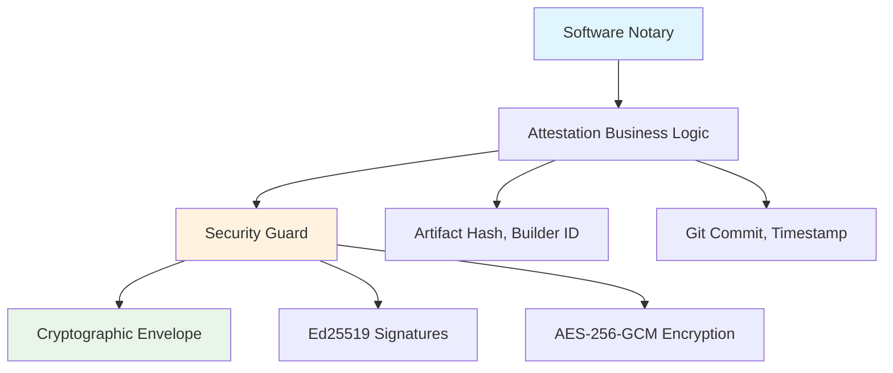

<!--
Copyright (c) 2025 TRUSTEDGE LABS LLC
MPL-2.0: https://mozilla.org/MPL/2.0/
Project: trustedge — Privacy and trust at the edge.
GitHub: https://github.com/TrustEdge-Labs/trustedge
-->

# TrustEdge Attestation

**Cryptographically signed software "birth certificates" for provenance and integrity verification.**

[](https://crates.io/crates/trustedge-attestation)
[](https://docs.rs/trustedge-attestation)
[](https://opensource.org/licenses/MPL-2.0)

---

## Overview

TrustEdge Attestation provides **cryptographically signed software attestations** - essentially "birth certificates" for software artifacts that prove their integrity, provenance, and build context. Think of it as a "Software Notary" that creates tamper-evident records of who built what, when, and from which source code.

### Key Features

- **🔐 Cryptographic Signatures**: Ed25519 digital signatures with hardware-backed keys
- **📦 TrustEdge Envelope Integration**: Sealed attestations using the TrustEdge envelope system
- **🌐 Git Integration**: Captures source commit hash and repository information
- **🏗️ Build Provenance**: Records builder identity and timestamp
- **🛡️ Tamper Evidence**: SHA-256 artifact hashing for integrity verification
- **⚡ Simple API**: Single function call for complete attestation workflow
- **🧪 Production Ready**: Comprehensive test suite with real cryptographic operations

---

## Architecture

The attestation system follows TrustEdge's clean separation of concerns:



### Components

- **Attestation**: Simple data structure capturing artifact metadata and provenance
- **Envelope**: Cryptographic wrapper providing signatures and tamper protection
- **CLI Tools**: `trustedge-attest` and `trustedge-verify` for command-line operations
- **Centralized API**: Single library functions for attestation creation and verification

## Quick Start

### CLI Usage

```bash
# Create an attestation for a binary
trustedge-attest --file target/release/my-app \
                 --builder-id "ci-job-12345" \
                 --output my-app.trst \
                 --verbose

# Verify the attestation
trustedge-verify --artifact target/release/my-app \
                 --attestation-file my-app.trst \
                 --verbose
```

### Library Usage

```rust
use trustedge_attestation::{
    create_signed_attestation, verify_attestation,
    AttestationConfig, VerificationConfig,
    OutputFormat, KeySource
};
use std::path::PathBuf;

// Create an attestation
let config = AttestationConfig {
    artifact_path: PathBuf::from("target/release/my-app"),
    builder_id: "developer@company.com".to_string(),
    output_format: OutputFormat::SealedEnvelope,
    key_source: KeySource::Generate, // Demo mode
};

let result = create_signed_attestation(config)?;

// Write to disk
std::fs::write("my-app.trst", result.serialized_output)?;

// Verify the attestation
let verification_config = VerificationConfig {
    artifact_path: PathBuf::from("target/release/my-app"),
    attestation_path: PathBuf::from("my-app.trst"),
    force_json: false,
};

let verification = verify_attestation(verification_config)?;
println!("Valid: {}", verification.is_valid);
```

## Use Cases

### Release Signing

Create verifiable attestations for software releases:

```bash
# Build and attest a release
cargo build --release
trustedge-attest --file target/release/my-app \
                 --builder-id "release-v1.0.0" \
                 --output releases/my-app-v1.0.0.trst
```

### CI/CD Integration

Integrate into CI pipelines for automated attestation:

```bash
#!/bin/bash
# In CI environment
trustedge-attest --file "$ARTIFACT_PATH" \
                 --builder-id "ci-job-${CI_JOB_ID}" \
                 --output "${ARTIFACT_PATH}.trst" \
                 --verbose

# Upload both artifact and attestation
aws s3 cp "$ARTIFACT_PATH" s3://releases/
aws s3 cp "${ARTIFACT_PATH}.trst" s3://releases/
```

### Supply Chain Verification

Verify software provenance throughout the supply chain:

```bash
# Download artifact and attestation
aws s3 cp s3://releases/my-app ./
aws s3 cp s3://releases/my-app.trst ./

# Verify integrity and provenance
trustedge-verify --artifact my-app --attestation-file my-app.trst --verbose
```

## Data Structures

### Attestation

The core attestation data structure:

```rust
pub struct Attestation {
    /// SHA-256 hash of the artifact being attested to
    pub artifact_hash: String,
    /// Name of the artifact file
    pub artifact_name: String,
    /// Git commit hash from which the artifact was built
    pub source_commit_hash: String,
    /// Identifier for the entity that created the attestation
    pub builder_id: String,
    /// ISO 8601 timestamp of when the attestation was created
    pub timestamp: String,
}
```

### Configuration Types

Configuration for creating attestations:

```rust
pub struct AttestationConfig {
    /// Path to the software artifact to attest
    pub artifact_path: PathBuf,
    /// Builder identifier (e.g., email, CI job ID)
    pub builder_id: String,
    /// Output format for the attestation
    pub output_format: OutputFormat,
    /// Source of cryptographic keys
    pub key_source: KeySource,
}

pub enum OutputFormat {
    /// Plain JSON attestation (no cryptographic envelope)
    JsonOnly,
    /// Cryptographically sealed envelope with attestation
    SealedEnvelope,
}

pub enum KeySource {
    /// Generate ephemeral keys (demo mode)
    Generate,
    /// Use provided signing key (production mode)
    Provided { signing_key: ed25519_dalek::SigningKey },
}
```

## Security Model

### Cryptographic Operations

- **Ed25519 Signatures**: Fast, secure digital signatures for attestation integrity
- **SHA-256 Hashing**: Cryptographic fingerprints of software artifacts
- **AES-256-GCM Encryption**: Envelope encryption for sealed attestations
- **Hardware Integration**: Support for YubiKey and HSM backends (via TrustEdge Core)

### Threat Mitigation

- **Supply Chain Attacks**: Verifiable build provenance linking artifacts to source commits
- **Binary Tampering**: SHA-256 hashing detects any modification to artifacts
- **Replay Attacks**: Timestamps and unique signatures prevent reuse
- **Forgery**: Ed25519 signatures provide non-repudiation

## Command Line Interface

### trustedge-attest

Create cryptographically signed attestations:

```bash
Usage: trustedge-attest [OPTIONS] --file <FILE> --builder-id <BUILDER_ID> --output <OUTPUT>

Options:
  -f, --file <FILE>              Path to the software artifact to attest
  -b, --builder-id <BUILDER_ID>  Builder identifier (e.g., email, CI job ID)
  -o, --output <OUTPUT>          Output file for the attestation (.trst file)
      --backend <BACKEND>        Key management backend [default: software_hsm]
      --key-id <KEY_ID>          Key ID to use for signing [default: attestation_key]
      --use-keyring              Use keyring backend
  -v, --verbose                  Show detailed progress information
      --json-only                Output JSON attestation without envelope
```

### trustedge-verify

Verify attestations against artifacts:

```bash
Usage: trustedge-verify [OPTIONS] --artifact <ARTIFACT> --attestation-file <ATTESTATION_FILE>

Options:
  -a, --artifact <ARTIFACT>                  Path to the software artifact to verify
  -t, --attestation-file <ATTESTATION_FILE>  Path to the attestation file (.trst or .json)
  -v, --verbose                              Show detailed verification information
      --json-input                           Treat attestation file as raw JSON
```

## API Reference

### Main Functions

```rust
/// Create a cryptographically signed software attestation
pub fn create_signed_attestation(config: AttestationConfig) -> Result<AttestationResult>

/// Verify a software attestation against an artifact
pub fn verify_attestation(config: VerificationConfig) -> Result<VerificationResult>
```

See the [API documentation](https://docs.rs/trustedge-attestation) for complete details.

## Installation

Add to your `Cargo.toml`:

```toml
[dependencies]
trustedge-attestation = "0.1"

# For envelope features (cryptographic sealing)
trustedge-attestation = { version = "0.1", features = ["envelope"] }
```

Or install the CLI tools:

```bash
cargo install trustedge-attestation --features envelope
```

---

## License

Licensed under the Mozilla Public License 2.0 (MPL-2.0).
See [LICENSE](../LICENSE) for details.
