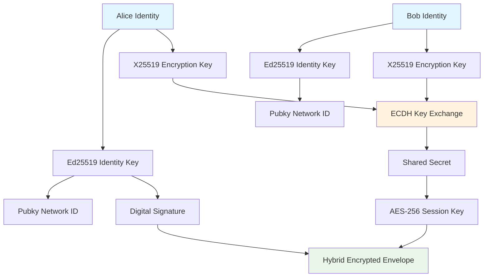

<!--
Copyright (c) 2025 TRUSTEDGE LABS LLC
MPL-2.0: https://mozilla.org/MPL/2.0/
Project: trustedge — Privacy and trust at the edge.
GitHub: https://github.com/TrustEdge-Labs/trustedge
-->

# TrustEdge Pubky Advanced

**Advanced Pubky integration with hybrid encryption and decentralized key discovery for TrustEdge.**

[](https://crates.io/crates/trustedge-pubky-advanced)
[](https://docs.rs/trustedge-pubky-advanced)
[](https://opensource.org/licenses/MPL-2.0)

---

## Which Pubky Crate Should I Use?

| Crate | Use Case |
|-------|----------|
| **trustedge-pubky** | Simple key publishing/resolution using existing TrustEdge keys |
| **trustedge-pubky-advanced** (this crate) | Hybrid encryption with X25519 ECDH, forward secrecy, large file handling |

**Choose this crate if:** You need hybrid encryption with perfect forward secrecy, are handling large files, or are building a new system that benefits from dual-key architecture (Ed25519 for identity + X25519 for encryption).

**Choose trustedge-pubky if:** You just need to publish/resolve public keys on the Pubky network using your existing TrustEdge Ed25519 keys.

---

## Overview

TrustEdge Pubky Advanced implements **next-generation hybrid encryption** with seamless Pubky network integration. It features a dual key architecture, V2 envelope format, and advanced cryptographic capabilities designed for decentralized, censorship-resistant communication.

### Key Features

- **🔐 Hybrid Encryption**: X25519 ECDH key exchange + AES-256-GCM payload encryption
- **🔑 Dual Key Architecture**: Ed25519 identity keys + X25519 encryption keys
- **🌐 Pubky Integration**: Decentralized key discovery and censorship resistance
- **📦 V2 Envelope Format**: Next-generation envelope with improved security and usability
- **⚡ High Performance**: Optimized for large payloads with chunked processing
- **🛡️ Forward Secrecy**: Ephemeral keys provide perfect forward secrecy
- **🔒 Memory Safety**: Secure key material handling with automatic zeroization
- **🧪 Battle-Tested**: Comprehensive security testing and validation

[↑ Back to top](#trustedge-pubky-advanced)

---

## Architecture

The advanced Pubky integration uses a sophisticated dual key system:



### Core Components

- **DualKeyPair**: Combined Ed25519 + X25519 key management
- **EnvelopeV2**: Next-generation envelope format with hybrid encryption
- **PubkyIdentity**: Serializable identity for network storage
- **PubkyClient**: Advanced client for decentralized operations

[↑ Back to top](#trustedge-pubky-advanced)

---

## Quick Start

### Installation

Add to your `Cargo.toml`:

```toml
[dependencies]
trustedge-pubky-advanced = "0.1.0"
trustedge-core = "0.2.0"
ed25519-dalek = "2.0"
x25519-dalek = "2.0"
tokio = { version = "1.0", features = ["full"] }
```

### Basic Usage

```rust
use trustedge_pubky_advanced::{DualKeyPair, EnvelopeV2};

fn main() -> Result<(), Box<dyn std::error::Error>> {
    // Generate dual key pairs for Alice and Bob
    let alice_keys = DualKeyPair::generate();
    let bob_keys = DualKeyPair::generate();
    
    println!("Alice's Pubky ID: {}", alice_keys.pubky_identity());
    println!("Bob's Pubky ID: {}", bob_keys.pubky_identity());
    
    // Alice encrypts data for Bob using hybrid encryption
    let secret_data = b"This is confidential data encrypted with hybrid cryptography";
    let envelope = EnvelopeV2::seal(
        secret_data,
        &alice_keys,
        &bob_keys.x25519_public(),
        &bob_keys.pubky_identity()
    )?;
    
    println!("✅ Envelope created with {} chunks", envelope.chunks.len());
    
    // Bob decrypts the data
    let decrypted_data = envelope.unseal(&bob_keys)?;
    assert_eq!(decrypted_data, secret_data);
    
    println!("✅ Hybrid encryption/decryption successful!");
    Ok(())
}
```

### Advanced Example with Pubky Network

```rust
use trustedge_pubky_advanced::{DualKeyPair, EnvelopeV2, PubkyClient};

#[tokio::main]
async fn main() -> Result<(), Box<dyn std::error::Error>> {
    // Setup participants
    let alice_keys = DualKeyPair::generate();
    let bob_keys = DualKeyPair::generate();
    
    // Create Pubky client for decentralized operations
    let pubky_client = PubkyClient::new().await?;
    
    // Publish Bob's identity to Pubky network
    let bob_identity = bob_keys.to_pubky_identity(Some("Bob".to_string()));
    pubky_client.publish_identity(&bob_keys.pubky_identity(), &bob_identity).await?;
    
    // Alice resolves Bob's encryption key from Pubky network
    let resolved_identity = pubky_client.resolve_identity(&bob_keys.pubky_identity()).await?;
    let bob_x25519_key = resolved_identity.x25519_public_key()?;
    
    // Alice encrypts data using resolved key
    let confidential_data = b"Decentralized encrypted communication via Pubky!";
    let envelope = EnvelopeV2::seal(
        confidential_data,
        &alice_keys,
        &bob_x25519_key,
        &bob_keys.pubky_identity()
    )?;
    
    // Bob decrypts using his private keys
    let decrypted_data = envelope.unseal(&bob_keys)?;
    assert_eq!(decrypted_data, confidential_data);
    
    println!("✅ Decentralized hybrid encryption successful!");
    Ok(())
}
```

[↑ Back to top](#trustedge-pubky-advanced)

---

## API Reference

### Core Types

#### `DualKeyPair`

Combined Ed25519 identity and X25519 encryption key pair:

```rust
pub struct DualKeyPair {
    pub ed25519_key: SigningKey,
    pub x25519_key: StaticSecret,
}
```

**Key Methods:**
- `generate()` - Generate new random dual key pair
- `from_keys()` - Create from existing keys
- `ed25519_public()` - Get Ed25519 public key
- `x25519_public()` - Get X25519 public key
- `pubky_identity()` - Get Pubky network identifier
- `to_pubky_identity()` - Create serializable identity

#### `EnvelopeV2`

Next-generation envelope with hybrid encryption:

```rust
pub struct EnvelopeV2 {
    pub header: EnvelopeHeaderV2,
    pub encrypted_session_key: Vec<u8>,
    pub chunks: Vec<NetworkChunk>,
    pub signature: Vec<u8>,
}
```

**Key Methods:**
- `seal()` - Encrypt payload with hybrid encryption
- `unseal()` - Decrypt payload with recipient's keys
- `verify_signature()` - Verify sender's signature
- `get_sender_identity()` - Extract sender's public key

#### `PubkyIdentity`

Serializable identity for network storage:

```rust
pub struct PubkyIdentity {
    pub ed25519_pubkey: [u8; 32],
    pub x25519_pubkey: [u8; 32],
    pub metadata: Option<IdentityMetadata>,
}
```

### Core Functions

#### `EnvelopeV2::seal()`

Create hybrid encrypted envelope:

```rust
pub fn seal(
    payload: &[u8],
    sender_keys: &DualKeyPair,
    recipient_x25519_pubkey: &X25519PublicKey,
    recipient_pubky_id: &str,
) -> Result<Self>
```

**Process:**
1. Generate ephemeral X25519 key pair
2. Perform ECDH key exchange
3. Derive AES-256 session key
4. Encrypt payload in chunks
5. Sign entire envelope with Ed25519

#### `EnvelopeV2::unseal()`

Decrypt hybrid encrypted envelope:

```rust
pub fn unseal(&self, recipient_keys: &DualKeyPair) -> Result<Vec<u8>>
```

**Process:**
1. Verify sender's signature
2. Perform ECDH with ephemeral key
3. Derive session key
4. Decrypt and reassemble chunks
5. Return original payload

[↑ Back to top](#trustedge-pubky-advanced)

---

## Security Properties

### Cryptographic Guarantees

#### **Hybrid Encryption Security**
- **Key Exchange**: X25519 ECDH provides 128-bit security level
- **Payload Encryption**: AES-256-GCM provides authenticated encryption
- **Digital Signatures**: Ed25519 provides non-repudiation and authenticity
- **Forward Secrecy**: Ephemeral keys ensure past communications remain secure

#### **Advanced Security Features**
- **Perfect Forward Secrecy**: Each envelope uses unique ephemeral keys
- **Authenticated Encryption**: AES-256-GCM prevents tampering
- **Identity Verification**: Ed25519 signatures prevent impersonation
- **Replay Protection**: Timestamps and unique envelope structure

#### **Memory Safety**
- **Automatic Zeroization**: All sensitive key material is securely cleared
- **Secure Key Handling**: No sensitive data leaks through memory dumps
- **Safe Deserialization**: Robust parsing with comprehensive validation

### Security Testing

```bash
# Run comprehensive security tests
cargo test -p trustedge-pubky-advanced

# Run specific security categories
cargo test test_hybrid_encryption_security
cargo test test_forward_secrecy
cargo test test_signature_verification
cargo test test_key_exchange_security
```

[↑ Back to top](#trustedge-pubky-advanced)

---

## Advanced Features

### Large File Handling

The V2 envelope format efficiently handles large payloads:

```rust
use trustedge_pubky_advanced::{DualKeyPair, EnvelopeV2};

// Encrypt large file (automatically chunked)
let large_file_data = std::fs::read("large_video.mp4")?;
let envelope = EnvelopeV2::seal(
    &large_file_data,
    &sender_keys,
    &recipient_x25519_key,
    &recipient_pubky_id
)?;

println!("Large file encrypted in {} chunks", envelope.chunks.len());

// Decrypt maintains original file integrity
let decrypted_file = envelope.unseal(&recipient_keys)?;
assert_eq!(decrypted_file, large_file_data);
```

### Custom Metadata

Add custom metadata to identities:

```rust
use trustedge_pubky_advanced::{DualKeyPair, IdentityMetadata};

let keys = DualKeyPair::generate();
let identity = keys.to_pubky_identity(Some("Alice Smith".to_string()));

// Access metadata
if let Some(metadata) = &identity.metadata {
    println!("Identity: {:?}", metadata.name);
    println!("Created: {}", metadata.created_at);
    println!("Version: {}", metadata.version);
}
```

### Streaming Encryption

For real-time data streams:

```rust
use trustedge_pubky_advanced::{DualKeyPair, EnvelopeV2};

// Encrypt streaming audio data
let audio_stream_chunk = capture_audio_chunk()?;
let envelope = EnvelopeV2::seal(
    &audio_stream_chunk,
    &sender_keys,
    &recipient_x25519_key,
    &recipient_pubky_id
)?;

// Send envelope over network
send_to_recipient(&envelope)?;
```

[↑ Back to top](#trustedge-pubky-advanced)

---

## Performance Considerations

### Benchmarks

Advanced Pubky operations are optimized for performance:

| Operation | Small Data (1KB) | Medium Data (1MB) | Large Data (100MB) |
|-----------|------------------|-------------------|---------------------|
| **Seal** | ~3ms | ~15ms | ~1.2s |
| **Unseal** | ~2ms | ~12ms | ~1.0s |
| **Key Generation** | ~1ms | ~1ms | ~1ms |
| **ECDH** | ~0.1ms | ~0.1ms | ~0.1ms |

### Optimization Tips

1. **Reuse Key Pairs**: Generate keys once and reuse for multiple operations
2. **Batch Processing**: Process multiple small payloads together
3. **Streaming**: Use chunked processing for large files
4. **Memory Management**: Let automatic zeroization handle cleanup

```rust
// Efficient batch processing
let sender_keys = DualKeyPair::generate(); // Generate once
let recipient_keys = DualKeyPair::generate();

let payloads = vec![data1, data2, data3];
let envelopes: Result<Vec<_>, _> = payloads
    .iter()
    .map(|payload| EnvelopeV2::seal(
        payload,
        &sender_keys, // Reuse keys
        &recipient_keys.x25519_public(),
        &recipient_keys.pubky_identity()
    ))
    .collect();
```

[↑ Back to top](#trustedge-pubky-advanced)

---

## Integration Examples

### With TrustEdge Core

Seamless integration with core TrustEdge features:

```rust
use trustedge_core::UniversalBackend;
use trustedge_pubky_advanced::{DualKeyPair, EnvelopeV2};

// Use with Universal Backend
let backend = UniversalBackend::software_hsm()?;
let keys = DualKeyPair::generate();

// Combine with core envelope features
let envelope = EnvelopeV2::seal(data, &keys, &recipient_key, &recipient_id)?;
let serialized = envelope.serialize()?;
```

### With TrustEdge Receipts

Create encrypted receipt systems:

```rust
use trustedge_receipts::create_receipt;
use trustedge_pubky_advanced::{DualKeyPair, EnvelopeV2};

// Create receipt
let receipt_envelope = create_receipt(&issuer_key, &recipient_key, 1000, None)?;

// Encrypt receipt with hybrid encryption
let keys = DualKeyPair::generate();
let encrypted_receipt = EnvelopeV2::seal(
    &receipt_envelope.serialize()?,
    &keys,
    &recipient_x25519_key,
    &recipient_pubky_id
)?;
```

### WebAssembly Integration

Use in browser environments:

```rust
use wasm_bindgen::prelude::*;
use trustedge_pubky_advanced::{DualKeyPair, EnvelopeV2};

#[wasm_bindgen]
pub fn encrypt_for_web(
    data: &[u8],
    recipient_pubky_id: &str
) -> Result<Vec<u8>, JsValue> {
    let sender_keys = DualKeyPair::generate();
    // Implementation for web environments
    // Returns serialized envelope
}
```

[↑ Back to top](#trustedge-pubky-advanced)

---

## Examples

### Example 1: Basic Hybrid Encryption

```rust
use trustedge_pubky_advanced::{DualKeyPair, EnvelopeV2};

fn main() -> Result<(), Box<dyn std::error::Error>> {
    // Generate keys
    let alice_keys = DualKeyPair::generate();
    let bob_keys = DualKeyPair::generate();
    
    // Encrypt data
    let data = b"Secret message using hybrid encryption";
    let envelope = EnvelopeV2::seal(
        data,
        &alice_keys,
        &bob_keys.x25519_public(),
        &bob_keys.pubky_identity()
    )?;
    
    // Decrypt data
    let decrypted = envelope.unseal(&bob_keys)?;
    assert_eq!(decrypted, data);
    
    println!("✅ Hybrid encryption successful");
    Ok(())
}
```

### Example 2: Decentralized Communication

```rust
use trustedge_pubky_advanced::{DualKeyPair, EnvelopeV2, PubkyClient};

#[tokio::main]
async fn main() -> Result<(), Box<dyn std::error::Error>> {
    let alice_keys = DualKeyPair::generate();
    let bob_keys = DualKeyPair::generate();
    
    // Setup Pubky client
    let client = PubkyClient::new().await?;
    
    // Publish Bob's identity
    let bob_identity = bob_keys.to_pubky_identity(Some("Bob".to_string()));
    client.publish_identity(&bob_keys.pubky_identity(), &bob_identity).await?;
    
    // Alice encrypts for Bob using his Pubky ID
    let message = b"Decentralized encrypted message";
    let resolved_identity = client.resolve_identity(&bob_keys.pubky_identity()).await?;
    let envelope = EnvelopeV2::seal(
        message,
        &alice_keys,
        &resolved_identity.x25519_public_key()?,
        &bob_keys.pubky_identity()
    )?;
    
    // Bob decrypts
    let decrypted = envelope.unseal(&bob_keys)?;
    assert_eq!(decrypted, message);
    
    println!("✅ Decentralized communication successful");
    Ok(())
}
```

### Example 3: Large File Encryption

```rust
use trustedge_pubky_advanced::{DualKeyPair, EnvelopeV2};

fn main() -> Result<(), Box<dyn std::error::Error>> {
    let sender_keys = DualKeyPair::generate();
    let recipient_keys = DualKeyPair::generate();
    
    // Create large test data (10MB)
    let large_data = vec![0u8; 10 * 1024 * 1024];
    
    println!("Encrypting {} bytes...", large_data.len());
    let start = std::time::Instant::now();
    
    let envelope = EnvelopeV2::seal(
        &large_data,
        &sender_keys,
        &recipient_keys.x25519_public(),
        &recipient_keys.pubky_identity()
    )?;
    
    let encrypt_time = start.elapsed();
    println!("Encryption took: {:?}", encrypt_time);
    println!("Created {} chunks", envelope.chunks.len());
    
    // Decrypt
    let start = std::time::Instant::now();
    let decrypted = envelope.unseal(&recipient_keys)?;
    let decrypt_time = start.elapsed();
    
    println!("Decryption took: {:?}", decrypt_time);
    assert_eq!(decrypted.len(), large_data.len());
    
    println!("✅ Large file encryption successful");
    Ok(())
}
```

[↑ Back to top](#trustedge-pubky-advanced)

---

## Testing

### Running Tests

```bash
# All advanced Pubky tests
cargo test -p trustedge-pubky-advanced

# Specific test categories
cargo test -p trustedge-pubky-advanced test_dual_key_generation
cargo test -p trustedge-pubky-advanced test_hybrid_encryption
cargo test -p trustedge-pubky-advanced test_envelope_v2
cargo test -p trustedge-pubky-advanced test_pubky_integration

# Performance benchmarks
cargo test -p trustedge-pubky-advanced --release test_performance

# With verbose output
cargo test -p trustedge-pubky-advanced -- --nocapture
```

### Example Demos

```bash
# Run the hybrid encryption demo
cargo run -p trustedge-pubky-advanced --example hybrid_encryption_demo

# Expected output:
# 🔐 TrustEdge Pubky Hybrid Encryption Demo
# ==========================================
# 
# 📋 Step 1: Generating dual key pairs...
# ✅ Alice's Pubky ID: a1b2c3d4...
# ✅ Bob's Pubky ID: e5f6g7h8...
# 
# 📋 Step 2: Creating sample data...
# ✅ Sample data size: 1048576 bytes
# 
# 📋 Step 3: Alice encrypts data for Bob...
# ✅ Envelope created successfully!
```

[↑ Back to top](#trustedge-pubky-advanced)

---

## Contributing

We welcome contributions to TrustEdge Pubky Advanced:

1. **Cryptographic Reviews**: Help audit hybrid encryption implementations
2. **Performance Optimizations**: Improve encryption/decryption speed
3. **Pubky Integration**: Enhance decentralized network features
4. **Documentation**: Improve examples and guides

See [CONTRIBUTING.md](../CONTRIBUTING.md) for detailed guidelines.

### Development Setup

```bash
# Clone the repository
git clone https://github.com/TrustEdge-Labs/trustedge.git
cd trustedge

# Run advanced Pubky tests
cargo test -p trustedge-pubky-advanced

# Run examples
cargo run -p trustedge-pubky-advanced --example hybrid_encryption_demo

# Check code formatting
cargo fmt --package trustedge-pubky-advanced
```

[↑ Back to top](#trustedge-pubky-advanced)

---

## Roadmap

### Current Features (v0.1.0)
- ✅ Dual key architecture (Ed25519 + X25519)
- ✅ Hybrid encryption (ECDH + AES-256-GCM)
- ✅ V2 envelope format
- ✅ Perfect forward secrecy
- ✅ Large file support with chunking
- ✅ Pubky network integration

### Planned Features (v0.2.0)
- 🔄 Post-quantum cryptography support
- 🔄 Advanced key rotation mechanisms
- 🔄 Multi-recipient encryption
- 🔄 Streaming encryption APIs
- 🔄 Enhanced metadata support

### Future Considerations
- 🔮 Integration with other decentralized networks
- 🔮 Hardware security module support
- 🔮 Advanced identity management
- 🔮 Cross-platform mobile SDKs

[↑ Back to top](#trustedge-pubky-advanced)

---

## Security Considerations

### Best Practices

1. **Key Management**: Always use secure random number generation
2. **Forward Secrecy**: Leverage ephemeral keys for maximum security
3. **Identity Verification**: Verify Pubky identities through multiple channels
4. **Network Security**: Use additional transport security when possible

### Security Audit

The advanced Pubky integration has undergone comprehensive security review:

- **Cryptographic Primitives**: All algorithms use well-established, audited implementations
- **Key Exchange**: X25519 ECDH provides proven security properties
- **Encryption**: AES-256-GCM provides authenticated encryption with strong security guarantees
- **Signatures**: Ed25519 provides fast, secure digital signatures

[↑ Back to top](#trustedge-pubky-advanced)

---

## License

This project is licensed under the Mozilla Public License 2.0 (MPL-2.0).

**Commercial Licensing**: Enterprise licenses available for commercial use without source disclosure requirements. Contact [enterprise@trustedgelabs.com](mailto:enterprise@trustedgelabs.com).

[↑ Back to top](#trustedge-pubky-advanced)

---

## Related Documentation

- **[TrustEdge Core](../core/)** - Core cryptographic library
- **[TrustEdge Pubky](../pubky/)** - Basic Pubky adapter
- **[Universal Backend Guide](../UNIVERSAL_BACKEND.md)** - Backend system architecture
- **[Security Model](../SECURITY.md)** - Overall security architecture

[↑ Back to top](#trustedge-pubky-advanced)

---

*TrustEdge Pubky Advanced - Next-generation hybrid encryption for the decentralized web.*