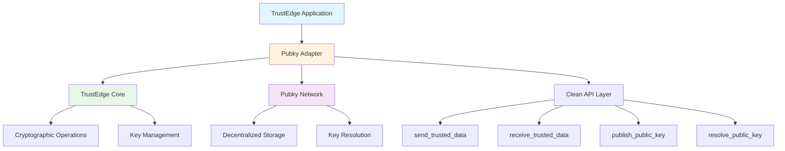

<!--
Copyright (c) 2025 TRUSTEDGE LABS LLC
MPL-2.0: https://mozilla.org/MPL/2.0/
Project: trustedge — Privacy and trust at the edge.
GitHub: https://github.com/TrustEdge-Labs/trustedge
-->

# TrustEdge Pubky Adapter

**Clean bridge between TrustEdge core cryptographic functions and the Pubky decentralized network.**

[](https://crates.io/crates/trustedge-pubky)
[](https://docs.rs/trustedge-pubky)
[](https://opensource.org/licenses/MPL-2.0)

---

## Overview

TrustEdge Pubky Adapter provides a **clean, simple bridge** between TrustEdge's core cryptographic primitives and the Pubky decentralized network. It maintains clean architecture by keeping Pubky network logic separate from core crypto operations while enabling seamless integration.

### Key Features

- **🌐 Decentralized Key Discovery**: Publish and resolve TrustEdge public keys via Pubky network
- **🔗 Clean Architecture**: Maintains separation between crypto primitives and network operations
- **🚀 Simple API**: Easy-to-use functions for common Pubky integration patterns
- **⚡ Async/Sync Support**: Both asynchronous and synchronous operation modes
- **🔐 Universal Backend Integration**: Works with TrustEdge's Universal Backend system
- **📋 Key Management**: Automatic serialization and deserialization of TrustEdge keys
- **🛡️ Error Handling**: Comprehensive error types for network and crypto operations
- **🧪 Mock Support**: Built-in mock backend for testing and development

---

## Architecture

The adapter follows a clean separation of concerns:



### Design Principles

- **Separation of Concerns**: Network logic stays separate from crypto primitives
- **Clean Interfaces**: Simple, intuitive API for common operations
- **Error Transparency**: Clear error handling and propagation
- **Testability**: Mock support for development and testing
- **Performance**: Efficient async operations with sync fallbacks

---

## Quick Start

### Installation

Add to your `Cargo.toml`:

```toml
[dependencies]
trustedge-pubky = "0.1.0"
trustedge-core = "0.2.0"
pubky = "0.1"
tokio = { version = "1.0", features = ["full"] }
```

### Basic Usage

```rust
use trustedge_pubky::{PubkyBackend, create_pubky_backend_random};
use trustedge_core::{KeyPair, AsymmetricAlgorithm};

#[tokio::main]
async fn main() -> Result<(), Box<dyn std::error::Error>> {
    // Create Pubky adapters for Alice and Bob
    let alice_adapter = create_pubky_backend_random()?;
    let bob_adapter = create_pubky_backend_random()?;
    
    // Generate TrustEdge key pairs
    let alice_keypair = KeyPair::generate(AsymmetricAlgorithm::Ed25519)?;
    let bob_keypair = KeyPair::generate(AsymmetricAlgorithm::Ed25519)?;
    
    // Publish public keys to Pubky network
    let alice_pubky_id = alice_adapter.publish_public_key(&alice_keypair.public).await?;
    let bob_pubky_id = bob_adapter.publish_public_key(&bob_keypair.public).await?;
    
    println!("✅ Alice's Pubky ID: {}", alice_pubky_id);
    println!("✅ Bob's Pubky ID: {}", bob_pubky_id);
    
    // Resolve Bob's public key from his Pubky ID
    let resolved_key = alice_adapter.resolve_public_key(&bob_pubky_id).await?;
    assert_eq!(resolved_key.key_bytes, bob_keypair.public.key_bytes);
    
    println!("✅ Successfully resolved Bob's key from Pubky network");
    Ok(())
}
```

### High-Level API

For common patterns, use the simplified high-level functions:

```rust
use trustedge_pubky::{send_trusted_data, receive_trusted_data};

// Alice sends encrypted data to Bob via Pubky resolution
let encrypted_envelope = send_trusted_data(
    b"Secret message for Bob",
    &alice_keypair.private,
    &bob_pubky_id,
    &alice_adapter
).await?;

// Bob receives and decrypts the data
let decrypted_data = receive_trusted_data(
    &encrypted_envelope,
    &bob_keypair.private,
    &bob_adapter
).await?;

assert_eq!(decrypted_data, b"Secret message for Bob");
```

---

## API Reference

### Core Types

#### `PubkyBackend`

The main adapter providing Pubky network integration:

```rust
pub struct PubkyBackend {
    client: Client,
    keypair: Keypair,
    runtime: Runtime,
}
```

**Key Methods:**
- `new()` - Create backend with existing Pubky keypair (async)
- `new_sync()` - Create backend synchronously
- `publish_public_key()` - Publish TrustEdge key to network
- `resolve_public_key()` - Resolve Pubky ID to TrustEdge key
- `our_pubky_id()` - Get our Pubky network identifier

#### `TrustEdgeKeyRecord`

Serializable record for storing TrustEdge keys in Pubky network:

```rust
pub struct TrustEdgeKeyRecord {
    pub public_key: PublicKeyData,
    pub created_at: u64,
    pub metadata: Option<HashMap<String, String>>,
}
```

#### `PubkyAdapterError`

Comprehensive error handling for adapter operations:

```rust
pub enum PubkyAdapterError {
    Network(anyhow::Error),
    KeyResolutionFailed(String),
    InvalidPubkyId(String),
    CoreError(trustedge_core::TrustEdgeError),
    SerializationError(serde_json::Error),
}
```

### Core Functions

#### `create_pubky_backend_random()`

Creates a new Pubky backend with random keypair:

```rust
pub fn create_pubky_backend_random() -> Result<PubkyBackend, PubkyAdapterError>
```

#### `send_trusted_data()`

High-level function to encrypt and send data via Pubky resolution:

```rust
pub async fn send_trusted_data(
    data: &[u8],
    sender_private_key: &PrivateKey,
    recipient_pubky_id: &str,
    pubky_backend: &PubkyBackend,
) -> Result<Envelope, PubkyAdapterError>
```

#### `receive_trusted_data()`

High-level function to receive and decrypt data:

```rust
pub async fn receive_trusted_data(
    envelope: &Envelope,
    recipient_private_key: &PrivateKey,
    pubky_backend: &PubkyBackend,
) -> Result<Vec<u8>, PubkyAdapterError>
```

---

## Examples

### Example 1: Key Publishing and Resolution

```rust
use trustedge_pubky::{PubkyBackend, create_pubky_backend_random};
use trustedge_core::{KeyPair, AsymmetricAlgorithm};

#[tokio::main]
async fn main() -> Result<(), Box<dyn std::error::Error>> {
    // Create adapter
    let adapter = create_pubky_backend_random()?;
    
    // Generate TrustEdge keypair
    let keypair = KeyPair::generate(AsymmetricAlgorithm::Ed25519)?;
    
    // Publish to network
    let pubky_id = adapter.publish_public_key(&keypair.public).await?;
    println!("Published key with Pubky ID: {}", pubky_id);
    
    // Resolve from network
    let resolved_key = adapter.resolve_public_key(&pubky_id).await?;
    assert_eq!(resolved_key.key_bytes, keypair.public.key_bytes);
    
    println!("✅ Key resolution successful");
    Ok(())
}
```

### Example 2: Encrypted Communication

```rust
use trustedge_pubky::{send_trusted_data, receive_trusted_data, create_pubky_backend_random};
use trustedge_core::{KeyPair, AsymmetricAlgorithm};

#[tokio::main]
async fn main() -> Result<(), Box<dyn std::error::Error>> {
    // Setup participants
    let alice_adapter = create_pubky_backend_random()?;
    let bob_adapter = create_pubky_backend_random()?;
    
    let alice_keypair = KeyPair::generate(AsymmetricAlgorithm::Ed25519)?;
    let bob_keypair = KeyPair::generate(AsymmetricAlgorithm::Ed25519)?;
    
    // Publish Bob's key
    let bob_pubky_id = bob_adapter.publish_public_key(&bob_keypair.public).await?;
    
    // Alice sends encrypted message to Bob
    let message = b"Hello Bob! This is encrypted via Pubky resolution.";
    let encrypted_envelope = send_trusted_data(
        message,
        &alice_keypair.private,
        &bob_pubky_id,
        &alice_adapter
    ).await?;
    
    // Bob receives and decrypts
    let decrypted_message = receive_trusted_data(
        &encrypted_envelope,
        &bob_keypair.private,
        &bob_adapter
    ).await?;
    
    assert_eq!(decrypted_message, message);
    println!("✅ Encrypted communication successful");
    Ok(())
}
```

### Example 3: Synchronous Operations

```rust
use trustedge_pubky::create_pubky_backend_random;
use trustedge_core::{KeyPair, AsymmetricAlgorithm};

fn main() -> Result<(), Box<dyn std::error::Error>> {
    // Create adapter (sync)
    let adapter = create_pubky_backend_random()?;
    let keypair = KeyPair::generate(AsymmetricAlgorithm::Ed25519)?;
    
    // Use sync methods
    let pubky_id = adapter.our_pubky_id();
    println!("Our Pubky ID: {}", pubky_id);
    
    // Resolve key synchronously
    let resolved_key = adapter.resolve_public_key_sync(&pubky_id)?;
    println!("✅ Sync resolution successful");
    Ok(())
}
```

---

## Integration with TrustEdge Core

### Universal Backend Integration

The Pubky adapter integrates with TrustEdge's Universal Backend system:

```rust
use trustedge_core::backends::UniversalBackend;
use trustedge_pubky::PubkyBackend;

// Create Pubky backend
let pubky_backend = create_pubky_backend_random()?;

// Use with Universal Backend registry
let mut registry = UniversalBackend::registry();
registry.register_backend("pubky", Box::new(pubky_backend));

// Perform operations through registry
let result = registry.perform_operation("pubky", "key_1", operation)?;
```

### With TrustEdge Receipts

Combine with the receipt system for decentralized receipt management:

```rust
use trustedge_receipts::create_receipt;
use trustedge_pubky::{send_trusted_data, create_pubky_backend_random};

// Create receipt
let receipt_envelope = create_receipt(&alice_key, &bob_key.verifying_key(), 1000, None)?;

// Send via Pubky network
let adapter = create_pubky_backend_random()?;
let transmitted_envelope = send_trusted_data(
    &receipt_envelope.serialize()?,
    &alice_keypair.private,
    &bob_pubky_id,
    &adapter
).await?;
```

---

## Testing and Development

### Mock Backend

For testing and development, use the built-in mock backend:

```rust
use trustedge_pubky::mock::MockPubkyBackend;

#[tokio::test]
async fn test_key_resolution() {
    let mock_backend = MockPubkyBackend::new();
    
    // Mock will simulate network operations
    let keypair = KeyPair::generate(AsymmetricAlgorithm::Ed25519)?;
    let pubky_id = mock_backend.publish_public_key(&keypair.public).await?;
    let resolved_key = mock_backend.resolve_public_key(&pubky_id).await?;
    
    assert_eq!(resolved_key.key_bytes, keypair.public.key_bytes);
}
```

### Running Examples

```bash
# Run the clean adapter demo
cargo run --example clean_adapter_demo

# Run the simple demo
cargo run --example simple_demo

# Run the exact API demo
cargo run --example your_exact_api
```

### Testing

```bash
# Run all tests
cargo test -p trustedge-pubky

# Run with network features (requires network access)
cargo test -p trustedge-pubky --features network-tests

# Run specific test categories
cargo test -p trustedge-pubky test_key_resolution
cargo test -p trustedge-pubky test_encrypted_communication
```

---

## Performance Considerations

### Network Operations

Pubky network operations are inherently network-bound:

| Operation | Typical Time | Notes |
|-----------|--------------|-------|
| Publish Key | 100-500ms | Depends on network conditions |
| Resolve Key | 50-200ms | Cached after first resolution |
| Send Data | 200-800ms | Includes key resolution + encryption |
| Receive Data | 100-300ms | Decryption is local |

### Optimization Tips

1. **Cache Resolved Keys**: Store resolved keys locally to avoid repeated network calls
2. **Batch Operations**: Group multiple operations when possible
3. **Async Operations**: Use async methods for better concurrency
4. **Connection Pooling**: Reuse Pubky client connections

```rust
// Efficient key caching
use std::collections::HashMap;

struct KeyCache {
    cache: HashMap<String, PublicKey>,
    adapter: PubkyBackend,
}

impl KeyCache {
    async fn get_key(&mut self, pubky_id: &str) -> Result<&PublicKey, PubkyAdapterError> {
        if !self.cache.contains_key(pubky_id) {
            let key = self.adapter.resolve_public_key(pubky_id).await?;
            self.cache.insert(pubky_id.to_string(), key);
        }
        Ok(self.cache.get(pubky_id).unwrap())
    }
}
```

---

## Error Handling

The adapter provides comprehensive error handling:

```rust
use trustedge_pubky::{PubkyAdapterError, resolve_public_key};

match resolve_public_key(&invalid_pubky_id).await {
    Ok(key) => println!("Resolved key: {:?}", key),
    Err(PubkyAdapterError::Network(e)) => {
        eprintln!("Network error: {}", e);
        // Handle network issues (retry, fallback, etc.)
    },
    Err(PubkyAdapterError::KeyResolutionFailed(id)) => {
        eprintln!("Failed to resolve key for ID: {}", id);
        // Handle missing keys
    },
    Err(PubkyAdapterError::InvalidPubkyId(id)) => {
        eprintln!("Invalid Pubky ID format: {}", id);
        // Handle malformed IDs
    },
    Err(e) => eprintln!("Other error: {}", e),
}
```

---

## Security Considerations

### Network Security

- **Key Authenticity**: Always verify resolved keys match expected values
- **Network Trust**: Pubky network provides decentralized trust, but validate critical operations
- **Replay Protection**: Use TrustEdge's built-in replay protection for sensitive operations

### Best Practices

```rust
// Always verify critical key resolutions
let resolved_key = adapter.resolve_public_key(&pubky_id).await?;
if let Some(expected_fingerprint) = known_fingerprints.get(&pubky_id) {
    let actual_fingerprint = resolved_key.fingerprint();
    if actual_fingerprint != *expected_fingerprint {
        return Err(PubkyAdapterError::KeyResolutionFailed(
            "Key fingerprint mismatch".to_string()
        ));
    }
}
```

---

## Contributing

We welcome contributions to the TrustEdge Pubky Adapter:

1. **Network Optimizations**: Improve performance and reliability
2. **Additional Backends**: Support for other decentralized networks
3. **Testing**: Add more comprehensive test scenarios
4. **Documentation**: Improve examples and guides

See [CONTRIBUTING.md](../CONTRIBUTING.md) for detailed guidelines.

### Development Setup

```bash
# Clone the repository
git clone https://github.com/TrustEdge-Labs/trustedge.git
cd trustedge

# Run Pubky adapter tests
cargo test -p trustedge-pubky

# Run examples
cargo run -p trustedge-pubky --example clean_adapter_demo

# Check code formatting
cargo fmt --package trustedge-pubky
```

---

## Roadmap

### Current Features (v0.1.0)
- ✅ Basic key publishing and resolution
- ✅ High-level send/receive API
- ✅ Async/sync operation support
- ✅ Mock backend for testing
- ✅ Universal Backend integration

### Planned Features (v0.2.0)
- 🔄 Key caching and optimization
- 🔄 Batch operations support
- 🔄 Advanced metadata handling
- 🔄 Connection pooling
- 🔄 Metrics and monitoring

### Future Considerations
- 🔮 Support for additional decentralized networks
- 🔮 Advanced key rotation mechanisms
- 🔮 Integration with decentralized identity systems
- 🔮 Performance optimizations for high-throughput scenarios

---

## License

This project is licensed under the Mozilla Public License 2.0 (MPL-2.0).

**Commercial Licensing**: Enterprise licenses available for commercial use without source disclosure requirements. Contact [enterprise@trustedgelabs.com](mailto:enterprise@trustedgelabs.com).

---

## Related Documentation

- **[TrustEdge Core](../trustedge-core/)** - Core cryptographic library
- **[TrustEdge Pubky Advanced](../trustedge-pubky-advanced/)** - Advanced Pubky integration features
- **[Universal Backend Guide](../UNIVERSAL_BACKEND.md)** - Backend system architecture
- **[Examples](../EXAMPLES.md)** - Real-world usage scenarios

---

*TrustEdge Pubky Adapter - Bridging cryptographic privacy with decentralized networks.*