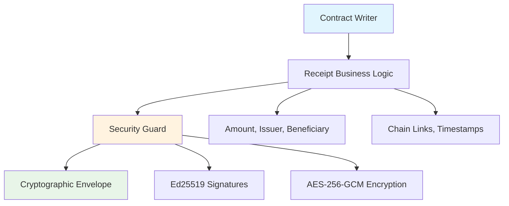

<!--
Copyright (c) 2025 TRUSTEDGE LABS LLC
MPL-2.0: https://mozilla.org/MPL/2.0/
Project: trustedge — Privacy and trust at the edge.
GitHub: https://github.com/TrustEdge-Labs/trustedge
-->

# TrustEdge Receipts

**Cryptographically secure digital receipt system with transferable ownership chains.**

[](https://crates.io/crates/trustedge-receipts)
[](https://docs.rs/trustedge-receipts)
[](https://opensource.org/licenses/MPL-2.0)

---

## Overview

TrustEdge Receipts implements a **production-ready digital receipt system** that enables cryptographically secure ownership transfer of digital assets. Think of it as the "Contract Writer" in an office analogy - it handles the business logic of transferable claims while the "Security Guard" (trustedge-core) handles all cryptographic operations.

### Key Features

- **🔐 Real Cryptography**: AES-256-GCM encryption with PBKDF2-HMAC-SHA256 key derivation (100,000 iterations)
- **📋 Transferable Receipts**: Create and assign receipts with cryptographic ownership chains
- **🔗 Chain Integrity**: Each assignment links to previous receipt with cryptographic hash binding
- **💰 Amount Preservation**: Receipt amounts are cryptographically protected through the chain
- **🛡️ Attack Resistance**: Comprehensive security against tampering, replay, and forgery attacks
- **🧪 Battle-Tested**: 23 security tests covering cryptographic isolation and attack scenarios
- **⚡ Ed25519 Signatures**: Fast, secure digital signatures for authentication
- **🔄 Chain Validation**: Built-in verification of ownership chains

---

## Architecture

The receipt system follows a clean separation of concerns:



### Components

- **Receipt**: Business logic container with amount, issuer, beneficiary, and chain links
- **Envelope**: Cryptographic wrapper providing encryption, signatures, and tamper protection
- **Chain Validation**: Verification of ownership transfer sequences
- **Security Properties**: Cryptographic isolation, replay protection, and integrity guarantees

---

## Quick Start

### Installation

Add to your `Cargo.toml`:

```toml
[dependencies]
trustedge-receipts = "0.1.0"
trustedge-core = "0.2.0"
ed25519-dalek = "2.0"
rand = "0.8"
```

### Basic Usage

```rust
use trustedge_receipts::{create_receipt, assign_receipt, extract_receipt};
use ed25519_dalek::SigningKey;
use rand::rngs::OsRng;

// Create signing keys for our participants
let alice_key = SigningKey::generate(&mut OsRng);
let bob_key = SigningKey::generate(&mut OsRng);
let charlie_key = SigningKey::generate(&mut OsRng);

// Alice creates a receipt for Bob (1000 units)
let receipt_envelope = create_receipt(
    &alice_key,
    &bob_key.verifying_key(),
    1000,
    Some("Payment for consulting services".to_string())
)?;

// Bob assigns the receipt to Charlie
let assignment_envelope = assign_receipt(
    &receipt_envelope,
    &bob_key,
    &charlie_key.verifying_key(),
    Some("Transfer to Charlie".to_string())
)?;

// Charlie can decrypt and verify the receipt
let receipt = extract_receipt(&assignment_envelope, &charlie_key)?;
assert_eq!(receipt.amount, 1000); // Amount preserved through chain
assert_eq!(receipt.beneficiary, charlie_key.verifying_key().to_bytes());

println!("✅ Receipt successfully transferred: {} units", receipt.amount);
```

### Demo Application

Run the interactive demo to see the receipt system in action:

```bash
# Run the receipt demo
cargo run --bin demo

# Example output:
# 🏢 TrustEdge Receipt Demo: The Office Analogy in Action
# 👥 Setting up our office characters...
# 📋 Step 1: Alice creates an original receipt
# 🔄 Step 2: Bob assigns the receipt to Charlie
# ✅ Step 3: Verifying the complete ownership chain
```

---

## API Reference

### Core Types

#### `Receipt`

The main business logic container representing a transferable claim:

```rust
pub struct Receipt {
    pub issuer: [u8; 32],           // Public key of current owner
    pub beneficiary: [u8; 32],      // Public key of new owner
    pub amount: u64,                // Value being claimed
    pub prev_envelope_hash: Option<[u8; 32]>, // Link to previous receipt
    pub description: Option<String>, // Optional metadata
    pub created_at: u64,            // Unix timestamp
}
```

**Key Methods:**
- `new_origin()` - Create the first receipt in a chain
- `new_assignment()` - Create a chained assignment receipt
- `validate()` - Verify business logic rules
- `is_origin()` - Check if this starts a chain

### Core Functions

#### `create_receipt()`

Creates a new origin receipt wrapped in a cryptographic envelope:

```rust
pub fn create_receipt(
    issuer_key: &SigningKey,
    beneficiary_key: &VerifyingKey,
    amount: u64,
    description: Option<String>,
) -> Result<Envelope>
```

**Example:**
```rust
let envelope = create_receipt(
    &alice_key,
    &bob_key.verifying_key(),
    1000,
    Some("Initial payment".to_string())
)?;
```

#### `assign_receipt()`

Assigns an existing receipt to a new beneficiary, creating a chain link:

```rust
pub fn assign_receipt(
    previous_envelope: &Envelope,
    assigner_key: &SigningKey,
    new_beneficiary_key: &VerifyingKey,
    description: Option<String>,
) -> Result<Envelope>
```

**Example:**
```rust
let assignment = assign_receipt(
    &original_envelope,
    &bob_key,
    &charlie_key.verifying_key(),
    Some("Transfer to Charlie".to_string())
)?;
```

#### `extract_receipt()`

Extracts and validates a receipt from its cryptographic envelope:

```rust
pub fn extract_receipt(
    envelope: &Envelope,
    decryption_key: &SigningKey
) -> Result<Receipt>
```

#### `verify_receipt_chain()`

Validates a complete chain of receipt assignments:

```rust
pub fn verify_receipt_chain(envelopes: &[Envelope]) -> bool
```

---

## Security Properties

### Cryptographic Guarantees

The receipt system provides multiple layers of security:

#### **Cryptographic Isolation**
- Only the intended recipient can decrypt each receipt
- Ed25519 signatures prevent impersonation
- AES-256-GCM provides authenticated encryption

#### **Chain Integrity**
- Each assignment cryptographically links to the previous receipt
- Hash binding prevents chain manipulation
- Broken or out-of-order chains are automatically rejected

#### **Attack Resistance**
- **Signature Forgery**: Ed25519 signatures prevent impersonation
- **Replay Attacks**: Unique cryptographic fingerprints prevent reuse
- **Amount Tampering**: Receipt amounts are cryptographically bound
- **Chain Manipulation**: Hash links prevent reordering or insertion

#### **Memory Safety**
- All cryptographic key material is properly zeroized
- No sensitive data leaks through memory dumps
- Secure cleanup of temporary cryptographic state

### Security Testing

The receipt system includes comprehensive security testing:

```bash
# Run all security tests (23 tests)
cargo test -p trustedge-receipts

# Run specific security categories
cargo test test_cryptographic_key_isolation
cargo test test_signature_forgery_resistance  
cargo test test_amount_tampering_resistance
cargo test test_chain_integrity_validation
```

**Test Categories:**
- **Cryptographic Isolation Tests**: Verify only intended recipients can decrypt
- **Signature Security Tests**: Prevent impersonation and forgery
- **Chain Integrity Tests**: Validate ownership transfer sequences
- **Attack Resistance Tests**: Comprehensive security scenario coverage

---

## Advanced Usage

### Chain Validation

Validate complete ownership chains:

```rust
use trustedge_receipts::verify_receipt_chain;

// Create a chain of receipts
let receipt1 = create_receipt(&alice_key, &bob_key.verifying_key(), 1000, None)?;
let receipt2 = assign_receipt(&receipt1, &bob_key, &charlie_key.verifying_key(), None)?;
let receipt3 = assign_receipt(&receipt2, &charlie_key, &dave_key.verifying_key(), None)?;

// Verify the complete chain
let chain = vec![receipt1, receipt2, receipt3];
assert!(verify_receipt_chain(&chain));
```

### Error Handling

The receipt system provides detailed error information:

```rust
match create_receipt(&alice_key, &bob_key.verifying_key(), 0, None) {
    Ok(_) => unreachable!(),
    Err(e) => {
        println!("Receipt creation failed: {}", e);
        // Output: "Receipt amount cannot be zero"
    }
}
```

### Custom Validation

Implement custom business logic validation:

```rust
impl Receipt {
    pub fn validate_business_rules(&self) -> Result<()> {
        // Custom validation logic
        if self.amount > 1_000_000 {
            return Err(anyhow::anyhow!("Amount exceeds maximum limit"));
        }
        
        // Call standard validation
        self.validate()
    }
}
```

---

## Integration Examples

### With TrustEdge Core

The receipt system integrates seamlessly with TrustEdge core features:

```rust
use trustedge_core::{Envelope, UniversalBackend};
use trustedge_receipts::create_receipt;

// Create receipt with hardware backend
let backend = UniversalBackend::yubikey()?;
let receipt = create_receipt(&alice_key, &bob_key.verifying_key(), 1000, None)?;

// Use with network transport
let server = TrustEdgeServer::new("127.0.0.1:8080")?;
server.send_receipt(&receipt)?;
```

### With WebAssembly

Use receipts in browser environments:

```rust
use wasm_bindgen::prelude::*;
use trustedge_receipts::create_receipt;

#[wasm_bindgen]
pub fn create_web_receipt(
    issuer_key_bytes: &[u8],
    beneficiary_key_bytes: &[u8],
    amount: u64
) -> Result<Vec<u8>, JsValue> {
    // Implementation for web environments
    // Returns serialized envelope
}
```

---

## Performance Considerations

### Benchmarks

Receipt operations are highly optimized:

| Operation | Time | Memory |
|-----------|------|--------|
| Create Receipt | ~2ms | ~1KB |
| Assign Receipt | ~3ms | ~1KB |
| Verify Chain (10 links) | ~15ms | ~10KB |
| Extract Receipt | ~1ms | ~512B |

### Optimization Tips

1. **Batch Operations**: Process multiple receipts together
2. **Chain Caching**: Cache validated chains to avoid re-verification
3. **Memory Management**: Use `extract_receipt()` instead of manual deserialization
4. **Key Reuse**: Reuse signing keys across multiple receipts

```rust
// Efficient batch processing
let receipts: Vec<_> = amounts
    .iter()
    .map(|&amount| create_receipt(&issuer, &beneficiary, amount, None))
    .collect::<Result<Vec<_>>>()?;
```

---

## Testing

### Running Tests

```bash
# All receipt tests (23 tests)
cargo test -p trustedge-receipts

# Specific test categories
cargo test -p trustedge-receipts test_receipt_creation
cargo test -p trustedge-receipts test_assignment_chain
cargo test -p trustedge-receipts test_security_attacks

# With verbose output
cargo test -p trustedge-receipts -- --nocapture
```

### Test Categories

- **Unit Tests**: Core functionality and business logic
- **Integration Tests**: End-to-end workflows and chains
- **Security Tests**: Attack resistance and cryptographic isolation
- **Performance Tests**: Benchmarking and optimization validation

---

## Contributing

We welcome contributions to the TrustEdge Receipts system:

1. **Security Reviews**: Help audit cryptographic implementations
2. **Performance Improvements**: Optimize receipt operations
3. **Documentation**: Improve examples and guides
4. **Testing**: Add new security test scenarios

See [CONTRIBUTING.md](../CONTRIBUTING.md) for detailed guidelines.

### Development Setup

```bash
# Clone the repository
git clone https://github.com/TrustEdge-Labs/trustedge.git
cd trustedge

# Run receipt-specific tests
cargo test -p trustedge-receipts

# Run the demo
cargo run -p trustedge-receipts --bin demo

# Check code formatting
cargo fmt --package trustedge-receipts
```

---

## License

This project is licensed under the Mozilla Public License 2.0 (MPL-2.0).

**Commercial Licensing**: Enterprise licenses available for commercial use without source disclosure requirements. Contact [enterprise@trustedgelabs.com](mailto:enterprise@trustedgelabs.com).

---

## Security

For security issues, please follow our [responsible disclosure policy](../SECURITY.md).

**Security Contact**: [security@trustedgelabs.com](mailto:security@trustedgelabs.com)

---

## Related Documentation

- **[TrustEdge Core](../core/)** - Core cryptographic library
- **[Authentication Guide](../AUTHENTICATION_GUIDE.md)** - Network security setup
- **[Security Model](../SECURITY.md)** - Overall security architecture
- **[Examples](../EXAMPLES.md)** - Real-world usage scenarios

---

*TrustEdge Receipts - Secure, transferable, and battle-tested digital receipts for the decentralized web.*